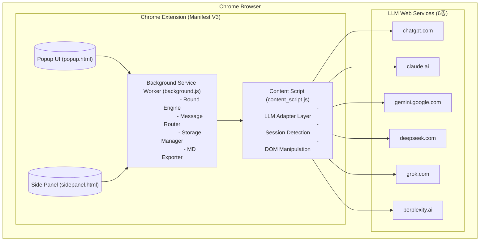

# 시스템 아키텍처

> ⚠️ **대체됨 — 구현·검증 기준은 `210.설계산출물-구현적용` + `100.START/VER-002` (2026-05-29).** 본 200-초안은 출처·대조용. 수치/구조 차이는 210 우선.

> 변경 이력: v1=원본, v2=2026-05-28 설계 추가건, v3=2026-05-28 검토 정정(LLM 전달 포맷 YAML 환원)

## 전체 구조도



## 레이어 구성

### 1. UI Layer
- **Popup**: 확장 아이콘 클릭 시 표시. LLM 선택, 라운드 진행 메인 화면
- **Side Panel**: Chrome 사이드 패널 (선택 사항)

### 2. Background Layer (Service Worker)
- 메인 로직 실행, 상태 관리
- Popup ↔ Content Script 간 메시지 중계
- chrome.storage.local에 선택 상태 persist
- 세션 완료 시 MD 파일 생성

### 3. Content Script Layer
- 각 LLM 사이트에 주입되어 DOM 접근
- session 탐지, prompt 전송, response 추출
- LLM별 Adapter로 분기 처리

### 4. LLM Web Services
- 사용자가 브라우저에 로그인한 6종 [v2] LLM 사이트
- API 키 불필요, 브라우저 세션 기반 접근
- prompt 실패 시 "로그인 필요" 메시지로 대체 (session 체크 제거) [v2]

## 통신 흐름

```
사용자 → Popup UI
  → chrome.runtime.sendMessage → Background SW
    → chrome.tabs.sendMessage → Content Script
      → LLM 사이트 DOM 조작
      → response 추출
    → Background SW (수집/라운드 관리)
  → Popup UI (표시)
```

## 기술 스택
- **Platform**: Chrome Extension Manifest V3
- **Storage**: chrome.storage.local (선택 상태), 파일시스템 (MD 저장)
- **Auth**: 브라우저 쿠키/세션 (API 키 미사용)
- **Format**: 내부 저장/메시징=JSON · **LLM 전달 context=YAML** [v3 정정] (YAML 환원 — transcript msg262)
