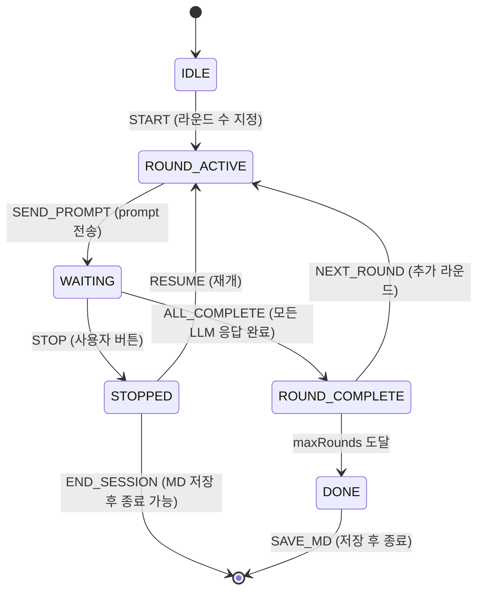

# 라운드 상태 천이 (State Machine)

> ⚠️ **대체됨 — 구현·검증 기준은 `210.설계산출물-구현적용` + `100.START/VER-002` (2026-05-29).** 본 200-초안은 출처·대조용. 수치/구조 차이는 210 우선.

> 변경 이력: v1=원본, v2=2026-05-28 설계 추가건

## 상태 다이어그램

## 상태 정의

| 상태 | 설명 | 전이 조건 |
|------|------|-----------|
| IDLE | 초기 상태, 세션 미시작 | 사용자 START |
| ROUND_ACTIVE | 새 라운드 시작, prompt 입력 가능 | 이전 라운드 완료 또는 STOPPED |
| WAITING | LLM 응답 대기 중 | prompt 전송 완료 |
| ROUND_COMPLETE | 모든 LLM 응답 수신 완료 | 모든 응답 completed |
| STOPPED | 사용자 STOP (부분 응답 폐기) | STOP 버튼 클릭 |
| DONE | 최대 라운드 도달, 세션 완료 | maxRounds 도달 |

## 이벤트 정의

| 이벤트 | 트리거 | 설명 |
|--------|--------|------|
| `START` | 사용자 | 라운드 수 지정, 첫 prompt 입력 |
| `SEND_PROMPT` | 사용자 | prompt 전송 → WAITING |
| `LLM_RESPONSE` | Content Script | 특정 LLM 응답 수신 |
| `ALL_COMPLETE` | 시스템 | 모든 LLM 응답 완료 → ROUND_COMPLETE |
| `STOP` | 사용자 버튼 | 응답 대기 중단 → STOPPED |
| `NEXT_ROUND` | 사용자 | 다음 라운드 시작 → ROUND_ACTIVE |
| `RESUME` | 사용자 (STOPPED 후) | 세션 재개 → ROUND_ACTIVE |
| `SAVE_MD` | 사용자 | MD 파일 생성 → 세션 종료 시 허용 (DONE, 또는 STOPPED→END_SESSION 중간 종료 포함). UI(260) 저장 다이얼로그와 정합 |
| `SAVE_ROUND` [v2] | 시스템 (자동) | 매 Round 완료 시 chrome.storage.session에 persist (SW 복구 대비) |

## 응답 전달 규칙 (Self-Exclusion) [v2]

- `ROUND_COMPLETE` → `ROUND_ACTIVE` 전이 시, **각 LLM에 전달할 context를 LLM별로 개별 구성**
- 자기 자신의 응답은 `otherResponses`에서 제외 (의도: 독립적 사고 유지, echo chamber 방지)
- 중단된 LLM(STOPPED round에서 미수신)의 응답도 전달 대상에서 제외

## STOP 처리 규칙
- STOP 버튼 클릭 시 WAITING → STOPPED
- 수신 완료된 LLM 응답은 유지
- 미수신 응답은 폐기
- STOPPED → ROUND_ACTIVE (사용자 RESUME)
- STOPPED → IDLE (사용자 완전 종료)

## 예외 처리
| 상황 | 처리 |
|------|------|
| 특정 LLM 응답 없음 | STOP 버튼으로만 중단 (자동 타임아웃 없음) |
| Content Script 미주입 | 에러 메시지 표시, 해당 LLM skip |
| LLM 사이트 DOM 변경 | adapter selector 업데이트 필요 (유지보수) |
