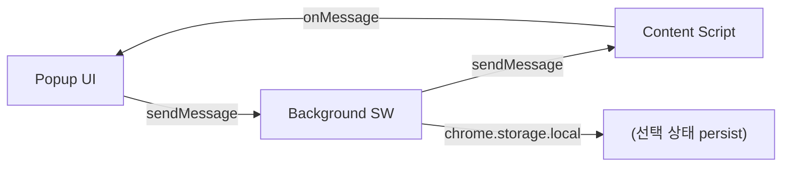

# 메시지 인터페이스

> ⚠️ **대체됨 — 구현·검증 기준은 `210.설계산출물-구현적용` + `100.START/VER-002` (2026-05-29).** 본 200-초안은 출처·대조용. 수치/구조 차이는 210 우선.

> 변경 이력: v1=원본, v2=2026-05-28 설계 추가건

## 메시지 라우팅 구조



## Action Type 정의

### Popup → Background

| Action | Payload | 설명 |
|--------|---------|------|
| `GET_LLM_STATUS` | `{}` | 로그인된 LLM 목록 조회 |
| `SELECT_LLMS` | `{llms: string[]}` | 선택한 LLM 저장 |
| `START_SESSION` | `{llms, maxRounds, tokenLimit}` | 세션 시작 [v2: tokenLimit 추가] |
| `SEND_PROMPT` | `{prompt: string}` | 현재 라운드 prompt 전송 |
| `STOP_ROUND` | `{}` | 현재 라운드 중단 |
| `NEXT_ROUND` | `{prompt?: string}` | 다음 라운드 시작 |
| `RESUME_SESSION` | `{}` | STOPPED 상태에서 재개 |
| `SAVE_MD` | `{}` | MD 파일 생성 |
| `SWAP_LLM` [v2] | `{slotIndex: number, newLlm: string}` | 특정 슬롯의 LLM을 다른 LLM으로 교체 (swap) |
| `START_SECRET_CHAT` | `{targetLlm: string}` | 비밀채팅 시작 |
| `SECRET_CHAT_SEND` | `{targetLlm, message}` | 비밀채팅 메시지 전송 |
| `END_SESSION` | `{}` | 세션 완전 종료 |

### Background → Popup

| Action | Payload | 설명 |
|--------|---------|------|
| `LLM_STATUS` | `{llms: LlmStatus[]}` | LLM별 로그인 상태 |
| `ROUND_UPDATE` | `{round, maxRounds, status, responses}` | 라운드 진행 상태 |
| `LLM_RESPONSE` | `{llm, content, tokens}` | 개별 LLM 응답 수신 |
| `ROUND_COMPLETE` | `{round, responses}` | 라운드 완료 |
| `SESSION_STATE` | `{state}` | 세션 상태 변경 알림 |
| `SECRET_CHAT_RESPONSE` | `{llm, message}` | 비밀채팅 응답 |

### Background → Content Script

| Action | Payload | 설명 |
|--------|---------|------|
| `SEND_PROMPT` | `{prompt, context}` | prompt 전송 + 응답 대기 ([v2] session 체크 제거, 실패 시 throw) |
| `STOP` | `{}` | 응답 생성 중단 |
| `EXTRACT_RESPONSE` | `{}` | 현재 응답 텍스트 추출 |

### Content Script → Background

| Action | Payload | 설명 |
|--------|---------|------|
| `SESSION_STATUS` | `{loggedIn: boolean}` | 로그인 상태 결과 |
| `RESPONSE_CHUNK` | `{content: string, done: boolean}` | 응답 스트리밍 또는 완료 |
| `ERROR` | `{code, message}` | 오류 발생 |

## 메시지 포맷 (예시)

```javascript
// Popup → Background: SEND_PROMPT
// (roundNo/maxRounds는 payload에 넣지 않음 — Background 상태에서 관리. 표 정의와 일치)
chrome.runtime.sendMessage({
  action: "SEND_PROMPT",
  payload: {
    prompt: "시장 조사 아이디어를 내줘"
  }
})

// Background → Content Script: SEND_PROMPT
// [v2] ※ context.otherResponses는 자기 자신 제외 (self-exclusion)
//   예시: claude 탭에 전송 → claude 응답 제외
chrome.tabs.sendMessage(tabId, {
  action: "SEND_PROMPT",
  payload: {
    prompt: "시장 조사 아이디어를 내줘",
    context: {
      roundNo: 2,
      otherResponses: {
        chatgpt: "온라인 설문조사",
        gemini: "소비자 인터뷰"
      }
    }
  }
})

// Content Script → Background: RESPONSE
chrome.runtime.sendMessage({
  action: "RESPONSE_CHUNK",
  payload: {
    content: "온라인 설문조사가 좋겠습니다...",
    tokens: 85,
    done: true
  }
})
```

## Tab ID 관리

각 LLM 사이트는 별도 탭에서 열려 있어야 함. Background SW에서 LLM별 tabId 매핑 유지:

```javascript
const llmTabs = {
  chatgpt: { tabId: 123, url: "https://chatgpt.com", status: "ready" },
  claude:  { tabId: 124, url: "https://claude.ai", status: "busy" },
  gemini:  { tabId: 125, url: "https://gemini.google.com", status: "waiting" }
}
```

## 에러 코드

| 코드 | 설명 |
|------|------|
| `ERR_001` | LLM 사이트 접근 불가 (탭 없음) |
| `ERR_002` | Content Script 미주입 |
| `ERR_003` | LLM 응답 비정상 (생성 실패·중단). ※ 자동 타임아웃 없음 — 장시간 미응답은 STOP으로 수동 처리 |
| `ERR_004` | DOM selector 변경 (응답 추출 실패) |
| `ERR_005` | 토큰 제한 초과 (설정된 tokenLimit 기준, 기본 1000) |
