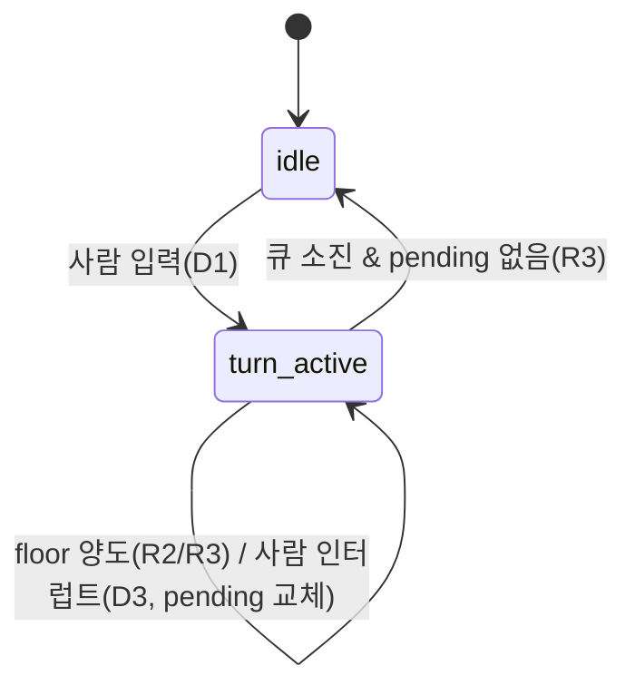

# 222. Coordinator — Floor 루프 상태머신 (ai-sarangbang)

> 자기완결. 본 제품의 **심장**. [221] 규칙 R1~R4의 실행 엔진. race-free 보장.
> 변경 이력: v1 (2026-06-02 초안) · v2 (critic 1차 — interrupt/epoch) · v3 (critic 2차 — single-flight 턴 루프로 재설계: epoch 제거·runTurn 중첩 차단·abort 화자 stopped 확정·whisperContext·debounce 제거·헬퍼 계약) · **v3.1 (P0 구현반영 — `onRoom` 통지 채널 추가: 턴 종료 `floorHolder=null`/`status` 변경의 UI 반영 경로[의사코드 갭]; 생성자를 `hooks` 객체 + `opts`로 정리; D3=사람 우선 abort 사용자 확정. 구현·M1 게이트 green @ `E:\workspace\ai-sarangbang`)**
> [중요] Gemini 공유 boolean 레이스 + v2 epoch 설계의 runTurn 중첩 레이스를 **단일 비행(single-flight) 루프 + pending 슬롯**으로 동시 해소.
> · **v4 (2026-06-05 — [227] 정합): §1·§2·§4 의사코드의 `FIFO 큐`/`enqueue`/`collectIntents`/`drainFloor`를 폐기하고 `매 턴 랜덤 셔플(shuffle) → 직렬 발언(runTurn/collectSpeakers/speakOne)`으로 개정. 자동 대화(runAutoTurn/pickAutoSpeaker [D-D])·`dispose`(228) 반영. 코드 정본 = ai-sarangbang `src/core/coordinator.ts`.**

---

## 1. 책임
- floor(발언권) 토큰 **1개**를 단독 소유·중재. 참가자는 직접 출력하지 않는다. Coordinator가 사람 입력마다 발언 후보(AI 전원)를 **랜덤 추첨(Fisher-Yates 셔플)** 해 한 명씩 floor를 부여하고 **스트림 종료까지 await** 후 다음 순번으로([227]).
- 공개 대화 누적 · 턴 경계 관리. whisper는 floor 밖 별도 경로(§7).
- 진입점은 **`startTurn(humanMsg)` 단 하나** — 진행 중이면 인터럽트(현재 발언 abort + `pending` 교체), 유휴면 턴 루프 시작.
- **턴 루프는 단일 비행(`busy` 가드)** — 절대 중첩 실행되지 않는다. 인터럽트는 `pending` 슬롯 교체로 흡수.

## 2. 동시성 모델 — single-flight 루프 (왜 race-free인가) [중요]
- **Gemini 버그**: 각 코루틴이 `while is_speaking` 후 `is_speaking=True` → check-then-set 비원자 + `queue.get()` 화자 어긋남 = TOCTOU.
- **v2 epoch 버그(2차 critic)**: `interrupt`가 `await runTurn`을 자기 콜스택에서 await → 연속 인터럽트 시 `runTurn` **중첩**. epoch 가드는 `drainFloor` 루프 본문만 보호하고, runTurn의 head(turnNo++/status/publish)·tail(floorHolder/status=idle)은 가드 밖이라 중첩 runTurn끼리 경합.
- **v3 해결 = single-flight**: 출력 루프(`runLoop`)는 **`busy` 가드로 단 하나만** 존재. 사람 입력은 `pending` 슬롯에 **덮어쓰기**만 하고, 진행 중이면 `current.abort()`로 현재 발언만 끊는다. `runLoop`이 `pending`을 순차 소비 → **runTurn은 항상 한 콜스택에서만**, 직렬 발언 루프도 항상 1개. 공유 boolean도 epoch도 없음 → 경쟁 자체가 구조적으로 불가능. ([227] 셔플 직렬·[C3] 자동 턴도 이 단일 루프 안에서 처리.)

## 3. 상태 모델

Room:
| status | 의미 |
|--------|------|
| `idle` | 턴 없음, 사람 입력 대기 |
| `turn_active` | 턴 진행 중(큐 처리), `floorHolder` = 현재 발언자 또는 턴 종료 시 null |

- `floorHolder`는 UI 구독 대상([223] `RoomSession.floorHolder`). [H-1] **발언 간 전이는 직접 교체**(다음 화자로 덮어씀, null 경유 안 함) → roster 깜빡임 없음. `null`은 **턴 종료 시에만**.

Participant (turn-state, `TurnState`):
| state | 의미 |
|-------|------|
| `idle` | 이번 턴 미발언/대기 안 함 |
| `queued` | 발언 의사 제출, floor 대기 |
| `speaking` | floor 보유, 스트리밍 중 |
| `done` | 이번 턴 발언 완료(자연 종료) |
| `stopped` | 발언 중단(사람 인터럽트/드라이버 에러) — 부분 응답 보존 |

> [H1] `MessageStatus`([223] `'streaming'|'done'|'stopped'|'error'`)는 turn-state의 부분집합이 아님 — **`error`는 Message 전용**(드라이버 실패), `idle`/`queued`는 Participant 전용. 대응: `speaking↔streaming`, `done↔done`, `stopped↔stopped`. 드라이버 에러 시 **Message=`error`·Participant=`stopped`**.



## 4. Floor 루프 — single-flight (의사코드)

```ts
type TurnState = 'idle' | 'queued' | 'speaking' | 'done' | 'stopped'

// [227] FIFO 큐·enqueue·collectIntents·drainFloor 폐기 → 매 턴 랜덤 셔플 후 직렬 발언.
// [전체·최신 정본 = 구현 ai-sarangbang/src/core/coordinator.ts] — 아래는 핵심 골격(요지).
class Coordinator {
  private spokeThisTurn = new Set<ParticipantId>()
  private turnState = new Map<ParticipantId, TurnState>()
  private current: AbortController | null = null         // 현재 발언자 abort(사람 인터럽트 D3)
  private pending: Message | null = null                  // [H-1] 대기 사람 입력(최신만). 인터럽트=이 슬롯 교체
  private busy = false                                    // [H-1] 턴 루프 single-flight 가드
  private whispers = new Map<ParticipantId, Whisper>()    // [H2] 휘발([223] §2)
  private activeWhispers = new Set<AbortController>()      // [228] dispose가 일괄 abort
  private disposed = false                                // [228] teardown 후 모든 진입점·루프 차단
  private readonly rng: () => number                      // [227] 셔플 난수원(주입=결정성·core 순수성)
  private autoMode = false; private autoLeft = 0          // [C3] 자동 대화
  private lastAutoSpeaker: ParticipantId | null = null    // [D-D] 자동턴 직전 화자(연속 회피)

  // [v3.1] 생성자 = (room, driver, hooks{publish,onState,onWhisper,onRoom?,onAuto?,onOrder?}, opts{rng,contextLimit,auto*,willSpeak,whisperTimeoutMs})
  constructor(room, driver, hooks, opts = {}) { /* 필드·opts 바인딩(rng ??= Math.random) */ }

  private setState(id: ParticipantId, s: TurnState) { this.turnState.set(id, s); this.hooks.onState(id, s) }

  // [유일 진입점] 사람 입력. 진행 중이면 인터럽트(현재 abort + pending 교체), 유휴면 루프 시작.
  startTurn(humanMsg: Message) {
    if (this.disposed) return                     // [228]
    humanMsg.status = 'done'                       // [C-1] 사람 발언=즉시 done(컨텍스트 포함)
    this.pending = humanMsg
    if (this.autoMode) this.setAuto(false)         // [C3] 사람 우선 → 자동 일시정지
    if (this.busy) this.current?.abort()           // [D3] 진행 중 발언만 중단. 루프가 pending을 다음 턴으로
    else void this.runLoop()
  }

  // [H-1] 단일 비행 루프 — 사람 입력(우선) 또는 자동 모드가 남는 동안 턴을 돈다. [228] disposed면 탈출.
  private async runLoop() {
    this.busy = true
    try {
      while (!this.disposed && (this.pending || (this.autoMode && this.autoLeft > 0))) {
        if (this.pending) { const m = this.pending; this.pending = null; await this.runTurn(m) }  // 사람 턴: 랜덤 직렬
        else { await this.runAutoTurn(); this.autoLeft--; /* 턴 간 interruptibleDelay(사람 입력에 깨움) */ }  // [C3]
      }
    } finally { this.busy = false; /* 큐 소진 & !pending → floorHolder=null·status=idle·onRoom */ }
  }

  // [227] 사람 턴 — 후보를 랜덤 추첨한 순서대로 1명씩 직렬 발언.
  private async runTurn(humanMsg: Message) {
    this.room.turnNo++; this.room.status = 'turn_active'; this.spokeThisTurn.clear()
    this.publish(humanMsg); this.spokeThisTurn.add(humanMsg.by); this.setState(humanMsg.by, 'done')  // [C-1]
    const order = this.shuffle(await this.collectSpeakers())   // [227] 매 턴 셔플(좌석 고정 아님)
    this.hooks.onOrder?.(rankMap(order))                       // [227] 1-based 순번 배지
    for (const p of order) this.setState(p.id, 'queued')
    for (const p of order) {                                   // 추첨 순서대로 직렬(R2/R3)
      if (this.disposed || this.pending) break                // [D3]/[228] 대기 입력·teardown → 다음 턴
      const ac = new AbortController(); this.current = ac
      await this.speakOne(p.id, ac.signal); this.current = null
      this.spokeThisTurn.add(p.id)
    }
    for (const p of order) if (!this.spokeThisTurn.has(p.id)) this.setState(p.id, 'idle')  // [M2] 미발언 queued 해제
    this.room.floorHolder = null; this.hooks.onOrder?.(new Map())  // 턴 종료 시에만 null·배지 클리어
    if (!this.pending) this.room.status = 'idle'
  }

  // 발언 후보(AI 전원) 좌석순 수집 — willSpeak(D2) opt-out. [C1] 훅 throw 가드. 순서는 runTurn이 셔플.
  private async collectSpeakers(): Promise<Participant[]> {
    const ais = this.room.participants.filter(p => p.kind === 'ai').sort((a, b) => a.seat - b.seat)
    const out: Participant[] = []
    for (const ai of ais) { try { if (await this.willSpeak(ai)) out.push(ai) } catch { /* skip */ } }
    return out
  }

  private shuffle<T>(a: T[]): T[] { /* [227] Fisher-Yates(this.rng 주입) — 원본 불변 복사본 반환 */ }

  // [227] 직렬 발언 1건 — floor 직접 교체(null 경유 안 함) + streamMessage.
  private async speakOne(id: ParticipantId, signal: AbortSignal) {
    this.room.floorHolder = id; this.setState(id, 'speaking'); this.notifyRoom()
    await this.streamMessage(id, signal)   // 빈응답→error('응답 없음')·abort→stopped·드라이버에러→error
  }

  // [C3] 자동 턴 — 한 AI([D-D] 랜덤 추첨·직전 화자 연속 회피)만 발언(사람 opener 없음).
  private async runAutoTurn() {
    const ais = this.room.participants.filter(p => p.kind === 'ai').sort((a, b) => a.seat - b.seat)
    if (!ais.length) { this.setAuto(false); return }
    const speaker = this.pickAutoSpeaker(ais); this.lastAutoSpeaker = speaker.id   // [D-D]
    this.room.turnNo++; this.room.status = 'turn_active'
    this.room.floorHolder = speaker.id; this.setState(speaker.id, 'speaking')
    const ac = new AbortController(); this.current = ac
    await this.streamMessage(speaker.id, ac.signal); this.current = null
    this.room.floorHolder = null; if (!this.pending) this.room.status = 'idle'
  }
  // [D-D] 직전 화자 제외 후 rng 추첨(연속 회피). AI 1명뿐이면 그대로(불가피).
  private pickAutoSpeaker(ais: Participant[]): Participant {
    const pool = ais.length > 1 ? ais.filter(p => p.id !== this.lastAutoSpeaker) : ais
    return pool[Math.floor(this.rng() * pool.length)]
  }

  // 단일 AI 발언 스트림(빈 응답=error '응답 없음', [227] H2). beginMessage/appendToken/endMessage = §4.1.
  private async streamMessage(by: ParticipantId, signal: AbortSignal) {
    const msg = this.beginMessage(by, this.room.turnNo)
    try {
      for await (const tok of this.driver.speak(buildSpeakContext(this.room, by, this.contextLimit), signal)) this.appendToken(msg, tok)
      const st: MessageStatus = signal.aborted ? 'stopped' : (msg.text ? 'done' : 'error')   // 빈 텍스트=무응답
      this.endMessage(msg, st); this.setState(by, st === 'done' ? 'done' : 'stopped')
    } catch { const st: MessageStatus = signal.aborted ? 'stopped' : 'error'; this.endMessage(msg, st); this.setState(by, 'stopped') }
  }

  // [H2] 귓속말 — floor 밖. 휘발 Map. 자체 타임아웃. [228] activeWhispers 추적(dispose 일괄 abort).
  async whisper(target: ParticipantId, text: string) {
    if (this.disposed) return
    if (!this.room.participants.some(p => p.id === target)) throw new Error('알 수 없는 대상')  // [M2] emit 전 검증
    /* whispers Map push + onWhisper 휘발 emit + driver.speak(whisperContext) 토큰마다 emit + 타임아웃/finally cleanup([223] §2) */
  }

  // [228] 세션 teardown(로비↔방 전환) — 진행 중 발언·지연·귓속말 중단 + disposed로 이후 진입·루프 차단(orphaned 0).
  dispose() {
    this.disposed = true; this.current?.abort(); this.current = null; this.pending = null
    this.autoMode = false; this.autoLeft = 0
    for (const ac of this.activeWhispers) ac.abort(); this.activeWhispers.clear()
  }
}
```

### 4.1 헬퍼 계약 [H-2] — 타이핑 효과 데이터 흐름의 단일 소스
```ts
// Message 생성·publish(history push + UI emit). status='streaming', id=newMessageId, ts=now, turnNo, role=by.kind.
beginMessage(by: ParticipantId, turnNo: number): Message
// msg.text 에 토큰 누적 + UI 갱신 emit. [중요] 타이핑 효과의 단일 소스 = 여기. UI Typewriter는 이 emit만 구독(자체 타이핑 금지, [225] §4).
appendToken(msg: Message, tok: string): void
// msg.status 확정 후 동일 id 갱신 emit(재-publish 아님, in-place 갱신).
endMessage(msg: Message, status: MessageStatus): void
```
- `beginMessage`가 `role`을 `participants.find(by).kind`로 **단독 채움**([223] M-3, 외부 설정 금지) → role↔kind 이중원 동기화 책임 단일화.
- **MockDriver(P0) 스크립트 포맷**(드라이버 측): `{ text: string; perTokenMs?: number; failAfter?: number }[]` 식 — 토큰을 `perTokenMs` 지연으로 흘리고, `failAfter`로 에러/무응답 케이스 시연. (정본 = [224] §P0 / drivers 폴더.)

## 5. 바지인 / abort — 사람 우선 (D3) [single-flight]
- 사람이 `turn_active` 중 `startTurn` 호출 → `pending` 슬롯 교체 + `current?.abort()`(현재 발언만 중단). **runLoop은 새로 시작하지 않음**(이미 busy) → 진행 중 루프가 `runTurn` 직렬 발언 루프의 `!this.pending`에서 빠져나와 `runTurn` 종료 → `runLoop`이 `pending`을 다음 턴으로 소비. **runTurn 중첩 0**.
- abort된 발언: `stream()` catch가 `signal.aborted`→`stopped` 확정 + **`setState(by,'stopped')`**([H-2]) → Message·Participant **둘 다 stopped**(§9·§3 표와 일관). completedNaturally 가드(v1 `222 §20`) 계승 — 중단을 `done`으로 오분류 안 함.
- AI 간 abort 없음(R2: 끝까지). **오직 사람 인터럽트(D3)만 abort.**

## 6. done 감지 (스트림 종료) [H-3 정정]
- **유일 기준**: 드라이버 **stream-end**(`AsyncIterable` 정상 종료) = done. mock/Ollama/API **모두 명확한 stream-end 제공**(추상화 계약, §8).
- **하드 상한(안전망)**: 무응답/무종료 타임아웃 → `stopped`+에러. **드라이버 래퍼 책임**([224] §5 — core 아님). whisper도 동일(`WHISPER_TIMEOUT_MS`).
- [H-3] v2의 "마지막 토큰 후 N ms debounce(1500)"는 **제거** — v1 DOM innerText 안정화 산물이라, 스트림 추상화에선 정상 응답의 사고 지연(1.5s 침묵)을 **조기 done 오판**하는 버그. 끝을 못 알리는 건 "버그난 드라이버"뿐이고 그건 하드 타임아웃으로 잡는다.

## 7. Whisper 채널 (R4) [H-3]
- floor 루프 **밖**(§4 `whisper()`). 사람 ↔ 특정 참가자 1:1. **휘발**: `whispers: Map`에만 존재, 공개 `history`·로그·MD·스냅샷 **미기록**([223] §2).
- **[C1] UI 렌더 경로**: WhisperPanel은 `onWhisper(target, thread)` emit 구독(공개 `publish`와 **별개 채널**). 토큰마다 발화 → 귓속말도 타이핑 렌더. **휘발 UI 전용**(history/MD/스냅샷 미포함 — 불변식 유지하며 화면엔 그림).
- **컨텍스트**: `whisperContext(target, w, room)`가 whisper 스레드(`Whisper.messages`)를 **`SpeakContext`로 변환**해 드라이버에 넘긴다([223] §4.1 정의) — 드라이버 seam(§8 `speak(ctx:SpeakContext,…)`)이 타입 수준에서 whisper 수용. 공개 history는 참조하지 않음(사적 격리).
- 동시성: floor와 독립. 같은 모델 경합 시(P1 Ollama 단일) 직렬화 — [C2] 미정. 타임아웃으로 hang 방지.

## 8. AgentDriver 인터페이스 (백엔드 seam)
```ts
interface AgentDriver {
  speak(ctx: SpeakContext, signal: AbortSignal): AsyncIterable<string>   // 토큰 스트림. 정상 종료 = done(§6)
}
// 구현체: P0 MockDriver(스크립트/지연, §4.1) · P1 OllamaDriver(localhost:11434) · P2 ApiDriver
// SpeakContext 정본 = [223] §4. 공개 발언(contextFor)·귓속말(whisperContext) 둘 다 SpeakContext로 정규화 → 드라이버는 동일 시그니처.
// 하드 타임아웃 안전망(§6)은 드라이버 래퍼에서 speak() 를 감싸 적용(core 비침투).
```
- 바지인 abort = `signal`로 전파(드라이버가 fetch/생성 취소).

## 9. 엣지케이스
| 케이스 | 처리 |
|--------|------|
| 후보 0 / 전원 opt-out(D2) | 직렬 발언 루프 즉시 종료 → `pending` 없으면 `idle`(연속 죽은방은 P1 [C4]) |
| 스트림 중 abort(D3) | `streamMessage` catch: Message=`stopped` + **Participant=`stopped`**([H-2]). 직렬 루프 `!pending`/`disposed`로 이탈 → runLoop이 다음 턴 |
| 드라이버 에러 | Message=`error` · Participant=`stopped` · 다음 화자로 계속 |
| 연속 바지인 N회 | `pending` 덮어쓰기 + 단일 runLoop 순차 소비 → runTurn 중첩 0([H-1]) |
| whisper 도중 턴 시작 | 독립 — whisper Map 유지, floor와 무관 |
| dispose 후 진입(로비 전환) | `startTurn`·`whisper`·`startAutoMode`·루프 모두 `disposed` 가드로 무시([228]) |

## 10. 미해결
| ID | 항목 | 상태 |
|----|------|------|
| C2 | whisper 중 드라이버 경합 직렬화(P1 단일 모델) | [미정] — [221] O2 |
| C3 | 자동 대화(D1 대안) | [구현] 랜덤 순서·직전 화자 연속 회피·턴수(1~99)·라운드 종료선([227] D-D) |
| C4 | 전원 opt-out 연속 "죽은 방" 안내(P1 willSpeak 활성 시) | [미정] — D2 확정 후 |
| C5 | R3 동적 발언 결정(발언 진행 중 willSpeak 재평가) | [미정] — P1 follow-up([M-1]) |

> 정정 이력: v2(C1 interrupt/epoch·H1 status·H2 whisper Map·M3 turnNo) → **v3 critic 2차: H-1(single-flight 재설계, epoch 폐기·runTurn 중첩 차단) · H-2(abort 화자 stopped 확정) · H-3(whisperContext·debounce 제거) · C-1(사람 status='done') · 헬퍼 계약(§4.1) · enqueue 가드(M-2) · floorHolder null 윈도우 제거**.
