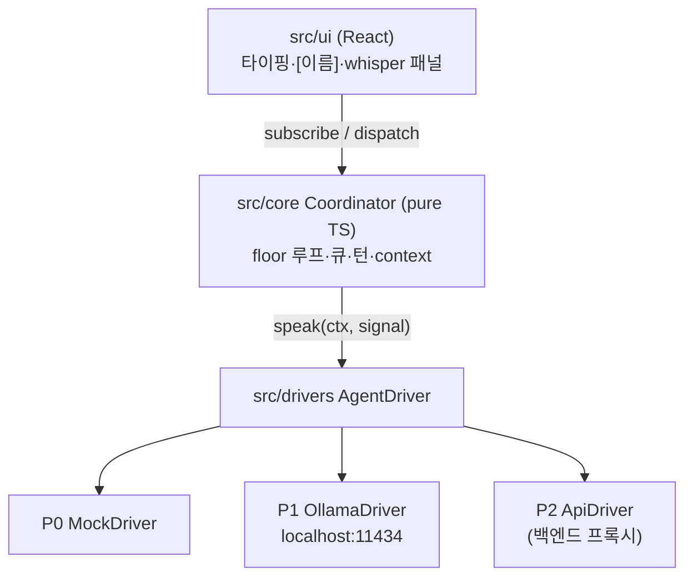

# 224. 아키텍처 · 스택 · 단계 (ai-sarangbang)

> 자기완결. [221] 제품·규칙과 [222] coordinator를 **실행 가능한 구조**로 묶는 문서. 스택·레이어·단계 결정의 정본.
> 변경 이력: v1 (2026-06-02 초안)
> 표기: 이모지 미사용 — `[결정]`/`[제안]`/`[미정]`/`[중요]` 텍스트 태그. 충돌 시 규칙은 [221] §3 우선.

---

## 1. 아키텍처 개요

- **형태**: 로컬 웹앱 (브라우저, 확장 아님). P0/P1 = **프론트엔드 only**. P2에서만 키 보호용 얇은 백엔드 도입(§3).
- **3레이어** — 의존 방향은 위→아래 단방향. 하위는 상위를 모름.

| 레이어 | 위치 | 책임 | 의존 |
|--------|------|------|------|
| **UI (React)** | `src/ui` | 화면·90s 감성(타이핑·`[이름]`·입퇴장)·입력·whisper 패널. 상태를 **구독**만. | Coordinator(읽기), App |
| **Coordinator (순수 TS)** | `src/core` | floor 루프·턴 경계·큐·whisper 경로·context 빌더([222]). **프레임워크 무관**. | AgentDriver(인터페이스) |
| **AgentDriver (백엔드 seam)** | `src/drivers` | `speak(ctx, signal): AsyncIterable<token>` 구현. mock/Ollama/API 교체점([222] §8). | (백엔드별) |

- [중요] **Coordinator는 React·DOM·fetch를 직접 모름.** UI는 Coordinator가 **노출하는 이벤트/상태**를 구독해 렌더. 드라이버는 인터페이스 뒤에 숨음 → 멀티유저 서버 이식(§6)과 무료→유료 전환(§3)이 **이 두 seam에서만** 일어남.

```text
        +------------------------------------------+
        |                src/ui (React)            |
        |  타이핑 효과 · [이름] 발화 · whisper 패널  |
        +---------------------+--------------------+
                              | subscribe(state/events), dispatch(humanMsg, whisper)
                              v
        +------------------------------------------+
        |        src/core  Coordinator (pure TS)   |
        |  floor 루프 · 큐(FIFO) · 턴 경계          |
        |  context 빌더(self-exclusion) · whisper   |
        +---------------------+--------------------+
                              | speak(ctx, signal): AsyncIterable<token>
                              v
        +------------------------------------------+
        |          src/drivers  AgentDriver        |
        |  P0 MockDriver / P1 OllamaDriver / P2 Api |
        +------------------------------------------+
```



## 2. 스택 [결정]

**Vite + React + TypeScript(strict).**

| 결정 | 값 | 사유 |
|------|----|----|
| 빌드/런타임 | **Vite** | 무료·로컬 dev 서버·HMR·제로 설정. 확장 아님 = 순수 웹앱이라 번들러 자유. |
| UI | **React 18** | v1(multichat) 스킬 **연속성**(동일 스택) → 러닝커브 0. |
| 언어 | **TypeScript strict** | [222] 의사코드가 이미 TS. 타입 안전 + carry-forward 자산이 TS. |
| 비용 | **0** | Vite/React/TS 전부 무료. P0/P1 외부 유료 의존 없음([221] §2). |

- [결정] **Coordinator = `src/core/` 순수 모듈** — React import 금지(lint 규칙으로 강제 권장). UI 상태 동기화는 경량 옵저버(직접 emit) 또는 얇은 어댑터로. 전역 상태 라이브러리는 **선택**이며 core에 침투 금지.
- [결정] **Driver = `src/drivers/`** — `AgentDriver` 인터페이스([222] §8) 구현체만. 백엔드 결정은 이 폴더 안에서 끝남.
- [제안] 테스트 = **Vitest**(v1 vitest 자산·습관 계승). core는 UI·드라이버 없이 단위 테스트 가능(순수성의 보상).
- [제안] i18n = ko/en 동시(코드생성원칙, 한글 하드코딩 금지) — 경량 사전 맵으로 P0부터.

## 3. 단계 P0 / P1 / P2 (= [221] §2)

> 원칙: **무료 최우선.** 메커닉(floor 루프·턴·whisper)이 **완전 무결**해진 뒤에야 실 AI → 그 다음에야 유료. 각 단계는 드라이버 교체뿐, Coordinator/UI **무변경**이 목표.

### P0 — MockDriver로 메커닉 무결화 [지금]
- 목표: [222]의 floor 루프·R1~R4·바지인 abort·done 감지를 **AI 없이** 완성.
- `MockDriver`: 스크립트된 토큰을 지연(setTimeout/async generator)으로 흘려보냄. `signal.abort` 즉시 반응(바지인 실증), 무응답·에러 케이스도 스크립트 가능.
- **완료기준**:
  - [221] R1~R3 동작(턴당 1회·floor 직렬화·큐 소진까지) — 단위 테스트 통과.
  - 바지인(D3): 사람 전송 시 현 floor abort → 부분 보존·`stopped`, completedNaturally 가드로 `done` 오분류 0([222] §5).
  - whisper(R4): 공개 로그·MD·스냅샷 **미기록** 검증.
  - 90s UI: `[이름]` 발화·글자별 타이핑·입퇴장 메시지 렌더.

### P1 — OllamaDriver (로컬, 무료) [다음]
- 목표: MockDriver를 `OllamaDriver`로 **교체만** 하고 실 LLM 발화.
- 엔드포인트: **`localhost:11434`** (Ollama 기본). 스트리밍 응답을 `AsyncIterable<string>`으로 어댑트.
- [중요] **CORS**: 브라우저→`localhost:11434` 직접 호출은 CORS에 막힐 수 있음 → (a) `OLLAMA_ORIGINS` 허용 설정, 또는 (b) **얇은 로컬 프록시**(Vite dev proxy `server.proxy` 또는 미니 Node) 중 택1. 키가 없으므로 프록시는 **CORS 우회 전용**(보안 목적 아님).
- abort: `signal` → fetch abort로 생성 취소([222] §8) 연결.
- **완료기준**:
  - 실 모델 토큰이 floor 루프를 타고 직렬 출력, 바지인 abort가 **생성 자체**를 멈춤.
  - done 감지 1순위(stream-end) 정상 + 안전망(debounce·하드 상한) 동작([222] §6).
  - Coordinator/UI 코드 변경 **0**(드라이버 교체만)인지 확인.

### P2 — ApiDriver (유료, 최후) [여유 시]
- 목표: 클라우드 API(예: OpenAI/Anthropic 호환) 발화. **여기서 처음** 백엔드 등장.
- [결정] **키 보호용 백엔드 프록시 도입** — API 키를 프론트에 두지 않음. `ApiDriver`는 프론트의 `/api/speak`(자체 프록시)만 호출, 키는 서버 환경변수. 비용 발생 단계라 호출량·모델도 서버에서 게이팅.
- **완료기준**:
  - 키가 **번들/네트워크 탭에 노출 0**(프록시 경유 확인).
  - 드라이버 교체만으로 동작(Coordinator/UI 무변경).
  - 과금 가드(호출 상한·모델 핀) 동작.

## 4. 폴더 구조 제안

> 구현은 `E:\workspace\ai-sarangbang`. 아래는 P0 기준 골격(제안). core/drivers 경계가 핵심.

```text
src/
  core/        # Coordinator (순수 TS, UI/드라이버 미의존) — [222]
    coordinator.ts     # floor 루프·큐·턴 경계 (§4 의사코드 구현)
    context.ts         # SpeakContext 빌더(공개 done 전사·self 포함, [223] §4)
    types.ts           # Room·Participant·Message·Intent·Whisper
    invariants.ts      # whisper 휘발·completedNaturally 가드 등 불변식
  drivers/     # AgentDriver 구현 (백엔드 seam) — [222] §8
    AgentDriver.ts     # interface
    MockDriver.ts      # P0
    OllamaDriver.ts    # P1
    ApiDriver.ts       # P2
  ui/          # React 레이어 (구독·렌더·90s 감성) — [225]
    Room.tsx           # 로그·발화 스트림(자동 스크롤)
    MessageLine.tsx    # [이름] 본문 1줄(색·상태 표식)
    Roster.tsx         # 참가자 좌석순·발언중/대기/완료([225] §2)
    Composer.tsx       # 사람 입력 → startTurn / 바지인
    WhisperPanel.tsx   # R4 1:1 패널(휘발)
    SaveBar.tsx        # 공개 대화 MD 저장(요청 시·whisper 제외)
    typing/Typewriter.tsx  # 글자별 타이핑(appendToken emit 구독 — 단일 소스, [222] §4.1)
  app/         # 조립·부트스트랩 (core+driver+ui 와이어링)
    main.tsx           # createRoot, 드라이버 주입(단계별 교체점)
    config.ts          # 단계 플래그·하드 타임아웃 등 설정(no guess→플래그)
  log/         # 공개 로그·MD export (whisper 제외) — [223]
    md-export.ts       # v1 MD 포맷 carry-forward ([223] §3.1)
    history.ts         # 공개 history 직렬화/스냅샷
```

- [중요] `app/main.tsx`가 **드라이버를 주입**하는 단일 지점 → P0→P1→P2 전환이 여기 한 줄. `core`는 어느 드라이버인지 모름.

## 5. Carry-forward 매핑표 (v1 multichat 자산 → 신제품)

> [221] §6 / [222] 계승의 구체화. **순수 도메인 로직만 이식, 환경 의존(DOM/chrome/스크래핑/throttle)은 전량 제외.** v1 문서 좌표 병기.

| v1 자산 | v1 위치(참고) | 신제품 처리 | 이식 위치 |
|---------|--------------|------------|-----------|
| 데이터 모델(Message·세션 등) | `210/214-데이터모델` | **이식**(턴/floor용으로 재명명) | `src/core/types.ts` |
| context 빌더(completed-only·공개 전사) | `210/216-교차전달-context빌더` | **이식·변환**(D5 발언 컨텍스트 — [C-2] self 포함으로 시맨틱 변경) | `src/core/context.ts` |
| MD 포맷(LLM별 md·summary) | `210/214` · `219` | **이식**(공개 로그만) | `src/log/md-export.ts` |
| whisper 불변식(휘발·미저장) | `210/214` 비밀채팅(SecretChat) | **이식**(R4 불변식) | `src/core/invariants.ts`, `src/log` |
| 상태머신(라운드→**턴/floor**) | `210/215-라운드엔진-상태머신` | **이식·변환**(병렬 라운드 → 직렬 floor 루프) | `src/core/coordinator.ts` ([222]) |
| completedNaturally 가드 | v1 `222 §20` | **이식**(abort 오분류 방지) | `src/core/coordinator.ts` ([222] §5) |
| done 안전망(하드 타임아웃) | v1 `222 §8` | **이식**(하드 타임아웃만 — debounce는 DOM 전용이라 제외 [H-3]) | `src/drivers/*` 래퍼 ([222] §6) |
| DOM 어댑터 / selector | `210/217` · `221-selector` | **제외** — 신제품은 드라이버 추상화 | (없음) |
| chrome MV3 / content script / 탭 의존 | `210/213` | **제외** — 순수 웹앱 | (없음) |
| 웹 스크래핑 / proxyFetch | `210/217` | **제외** — 드라이버가 백엔드 호출 | (없음) |
| 백그라운드 탭 throttle 대응 | v1 런타임 디버깅 세션 | **제외** — 단일 앱·외부 탭 없음 | (없음) |

- [중요] **변환이 곧 본 제품의 의의**: v1의 "전원 동시 응답(병렬 라운드)" → 본 제품 "한 명씩 floor 직렬화(턴제)". 같은 도메인 모델 위에서 **실행 엔진만 교체**([222]).

## 6. 멀티유저 이식 경로 (follow-up)

> [221] §2/§6: 솔로가 현재 범위. 단 **지금의 순수 설계가 미래 멀티유저를 공짜로 연다.**

- Coordinator가 순수 TS 모듈(`src/core`)이므로 **그대로 Node 서버로** 옮길 수 있음 → floor 권위가 서버에 1개 = 본래 [222]의 "단일 소비자 루프"가 **네트워크 레이스도 그대로 차단**.
- 경로(제안): `src/core` → Node 호스트 + **WebSocket** 서버. 클라이언트(UI)는 `dispatch(humanMsg/whisper)` 를 WS로 보내고 `subscribe(state/events)` 를 WS로 받음 — **현재 UI↔core 인터페이스와 동일 형태**라 UI 거의 무변경.
- 드라이버는 서버 측에 둠(키·모델 서버 보관, P2 백엔드와 자연 합류).
- [미정] 동시 사람 다수일 때 R1(턴당 1회)·D4(큐 우선순위)의 멀티유저 의미 = follow-up 설계([222] C3 인접).

## 미해결

| ID | 항목 | 상태 |
|----|------|------|
| A1 | UI↔core 상태 동기화 수단(경량 옵저버 vs 전역 상태 lib) | [제안] — core 순수성 유지 전제로 구현 시 택1 |
| A2 | P1 CORS 처리(`OLLAMA_ORIGINS` vs Vite proxy vs 미니 프록시) | [미정] — P1 착수 시, 환경 따라 ([221] O2) |
| A3 | P2 백엔드 프록시 런타임(Node/엣지 함수) · 호스팅 | [미정] — P2 진입 시 |
| A4 | 멀티유저 WS 프로토콜·턴 의미 정밀화 | follow-up ([222] C3) |
