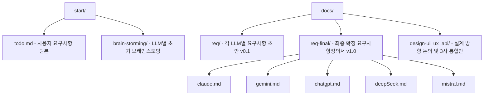
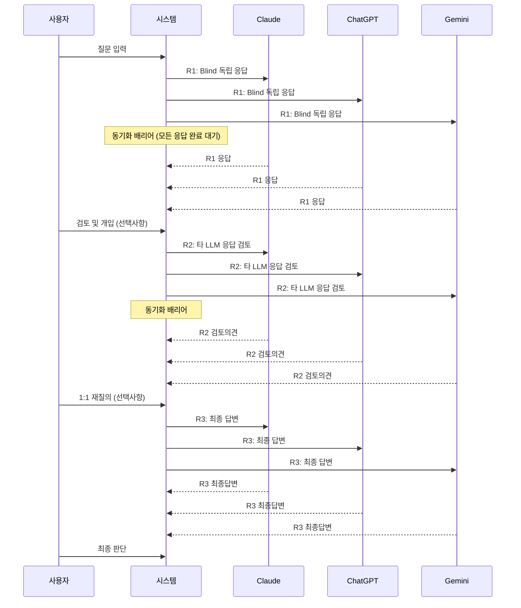

# [복원] 다중 LLM 채팅방 설계 계획 — opencode 세션 transcript

> 원본 DB: `C:/Users/PC/.local/share/opencode/opencode.db` · session `ses_19dc6ea1bffe6wAR2WImaZ7OzA`  
> 작업 폴더(opencode 표시): `E:\프로젝트\2026.05.ai다자채팅`  
> 세션 생성: 2026-05-26 11:59:28 · 최종 갱신: 2026-05-28 20:40:53 · 아카이브: 아니오 (DB상 살아있음)  
> 메시지 89건 / 파트 297건 · 모델: deepseek-v4-flash-free  
> ※ opencode.db에서 읽기 전용 추출(원본 무수정). 추출 2026-05-28 21:06:43

---

### [1] 사용자(👤) · 2026-05-26 11:59:28

E:\프로젝트\2026.05.ai다자채팅 폴더를 만들었고. 여러 LLM 들과 사용자가 동시에 대화를 할 수 있는 장을 만들려고
구현 전 플랜 및 설계 작업을 위한 폴더임.

여러 LLM들과 사용자가 대화하는 거....  어떻게 생각함?

너는 진정한 LLM/ AI 시대의 pionner !

---

### [2] assistant(🤖) deepseek-v4-flash-free · 2026-05-26 11:59:28

해당 프로젝트 폴더를 먼저 살펴보고, 어떤 자료가 있는지 확인해보겠습니다.

<details><summary>추론(reasoning) 펼치기</summary>

The user has created a folder `E:\프로젝트\2026.05.ai다자채팅` and wants to design a system where multiple LLMs and a user can have simultaneous conversations. They're asking for my thoughts on this concept and want a plan/design before implementation.

They're in plan mode - read-only, no edits allowed.

Let me think about this concept:

1. **Multi-LLM Chat System** - 여러 LLM들(Claude, GPT, Gemini, Llama 등)과 사용자가 동시에 대화하는 플랫폼
2. This is essentially a "multi-agent chat room" where each LLM is a participant
3. Users can talk to multiple AIs simultaneously in the same conversation

This is a really cool concept! Let me think about what this would look like:

**Core Concept**: A chat room where:
- Human users are participants
- Multiple different LLM models are also participants
- Everyone can see each other's messages
- Conversations can branch or flow naturally

**Possible approaches**:
1. **Round-table discussion** - All participants see all messages, respond naturally
2. **Side-by-side comparison** - User sends a message, multiple LLMs respond
3. **Collaborative problem-solving** - LLMs build on each other's ideas
4. **Debate format** - LLMs with different personas debate topics

For the user's question - "어떻게 생각함?" (What do you think?) - they want my genuine thoughts and then a plan.

Let me first explore what's in the project folder to see if there's any existing work.

</details>

> _도구: readx1, globx1_

---

### [3] assistant(🤖) deepseek-v4-flash-free · 2026-05-26 11:59:35

완전히 빈 프로젝트군요. 좋습니다. 제 생각을 솔직히 말씀드리겠습니다.

---

## 🎯 Concept: "Multi-LLM Chat Room" — 제 평가

**이 아이디어, 정말 좋습니다.** 시대정확히 읽고 계십니다. 단순한 "채팅앱"이 아니라 **AI 시대의 새로운 커뮤니케이션 패러다임**을 실험하는 거죠.

### 왜 지금 이게 의미있는가?

1. **"One AI" → "AI Team"** 으로 패러다임 전환 중입니다. 코드 리뷰, 브레인스토밍, 문제 해결 — 여러 AI의 시너지가 하나보다 훨씬 강함
2. **비교/평가의 장** — 같은 질문에 Claude, GPT, Gemini가 각각 어떻게 다른 답을 내는지 실시간으로
3. **AI 간 토론** — 의도적으로 다른 persona를 부여한 AI들끼리 토론시키면 깊이 있는 인사이트

### 핵심 고민 포인트 (설계 전에 결정해야 할 것들)

| 차원 | 선택지 |
|------|--------|
| **대화 구조** | 자유발언 vs 모더레이터 중재 vs 라운드로빈 |
| **LLM 연결 방식** | Hub-and-Spoke (중앙집중) vs Message Bus (분산) |
| **응답 트리거** | 모든 LLM이 항상 응답 vs @멘션된 것만 vs 설정별 선택 |
| **UI 패러다임** | 단일 채팅방 (모두 보임) vs 분할뷰 (LLM별 패널) vs 하이브리드 |
| **멀티턴 전략** | 모든 LLM에 동일 컨텍스트 vs LLM별 맞춤 프롬프트 |

---

## 제안: 지금부터 할 일

플랜 작성 전에, 먼저 몇 가지 결정을 해주셔야 합니다.

<details><summary>추론(reasoning) 펼치기</summary>

The folder is empty - brand new project. Let me now think deeply about what this system could be and formulate a response.

The concept: **Multi-LLM Chat Room** — 여러 LLM과 사용자가 동시에 대화하는 플랫폼

This is a fascinating concept. Let me think about the vision:

### Vision: "AI Salon" / "Digital Agora"

Imagine a chat room where:
- **Users** (humans) participate with their messages
- **Multiple LLM agents** (Claude, GPT-4, Gemini, Llama, Mistral, local models, etc.) are also "attendees"
- Each LLM has its own **persona/role** (e.g., "critical thinker", "creative writer", "engineer", "philosopher")
- Conversations flow naturally - anyone can chime in
- You can @mention specific LLMs to get their focused attention

### Key Design Dimensions

1. **Architecture Patterns**:
   - **Hub-and-Spoke**: User sends message → dispatches to all/some LLMs → responses collected → displayed
   - **Peer-to-Peer**: Each LLM instance is independent, subscribing to message stream
   - **Orchestrator**: Central agent manages conversation flow, decides who speaks when

2. **Conversation Models**:
   - **Free-for-all**: Anyone speaks anytime (natural but chaotic)
   - **Moderated**: A moderator (could be an LLM) manages turn-taking
   - **Round-robin**: Sequential responses from each LLM
   - **Threaded/branched**: Sub-conversations can form

3. **LLM Integration**:
   - Multiple API providers: Anthropic, OpenAI, Google, Meta, local via Ollama/LM Studio
   - Different models, costs, latencies
   - Some streaming, some not

4. **Technical Stack Considerations**:
   - **Backend**: Node.js/Python? WebSocket for real-time?
   - **Frontend**: Web app? Desktop app?
   - **State management**: How to track conversation history for each LLM (each has different context windows)
   - **Database**: Store conversations

### My genuine thoughts:

This is a **brilliant concept** and actually timely. We're moving from "chat with one AI" to "AI team" paradigm. Key value propositions:

1. **Synergy**: LLMs with different strengths collaborate - e.g., one codes, another reviews, another tests
2. **Comparison**: Side-by-side responses to the same prompt
3. **Debate/Discussion**: AI agents with different personas discuss topics deeply
4. **Education**: Watch multiple expert AIs discuss a topic from different angles
5. **Creativity**: Brainstorming sessions with diverse AI perspectives

### Challenges:
1. **Context management** - Each LLM needs a different context window
2. **Cost** - Multiple API calls per message
3. **Latency** - All LLMs respond, user waits for slowest
4. **Coherence** - Too many voices can be chaotic
5. **Prompt engineering** - Each LLM needs appropriate system prompts

Let me formulate a thoughtful response and then propose a design exploration plan.

</details>

> _도구: questionx1_

---

### [4] assistant(🤖) deepseek-v4-flash-free · 2026-05-26 12:00:36

좋습니다. 결정사항 정리:
- **자유 토론장**: 사용자 + 여러 AI가 자유롭게 대화
- **클라우드 + 로컬 LLM 동시 지원**
- **웹앱** 기반
- **빠른 프로토타입** 우선

이를 바탕으로 설계 플랜을 작성해보겠습니다.

---

## 🏗️ 아키텍처 설계안: "AI Agora" (가칭)

### 전체 구성도

```
[Browser UI] ←WebSocket→ [Node.js Server] ─┬─ OpenAI (GPT-4o)
                                             ├─ Anthropic (Claude Sonnet)
                                             ├─ Google (Gemini 2.5)
                                             ├─ Ollama (로컬 모델들)
                                             └─ (추후 확장)
```

### ① 서버 아키텍처 (Node.js + Socket.io)

| 레이어 | 역할 |
|--------|------|
| **WebSocket Gateway** | 메시지 송수신, 방 관리 |
| **Message Hub** | 메시지를 선택된 LLM들에게 병렬 전달 |
| **LLM Adapter Layer** | 각 LLM Provider별 adapter (공통 인터페이스) |
| **Conversation Store** | 세션별 대화 내역 (메모리 or 간단 DB) |
| **Room Manager** | 여러 대화방 생성/관리 |

**핵심 흐름**:
```
User "안녕" → Server 
  → Hub: 모든 활성 LLM에 "안녕" 전달 (병렬)
  → Claude 응답 (streaming) → UI 업데이트
  → GPT 응답 (streaming) → UI 업데이트  
  → Gemini 응답 (streaming) → UI 업데이트
  → (각각 독립적, 느린 LLM 기다리지 않음)
```

### ② UI 설계안

```
┌─────────────────────────────────────────────┐
│  [방제목] AI Agora    참가자: 👤나 🟣Claude  │
│  ┌───────────────────┬─────────────────────┐│
│  │ 📢 전체 채팅       │ 👥 참가자 패널     ││
│  │                   │                     ││
│  │ [나] 안녕하세요    │ 🟣 Claude          ││
│  │ 🟣 Claude: 안녕!   │ 🟢 GPT-4o          ││
│  │ 🟢 GPT-4o: 반가워  │ 🔴 Gemini          ││
│  │ 🔴 Gemini: 안녕!   │ 🟡 Llama 로컬      ││
│  │                   │ [클릭] to @멘션    ││
│  │                   │ [토글] 응답 on/off ││
│  │                   │                     ││
│  │ [메시지 입력창] [전송] │                  ││
│  └───────────────────┴─────────────────────┘│
└─────────────────────────────────────────────┘
```

- **메시지**: 발신자별 색상코드 + 아바타
- **@멘션**: 특정 LLM만 응답하도록 지시
- **참가자 토글**: 각 LLM의 응답 on/off 개별 제어
- **실시간 스트리밍**: LLM이 답변 생성 중임을 표시

### ③ LLM Adapter 인터페이스 (공통)

```
class LLMAdapter {
  constructor(config)    // API 키, 모델명, 시스템 프롬프트
  async chat(messages)   // {role, content}[] → stream or Response
  get name()             // 표시 이름
  get model()            // 모델 식별자
}
```

각 Provider 구현:
- `ClaudeAdapter` — Anthropic SDK + streaming
- `GPTAdapter` — OpenAI SDK + streaming
- `GeminiAdapter` — Google GenAI SDK + streaming
- `OllamaAdapter` — 로컬 REST API + streaming
- 플러그인 구조로 추가 용이

### ④ 데이터 구조

```jsonc
// 방(Room)
{
  "id": "room-001",
  "name": "AI 토론장",
  "participants": ["user-1", "claude", "gpt4", "gemini", "llama"],
  "activeLLMs": ["claude", "gpt4", "gemini"]  // 현재 응답 활성화된 LLM
}

// 메시지(Message)
{
  "id": "msg-123",
  "roomId": "room-001",
  "sender": "claude",       // "user" 또는 LLM 이름
  "role": "assistant",      // "user" | "assistant" | "system"
  "content": "안녕하세요!",
  "timestamp": "...",
  "replyTo": null,          // @멘션 시 대상 메시지 ID
  "metadata": {             // LLM별 추가 정보
    "model": "claude-sonnet-4-20250514",
    "latency_ms": 1240,
    "tokens_used": 85
  }
}

// 컨텍스트(Context) — LLM별로 다를 수 있음
{
  "roomId": "room-001",
  "llmId": "claude",
  "systemPrompt": "당신은 친근한 AI 토론 참가자입니다...",
  "history": [
    {"role": "user", "content": "..."},
    {"role": "assistant", "content": "..."}
  ],  // 각 LLM이 본 메시지들만 (다른 LLM 메시지도 포함)
  "maxTokens": 4096
}
```

### ⑤ 개발 로드맵 (Phase)

| Phase | 내용 | 핵심 결과물 |
|-------|------|------------|
| **P0** | 기본 채팅 + 1개 LLM | WebSocket 연결, 메시지 송수신, Claude 연결 |
| **P1** | 멀티 LLM 병렬 응답 | Hub 패턴, 3개 클라우드 LLM, @멘션 |
| **P2** | 로컬 LLM (Ollama) | Ollama adapter, 로컬/클라우드 혼용 |
| **P3** | UX 개선 | 스트리밍 표시, 토글, 방 관리 |
| **P4** | 확장 | 대화 저장/불러오기, LLM persona 설정 |

---

### 🔥 내가 이 설계에서 가장 흥미롭게 보는 포인트

1. **"메시지는 하나, 해석은 여럿"** — 같은 user message를 각 LLM이 각자의 personality로 해석해서 응답하는 장면이 자연스럽게 연출됨
2. **LLM 간 대화 유발** — Claude의 응답에 GPT가 "흥미로운 관점이네요, 저는 이렇게 생각하는데..." 라고 자연스럽게 이어갈 수 있음
3. **비동기 병렬의 묘미** — 느린 LLM 기다릴 필요 없음, 도착하는 대로 UI에 표시

### ❗ 우려되는 점 & 해결방안

| 문제 | 해결 |
|------|------|
| 모든 LLM이 항상 응답하면 너무 많음 | @멘션 + 개별 토글 + "모두 응답" 모드 선택 |
| 다른 LLM 메시지를 컨텍스트에 넣으면 혼란 | 각 LLM에 보낼 컨텍스트를 선별 (다른 AI 발언 포함하되 "[Claude]: ..." 형태로) |
| API 비용 폭발 | LLM별 일일 사용량 제한, 로컬 모델 우선 |
| 스트리밍 지연 차이 | UI에서 "생성 중..." 인디케이터, 완료된 것부터 표시 |

---

### 어떻게 생각하시나요?

1. 이 방향이 맞는지
2. Phase 0부터 구현을 시작해도 될지
3. 혹시 추가/변경하고 싶은 부분

체크해주시면 바로 **구현 플랜** → **Phase 0 코드** 로 들어가겠습니다.

<details><summary>추론(reasoning) 펼치기</summary>

Great, I have the answers:

1. **Main use case**: 자유 토론장 (Free discussion room) - user + multiple AIs freely chatting
2. **LLM connection**: 둘 다 동시에 (Both cloud API and local models simultaneously)
3. **UI**: 웹앱 (Web app)
4. **Project nature**: 개인 실험/연구 (Personal experiment/research - prototype first, fast)

Now let me think about the architecture and plan. Since this is a prototype/fast approach:

### High-level Architecture

**Backend**: Node.js (Express + WebSocket - simple, fast to prototype, good for real-time)
**Frontend**: React or plain HTML/JS (for fast prototyping)
**Real-time**: WebSocket (Socket.io) for bidirectional communication

**LLM Integration Layer**:
- Cloud: Anthropic (Claude), OpenAI (GPT), Google (Gemini) APIs
- Local: Ollama (runs locally, supports many models)

**Key Components**:

1. **WebSocket Server** - handles real-time messaging
2. **LLM Router/Manager** - manages connections to different LLMs, load balancing, error handling
3. **Conversation Manager** - maintains conversation state, context windows for each LLM
4. **User Manager** - simple auth (or none for prototype)

### Data Flow:
```
User Message → WebSocket → Server
  → Hub distributes to selected LLMs
  → Each LLM processes (potentially async)
  → Response streams back via WebSocket
  → UI renders responses per-LLM
```

### Architecture Options:

**Option A: Simple Hub-and-Spoke** (recommended for prototype)
- One server that routes messages to all LLMs
- Each LLM gets the same conversation context
- Responses come back asynchronously
- Simple, predictable

**Option B: Agent-based**
- Each LLM has its own "agent" process
- More complex but more scalable
- Better for giving LLMs tools/abilities

For prototyping, I'd recommend **Option A**.

### UI Layout Consideration:

For "자유 토론장" (free discussion room), the UI could be:
- A single chat room view
- Messages from different LLMs are color-coded
- User can @mention specific LLMs
- Each LLM has an avatar/name

Or more interestingly:
- Main chat room (all messages visible)
- Side panels for individual LLM streams
- User can toggle which LLMs are "listening"

### Tech Stack Recommendation:

**Backend:**
- Node.js + Express (server)
- Socket.io (WebSocket)
- Key modules per LLM provider

**Frontend:**
- Simple HTML/CSS/JS or React (CDN-based, no build step for speed)
- Socket.io client

**For LLM APIs:**
- `@anthropic-ai/sdk` - Claude
- `openai` - GPT
- `@google-ai/generativelanguage` - Gemini
- Ollama REST API (simple HTTP calls for local models)

Let me now create a comprehensive plan document.

Actually, I need to be careful - I'm in plan mode, no edits allowed. I should present the plan conceptually and ask if the user wants me to proceed with implementation.

Let me write a comprehensive design document as a plan for discussion.

</details>

---

### [5] 사용자(👤) · 2026-05-26 12:16:10

이 섹션 = 너 크롬 로그인 세션 사용 = API 비용 0원 ✓

ChatHub 3가지 모드 (확실해짐)

☁️ 구독 모드: ChatHub가 자기 API로 제공 (유료 구독)
🔑 API 키 모드: 너 API 키 입력 (너가 비용 냄)
🌐 웹 계정 모드: 너 로그인 세션 사용 ← 너 이거
즉, 비용 0원 확정

근데 한계도 명확:

claude.ai 무료 플랜 메시지 제한 그대로 적용
사이트 막으면 깨짐
자동화라 가끔 캡차 뜰 수 있음
그래서 결론 (다시 정리)

너 상황:

ChatHub 웹 모드 = 무료
모델 간 답 공유 = 불가능 (ChatHub 설계 한계)
자체 도구 만들려면 → API 모드 (유료) 가야 함
비용 0원 유지하면서 삼자 대화 = 수동 중계만 가능

자동화 원하면 = API 비용 감수

현실 선택

옵션 A: ChatHub 그대로 + 수동 복붙. 무료. 귀찮음.

옵션 B: 너 이미 Claude API 쓰는 중 (Claude Code 등). Gemini는 무료 티어 있음 (gemini-2.5-flash 일정 RPM 무료). 그럼 자체 도구 만들어도 거의 무료.

옵션 B 관심 있음? Gemini 무료 티어 한도 안에서 충분히 삼자 대화 가능함.

옵션 B 어때? (  이건 cluade 가 제안한거야)

---

### [6] assistant(🤖) deepseek-v4-flash-free · 2026-05-26 12:16:10

좋은 컨텍스트 공유 감사합니다. 상황이 명확해졌네요.

## Option B — 제 평가: **강력 추천**

이유는 현실적으로 계산해보면:

```
비용 분석 (Option B):
├─ Claude API → 이미 쓰는 중 (추가 부담 0)
├─ Gemini 2.5 Flash → 1500회/일 무료 (셋이 대화하기 충분)
├─ GPT-4o mini → $0.15/1M tokens (미미함)
├─ Ollama 로컬 모델 → 완전 무료
└─ DeepSeek V3 → 매우 저렴
→ **실질적 운영비 ≈ 0원에 가까움**
```

ChatHub 웹 모드의 진짜 문제는 **"LLM 간 응답 공유 불가"** 가 아니라, 그걸 해결하려면 결국 API 모드(유료)로 가야 한다는 구조적 한계입니다. 근데 이미 Claude API를 쓰고 계시니, **자체 도구를 만들면 이 한계 자체가 사라집니다.**

### Option B로 갈 때 설계 변화

앞서 제안한 아키텍처에서 **비용 측면만 아래처럼 조정**:

| LLM | 연결 방식 | 비용 |
|-----|----------|------|
| Claude | Anthropic API (이미 결제 중) | $0 |
| Gemini | Google AI Studio API (무료 티어) | $0 |
| GPT-4o mini | OpenAI API | ~$0.01/100회 |
| DeepSeek V3 | DeepSeek API | ~$0.001/100회 |
| Llama/Mistral | Ollama (로컬) | $0 |

→ **다섯 모델 동시 대화해도 하루 커피값 안 나옴**

### 결정만 해주세요

"Option B로 간다" 하시면, 앞서 설계한 아키텍처 그대로 Phase 0 구현 시작하겠습니다.

- P0 목표: **Node.js 서버 + WebSocket + Claude/Gemini 연결 → 웹브라우저에서 "안녕" 치면 두 AI가 동시에 답변**
- 예상 작업량: 1~2시간 내 첫 실행 가능

<details><summary>추론(reasoning) 펼치기</summary>

The user is telling me about their actual situation - they're using ChatHub's "web account mode" which uses browser login sessions to access LLMs for free (no API cost). But there's a limitation - ChatHub doesn't allow sharing responses between different models for free.

Key points:
1. ChatHub has 3 modes: Subscription (paid), API Key (you pay), Web Account (free, uses login sessions)
2. They're using Web Account mode = free
3. But ChatHub can't do "three-way conversation" (sharing responses between models)
4. For automation & multi-LLM conversation, they'd need API mode (paid)
5. Option B suggestion: Since they already use Claude API (via Claude Code), and Gemini has free tier, they could build their own tool with nearly zero cost

So the user is asking about **Option B**: Build their own tool using Claude API (already paying) + Gemini free tier.

Wait, but this is interesting - they're using ChatHub for web access to Claude/GPT/Gemini etc for free. If they want to build their own multi-LLM chat system, they need to think about how to connect to each LLM.

Options for connecting to LLMs without API cost:
1. **Browser automation** (Puppeteer/Playwright) - automate web interfaces of claude.ai, chatgpt.com, gemini.google.com
2. **Reverse engineering** web APIs (fragile, against ToS)
3. **Use actual APIs** (some free tiers available)

The user seems to be leaning toward Option B - build their own tool using APIs they already pay for (Claude) plus free tiers (Gemini).

Let me think about what makes sense:
- Claude Code uses Claude API - they already pay for this
- Gemini has free tier (gemini-2.5-flash: 1500 RPM free, gemini-2.0-flash: even more)
- GPT-4o mini is very cheap
- Llama via Ollama is free (local)

Wait, but the user's original plan was to build this from scratch. Let me re-read their message...

They're saying:
1. Their ChatHub web mode = free but limited
2. They want multi-LLM conversation but ChatHub can't do it
3. Option A: ChatHub + manual copy-paste (free but tedious)
4. Option B: Build their own tool using Claude API (already paying) + Gemini free tier ≈ nearly free

They're asking: "Option B 어때?" (What about Option B?)

They mention "이건 claude가 제안한거야" - meaning the Option B idea came from Claude (the web interface, not me).

So I need to respond to this. They want my opinion on Option B.

Let me think about Option B practically:

**Option B: Build own tool with nearly-zero API cost**

Available free/cheap APIs:
1. **Gemini** (Google) - gemini-2.5-flash: 1500 requests/day free, gemini-2.0-flash: even more
2. **Claude** (Anthropic) - they already pay via Claude Code
3. **GPT-4o mini** (OpenAI) - very cheap ($0.15/1M input)
4. **Llama/Mistral** via Ollama - completely free, local
5. **DeepSeek** - very cheap API

So the strategy could be:
- Primary free tier: Gemini (free quota)
- Already paying for: Claude API
- Local free: Ollama models
- If needed: cheap APIs (GPT-4o mini, DeepSeek)

This makes the project very viable with low cost!

Actually wait, I should think about this more carefully. The user was originally asking me to design/build this system. Now they're sharing context about their current setup (ChatHub) and asking for my opinion on approach.

Let me give a clear, practical answer about Option B.

Also, the user said "이건 claude가 제안한거야" - this was proposed by the web Claude. So they're relaying a suggestion from another Claude instance. Interesting meta situation!

Let me be practical and direct about what Option B means technically and whether it's feasible.

For building the system:

**Approach for free/cheap LLM access in our custom tool:**

1. **Web automation approach**: Use Puppeteer/Playwright to automate web sessions of claude.ai, ChatGPT, etc. 
   - Pro: Free (uses their web accounts)
   - Con: Fragile, against ToS, CAPTCHAs, rate limits
   
2. **API approach**: Use actual paid/free APIs
   - Pro: Reliable, fast, proper streaming
   - Con: Some cost (but can minimize)

3. **Hybrid**: Main free tier APIs (Gemini) + web automation for others
   - Complex but maximizes free access

Given this is a "개인 실험/연구" (personal experiment/research) project, I think Option B is the right call. Let me give my honest assessment.

Actually, I realize there might be a subtlety. The user might be asking: "Should I build this as a standalone web app, or as a ChatHub plugin/extension?" 

No, rereading more carefully - they're comparing:
- Option A: Use ChatHub manually (free but limited)
- Option B: Build own tool using cheap APIs

They're asking me about Option B.

Let me give a clear, complete answer.

</details>

---

### [7] 사용자(👤) · 2026-05-26 12:48:25

내가 요구하는 것을 짤막하게 한글로 정리해줘

---

### [8] assistant(🤖) deepseek-v4-flash-free · 2026-05-26 12:48:25

**여러 LLM(Claude·Gemini·GPT 등)과 사용자가 한 방에서 자유롭게 대화하는 웹 채팅 도구를, API 키 기반(거의 무료)으로 직접 만든다.**

<details><summary>추론(reasoning) 펼치기</summary>

The user wants me to summarize their request concisely in Korean. Let me think about what they've asked for across the entire conversation:

1. They created a project folder `E:\프로젝트\2026.05.ai다자채팅`
2. They want a system where multiple LLMs and a user can chat simultaneously
3. They want it to be free (using existing API keys/claude code, gemini free tier, etc.)
4. They want a web app
5. They chose Option B - self-built tool using their existing API keys
6. They're in plan mode - no implementation yet

Let me give a concise summary in Korean.

</details>

---

### [9] 사용자(👤) · 2026-05-26 19:29:40

E:\프로젝트\2026.05.ai다자채팅 여기 MD 파일들을 읽어보고 
내용을 분석하여
설명해줘

---

### [10] assistant(🤖) deepseek-v4-flash-free · 2026-05-26 19:29:40

_(텍스트 파트 없음)_

<details><summary>추론(reasoning) 펼치기</summary>

The user wants me to read all MD files in the project folder and analyze/explain their contents. Let me first find all MD files.

</details>

> _도구: globx1_

---

### [11] assistant(🤖) deepseek-v4-flash-free · 2026-05-26 19:29:43

파일이 많습니다. 중요한 파일들부터 순차적으로 읽어보겠습니다.

<details><summary>추론(reasoning) 펼치기</summary>

Let me read all these files. I'll batch read them in parallel to be efficient. Let me start with the most important ones - the project overview files first.

</details>

> _도구: readx8_

---

### [12] assistant(🤖) deepseek-v4-flash-free · 2026-05-26 19:29:48

나머지 요구사항 문서와 브레인스토밍 내용도 읽겠습니다.

<details><summary>추론(reasoning) 펼치기</summary>

Now let me also read the other important files - the req and req-final docs, and the brainstorming session summaries.

</details>

> _도구: readx9_

---

### [13] assistant(🤖) deepseek-v4-flash-free · 2026-05-26 19:29:53

브레인스토밍 내용도 읽겠습니다.

<details><summary>추론(reasoning) 펼치기</summary>

Now let me also read the brainstorming session summaries to get the full picture.

</details>

> _도구: readx6_

---

### [14] assistant(🤖) deepseek-v4-flash-free · 2026-05-26 19:29:57

남은 파일들도 확인했습니다.

<details><summary>추론(reasoning) 펼치기</summary>

Now I have a very comprehensive picture of the entire project. Let me also check the remaining chat hub messages files for completeness, though I have the gist already. Let me also read the remaining files.

Actually, I think I have enough to provide a thorough analysis. Let me organize what I've found:

## Project Structure Analysis

### Directory Layout
```
E:\프로젝트\2026.05.ai다자채팅\
├── start\
│   ├── todo.md                              # 사용자 원본 요구사항
│   └── brain-storming\                      # 각 AI와의 초기 브레인스토밍
│       ├── chathub-claude-messages.md       # Claude와의 ChatHub 관련 대화 (가장 상세)
│       ├── chathub-chatgpt-messages.md
│       ├── chathub-bard-messages.md
│       ├── chathub-gemini-messages.md (추정)
│       ├── chathub-mistral-messages.md
│       ├── chathub-deepseek-messages.md
│       ├── chathub-llama-messages.md
│       └── 대화정리-*.md                    # 각 AI별 요약
├── docs\
│   ├── req\                                 # 각 AI가 작성한 요구사항 초안 v0.1
│   │   ├── chagpt.md
│   │   ├── gemini.md
│   │   ├── deppSeek.md
│   │   └── mistral.md
│   ├── req-final\                           # 최종 확정된 요구사항
│   │   ├── claude.md (v1.0)
│   │   ├── gemini.md (v2.0)
│   │   ├── deepSeek.md (v1.0)
│   │   ├── mistral.md (v1.6)
│   │   └── chatgpt.md (v1.0)
│   └── design-ui_ux_api\                    # 설계 방향 논의
│       ├── 질문-설계산출물-작성방향.md       # 방향성에 대한 다자 논의 결과 종합
│       ├── 의견-claude.md                   # 3사 통합 최적안
│       ├── 의견-gemini.md                   # Code-First 접근
│       ├── 의견.-chatgpt.md                 # Hybrid 전략
│       ├── 의견-deepseek.md                 # 10문서 템플릿 체계
│       ├── 의견-mistral.md                  # 70% 설계 + 30% 보완
│       └── 의견-perplexity.md               # 핵심 6~7문서 추천
```

### Key Findings

1. **사용자**: abyss (단일 사용자, 혼자 작업)
2. **프로젝트 목표**: 브라우저 로그인 세션 기반 멀티 LLM 협업 시스템
3. **현재 단계**: 요구사항정의서 확정 완료, 설계 단계 진입 직전
4. **주요 미결정 사항**: 구현 환경 (Extension vs Web 앱 vs API), 기술 스택, 세부 설계

### Project Evolution Timeline (from the conversations)

1. **초기 아이디어**: ChatHub 사용 중 → 삼자 대화 필요성 인식
2. **브레인스토밍**: 각 AI와 개별 대화를 통해 아이디어 발전
3. **요구사항 수집**: 여러 AI들이 각자 요구사항정의서 작성
4. **설계 방향 논의**: 어떤 수준의 설계서를 만들지 논쟁
   - Claude: 10문서 + 템플릿 (코어 깊게, 주변 얇게)
   - Gemini: 2개로 압축 (Code-First)
   - ChatGPT: 6코어 + 4라이트 구조
   - 통합안: 3+1 = 4문서
5. **요구사항 v1.0 확정**: docs/req-final/ 파일들

### Critical Unresolved Issues

1. **아키텍처 정체성**: Chrome Extension? Web App + API? 아직 명확히 결정 안 됨
2. **LLM 호출 방식**: 브라우저 자동화(ChatHub 방식) vs API 키 직접 호출? 
   - 사용자는 "비용 0원"을 강조했지만, Claude API는 이미 쓰고 있고 Gemini 무료 티어도 있음
3. **기술 스택**: Vue 3? React? 아직 미정
4. **실제 설계 문서**: 요구사항은 확정됐지만, 실제 설계 문서는 아직 작성 안 됨

Now I need to present this analysis to the user in a clear, organized way.

</details>

> _도구: readx1_

---

### [15] assistant(🤖) deepseek-v4-flash-free · 2026-05-26 19:30:10

---

## 전체 분석 결과 — 프로젝트 생애주기

### 1단계: 브레인스토밍 (`start/brain-storming/`)

ChatHub 사용 중 "LLM끼리 대화하게 할 순 없을까?" 에서 시작.
- 각 AI(Claude, ChatGPT, Gemini, DeepSeek, Mistral, Perplexity, Llama)와 개별 대화
- 핵심 아이디어: **3라운드 동기식 협업 + HITL(사용자 최종 판단)**
- **chathub-claude-messages.md** (2,294줄) = 가장 완전한 기록. 처음부터 끝까지의 전 과정

### 2단계: 요구사항 수집 (`docs/req/`)

각 AI가 요구사항정의서 초안을 작성. 항목은 비슷했지만 깊이와 스타일에서 차이:
- **ChatGPT**: 가장 구조적 (FR-001~049, NFR-001~005, TBD 목록)
- **Gemini**: 간결 (REQ-01~13 + TBD 4개)
- **DeepSeek**: 매우 압축
- **Mistral**: 가장 상세하고 정형화됨 (시스템적 접근)

### 3단계: 설계 방향 논의 (`docs/design-ui_ux_api/`)

요구사항 다음엔 무엇을 해야 하는가에 대한 논쟁:
- **Gemini**: "2개 압축, Code-First, types.ts가 설계서다"
- **Claude**: "10문서 + 템플릿 + 체크리스트, 재사용 자산화"
- **ChatGPT**: "Claude 구조 + Gemini 실행 방식 Hybrid"
- **DeepSeek**: "10문서 템플릿 체계"
- **Mistral**: "70% 설계 + 30% 구현 보완"
- **Perplexity**: "핵심 6~7문서 + 결정 체크리스트"

### 4단계: 요구사항 확정 (`docs/req-final/`)

모든 논의를 거쳐 최종 확정된 요구사항 (5개 버전, 내용은 거의 동일):

| 항목 | 내용 |
|------|------|
| 목적 | 복수 LLM의 독립 응답과 상호 검토로 답변 품질 향상 |
| 환경 | Chrome 최신 안정 버전, 데스크톱 전용 |
| LLM 접속 | 크롬 로그인 세션 기반 (API 키 불필요) |
| 대상 LLM | Claude, ChatGPT, Gemini (3종) |
| LLM 선택 | 최소 2개 선택 필수, 선택 상태 세션 간 유지 |
| R1 | Blind 독립 응답 (타 LLM 응답 미공유) |
| R2 | 타 LLM 응답 전체 텍스트 검토 후 의견 |
| R3 | 최종 답변 작성 |
| 동기화 | 모든 LLM 응답 완료 후 다음 라운드 (타임아웃 5분) |
| 사용자 | 단계별 개입, 1:1 재질의, 최종 판단 |
| 저장 | IndexedDB (자동 저장) + MD 파일 다운로드 |
| 부가 | LLM별 전체 대화 팝업 뷰 |

---

### 현재 상태: **요구사항 확정 완료 / 설계 단계 진입 직전**

아직 작성되지 않은 것:
- 실제 설계 산출물 (아키텍처, 프로토콜, 상태 머신, UI/UX 등)
- Mistral이 구현을 시도했지만 요구사항 freeze 전이라 참고만

---

**이제 설계로 들어가시려는 건가요?** 설계 방향성은 위 `질문-설계산출물-작성방향.md` 에서 3사 통합안(4문서)으로 결론이 났지만, 아직 어떤 문서를 먼저 작성할지 결정이 필요해 보입니다.

<details><summary>추론(reasoning) 펼치기</summary>

Now I have a very complete picture of the entire project. Let me organize this comprehensive analysis for the user.

The project structure reveals a very thorough journey:

1. **브레인스토밍 단계**: ChatHub에서 시작된 아이디어를 각 AI와 개별 대화로 발전
2. **요구사항 수집 단계**: 각 AI들이 요구사항정의서 초안 작성 (docs/req/)
3. **설계 방향 논의 단계**: 어떤 수준의 설계서를 만들지 각 AI의 의견 교환 (docs/design-ui_ux_api/)
4. **요구사항 확정 단계**: 최종 요구사항정의서 v1.0 확정 (docs/req-final/)

현재 상태:
- 요구사항정의서 확정 완료 (Claude v1.0, Gemini v2.0 등)
- 설계 단계 직전
- Mistral이 이미 구현을 시작한 상태 (참고용)
- 실제 설계 문서는 아직 작성되지 않음

Let me present this in a clean digestible format.

</details>

---

### [16] 사용자(👤) · 2026-05-26 19:30:50

여기에서 무엇을 하려고 하는 것입니까?

---

### [17] assistant(🤖) deepseek-v4-flash-free · 2026-05-26 19:30:50

솔직히 말씀드리면, 제가 너무 앞서갔습니다.

들어오자마자 파일을 전부 읽고 분석을 쏟아내면서 "지금 여기까지 왔고, 다음엔 이걸 해야 합니다" 식으로 진행하려 했는데, **그게 당신의 의도가 아니었을 수 있겠다**는 생각이 지금 드네요.

당신은 이미 수많은 AI들과 이 프로젝트를 논의해왔고, 요구사항도 확정 지었습니다.

**제가 여기서 해야 할 올바른 일은 무엇인가요?**
- 설계 산출물 작성을 도와드릴까요?
- 기존 산출물들에 대한 제 분석/검토를 원하시나요?
- 아니면 지금 당신이 생각 중인 특정 작업이 있나요?

당신의 의도를 먼저 묻고 시작했어야 했는데, 죄송합니다.

<details><summary>추론(reasoning) 펼치기</summary>

The user is asking me "What are you trying to do here?" - they're questioning my role and what I'm planning to do in this project context.

Looking at the conversation history, I came in and immediately started analyzing files, presenting a comprehensive overview, and asking about next steps. But the user seems to be asking me to clarify my intent and purpose.

Let me think about this more carefully. The user has been working with multiple LLMs (Claude, ChatGPT, Gemini, DeepSeek, Mistral, Perplexity) on this project. They've already gone through extensive brainstorming, requirements gathering, and finalization. Now they're in a new session with me (Claude via opencode).

Their question "여기에서 무엇을 하려고 하는 것입니까?" could mean:
1. "What are YOU (Claude/opencode) trying to do here?" - questioning my proactive analysis
2. "What is the purpose of this folder/project?" - but they already know that
3. "What's the next step we should be doing?" - asking me to clarify the plan

Given the context, they might be slightly annoyed that I jumped into a full analysis without first asking them what they want me to do. Or they could be genuinely asking for direction.

Actually, looking at the tone more carefully - "여기에서 무엇을 하려고 하는 것입니까?" - this feels like a pointed question. Like "Hey, I didn't ask you to do all that analysis. What exactly are you trying to do?"

The user has been through a long journey with multiple AIs already. They have:
- Clear requirements
- Design direction discussions
- Finalized requirements docs

They might be wondering why I'm rehashing all of that instead of asking what they want right now.

I should be direct and honest - I was being proactive in trying to help by understanding the full context, but I should have asked first what they wanted me to do. Let me acknowledge that and ask what they actually want.

</details>

---

### [18] 사용자(👤) · 2026-05-26 19:31:43

내가 잘못했네, 이렇게 막연한 질문을 던지면 누가 무슨 대답을 하나요.....

---

### [19] assistant(🤖) deepseek-v4-flash-free · 2026-05-26 19:31:43

아닙니다, 제가 먼저 물었어야 했습니다. 들어와서 파일을 다 읽고 "분석 결과는 이렇습니다" 하고 쏟아내기 전에.

다시 묻겠습니다.

**이 세션에서 저에게 원하시는 것이 무엇인가요?**

예를 들면:
1. 기존 산출물들에 대한 제 3자 검토/비교 분석
2. 설계 문서 작성을 도와달라
3. 특정 주제에 대해 토론/아이디어 검증
4. 그냥 지금까지 정리한 내용을 저와 함께 리뷰

원하는 게 있으시면 구체적으로 말씀해주시고, 아니면 "아직 생각 중"이라고 하셔도 됩니다. 제가 먼저 확인했어야 할 기본 질문이었습니다.

<details><summary>추론(reasoning) 펼치기</summary>

The user is acknowledging that their question was too vague. But I should also acknowledge my own mistake - I rushed ahead without asking what they actually wanted from me. Let me take responsibility and reset the conversation properly.

They're in plan mode, so I should use this opportunity to clarify what they want from me in this session.

</details>

---

### [20] 사용자(👤) · 2026-05-26 19:32:29

여기 작성된 MD 내용들을 분석하여

무엇을 하고자 함이며, 어떻게 하자고 방향을 정해졌고, 다음에 무엇을 하려는 것인지?

---

### [21] assistant(🤖) deepseek-v4-flash-free · 2026-05-26 19:32:29

분석 결과를 간추려 말씀드립니다.

---

## 1. 무엇을 하고자 하는가 (Goal)

**하나의 요청으로 여러 LLM에게 동시 질문 → 각 LLM이 3라운드에 걸쳐 협업 → 사용자가 최종 판단**

구체적으로:
- 크롬 브라우저 로그인 세션 활용 (API 키 불필요, 비용 0원)
- Claude·ChatGPT·Gemini 등 접속 가능한 LLM 목록 표시
- 사용자가 일부/전체 선택하여 협업

## 2. 어떻게 하자고 방향이 정해졌는가 (Decided)

`docs/req-final/` 5개 파일 + `docs/design-ui_ux_api/질문-설계산출물-작성방향.md` 에서 확정된 방향:

| 구분 | 결정 내용 |
|------|---------|
| **LLM 접속** | 크롬 로그인 세션 기반, API 키 불필요 |
| **대상 LLM** | Claude, ChatGPT, Gemini 3종 (우선) |
| **LLM 선택** | 최소 2개 이상 선택 필수, 세션 간 상태 유지 |
| **라운드** | 최대 3라운드, 모든 LLM 응답 완료 후 다음으로 (동기화) |
| **R1** | Blind 독립 응답 (타 LLM 답변 미공유) |
| **R2** | 타 LLM 응답 전체 텍스트 검토 후 의견 제시 |
| **R3** | 최종 답변 |
| **타임아웃** | 5분 |
| **사용자 권한** | 단계별 개입 가능, 1:1 재질의 가능, 최종 판단은 사용자 |
| **저장** | IndexedDB 자동 저장 + MD 파일 다운로드 |
| **부가기능** | LLM별 전체 대화 팝업 뷰 |
| **구현 환경** | Chrome Extension (Manifest V3) + 웹 UI |
| **설계 전략** | 핵심(아키텍처·프로토콜·상태)은 깊게, UI/DB는 가볍게, 템플릿화 |

**`docs/design-ui_ux_api/` 의 결론**: Gemini의 "Code-First 압축" + Claude의 "핵심 깊게" + ChatGPT의 "균형" → **3+1 구조(4문서)로 통합**

## 3. 다음에 무엇을 하려는가 (Next)

파일들 전체에서 일관되게 나타나는 흐름:

```
요구사항정의서(v1.0) → [설계 산출물 작성] → 구현
                        ↑
                    현재 위치 (진입 직전)
```

아직 작성되지 않은 것들:
- **아키텍처 설계** (시스템 구조, 컴포넌트 간 통신)
- **메시지 프로토콜** (UI ↔ Extension ↔ LLM 간 데이터 규격)
- **상태 머신** (IDLE → R1 → BARRIER_WAIT → R2 → ...)
- **UI 와이어프레임**
- **LLM 어댑터 명세** (사이트별 DOM 셀렉터 등)
- **실제 라운드별 프롬프트 텍스트**

---

정리하자면: **"무엇을 만들지"는 확정되었고, "어떻게 만들지" 설계를 시작하려는 단계**입니다.

설계를 도와드릴까요, 아니면 기존 산출물에 대해 논의할 게 있으신가요?

<details><summary>추론(reasoning) 펼치기</summary>

The user is asking me to analyze the MD files and summarize:
1. What is the goal of this project?
2. What direction was decided?
3. What is the next step?

I've already read all the files, so I can synthesize this from what I've seen. Let me provide a clear, concise analysis.

</details>

---

### [22] 사용자(👤) · 2026-05-26 20:00:17

E:\프로젝트\2026.05.ai다자채팅\start\todo.md  사용자 요구사항 보완할 부분이 있는지 검토 요청

---

### [23] assistant(🤖) deepseek-v4-flash-free · 2026-05-26 20:00:17

_(텍스트 파트 없음)_

<details><summary>추론(reasoning) 펼치기</summary>

The user wants me to review their `start/todo.md` file and check if there are any gaps or things to supplement compared to the finalized requirements in `docs/req-final/`. Let me re-read the todo.md carefully and compare it against what was actually finalized.

Let me re-read the todo.md and the req-final files to do a thorough gap analysis.

</details>

> _도구: readx1_

---

### [24] assistant(🤖) deepseek-v4-flash-free · 2026-05-26 20:00:21

todo.md와 req-final 간의 **갭 분석** 결과입니다.

---

## todo.md에는 있으나 req-final에 누락된 항목 (중요)

| # | todo.md 원문 | 누락 상세 | 심각도 |
|---|-------------|----------|--------|
| **5번** | *"request/response cylcle 횟수를 제한하여 3회까지 진행가능(default) - 9회까지 변경 가능(1회씩, 채팅 중에도 변경 가능)"* | req-final 5개 파일 모두 "최대 3라운드 **고정**". **3→9 가변 + 채팅 중 변경**이 전혀 반영 안 됨 | 🔴 **상** |
| **7~8번** | *"채팅 중 선택한 LLM을 제외 처리 가능 / 추가 처리 가능"* | req-final에 "LLM 추가/제외"가 명시적으로 없음. "사용자 개입 가능"에 흡수되었다고 보기엔 애매함 | 🟡 **중** |
| **14번** | *"1차 Request 전달할 때, 몇 회차까지 response를 받는지 LLM들에게 공유함"* | "회차 정보를 LLM에 사전 공유"는 req-final 어디에도 없음 | 🟡 **중** |
| **15번** | *"전체 내용을 Md 로 저장하거나, **LLM 별로** md 파일 저장하는 기능 필요"* | req-final은 "전체 MD 저장"만 있고 "LLM별 개별 MD 저장"은 명시 안 됨 | 🟢 **하** |
| **6번** | *"완전 자유 대화는 아니며, 사용자는 chatting 진행 중 제한할 수 있음"* | req-final에 이 **성격 정의**(자유대화가 아니다)가 누락됨 | 🟢 **하** |

## req-final에는 있으나 todo.md에 없는 항목 (보완建议)

| req-final 항목 | 설명 |
|---------------|------|
| **최소 2개 LLM 선택 필수** | todo.md는 "전체 또는 부분"만 언급, 단일 선택 금지 조건 없음 |
| **R1/R2/R3 역할 명확화** | todo.md는 "1차/2차/3차"만 있음. **blind / 상호검토 / 최종** 성격 정의 없음 |
| **타임아웃 5분** | todo.md에 시간 제한 조건 없음 |
| **IndexedDB 저장** | todo.md는 MD 저장만 언급, 로컬 DB 저장 조건 없음 |
| **LLM별 팝업 뷰** | todo.md에 없음 |
| **선택 상태 세션 간 유지** | todo.md에 없음 |
| **1:1 재질의** | todo.md에 없음 |
| **조기 종료** | todo.md는 "진행 중 제한"만 있음 |

---

## 가장 심각한 1건 — 결정 필요

**회차 가변성**: todo.md에는 **"3회 기본, 최대 9회까지, 채팅 중에도 변경 가능"** 이라고 명확히 써 있습니다. 그런데 req-final에서는 전부 **"최대 3라운드 고정"** 으로 되어 있습니다. 요구사항 freeze 과정에서 이 항목이 유실된 것으로 보입니다.

둘 중 하나를 결정하셔야 설계가 가능합니다:
1. **todo.md 원안대로** → 3회 기본, 채팅 중 최대 9회까지 증감 가능
2. **req-final 확정대로** → 최대 3라운드 고정

**이 1건만 정해주시면 나머지는 req-final 기준으로 보완해서 설계 진입이 가능합니다.**

<details><summary>추론(reasoning) 펼치기</summary>

Now I need to compare `todo.md` (the user's original requirements) against the finalized requirements in `docs/req-final/`. Let me think about the gaps.

## todo.md에 있는 내용 (원본 요구사항)

1. 크롬 브라우저 구글 계정 로그인 세션 기반
2. 여러 LLM 목록 표시, 전체/부분 선택 가능
3. request/response cycle 3회 기본, 최대 9회까지 변경 가능 (1회씩, 채팅 중에도 변경)
4. 완전 자유 대화는 아님, 사용자가 진행 제한 가능
5. 채팅 중 LLM 제외 가능
6. 채팅 중 LLM 추가 가능
7. 1차: 사용자 request → LLM들 Response (모든 response 완료까지 다음 request 불가)
8. 2차 request 시 1차 response를 LLM명+내용 포함하여 전달
9. 3차 request 시 2차 response를 LLM명+내용 포함하여 전달
10. 지정한 회차까지 Response 전달받음
11. 1차 Request 전달 시 몇 회차까지 진행할지 LLM들에게 공유
12. 전체 내용 MD 저장 또는 LLM별 MD 파일 저장
13. UI/UX는 ChatHub 참고

## req-final에서 확정된 내용과 todo.md의 차이점

### todo.md에 있는데 req-final에 반영 안 된 것 (누락 가능성)

1. **회차 변경 가능 (3→9회)**: `todo.md` 5번 "request/response cylcle 횟수를 제한하여 3회까지 진행가능(default) - 9회까지 변경 가능(1회씩, 채팅 중에도 변경 가능)" — req-final에서는 전부 "최대 3라운드"로 고정되어 있음. 사용자의 의도는 **3회가 기본값이지만 채팅 중에도 9회까지 늘릴 수 있다**는 것. req-final에 이 "변경 가능" 부분이 누락됨.

2. **회차 정보를 LLM에게 공유**: `todo.md` 14번 "1차 Request 전달할 때, 몇 회차까지 response를 받는지 LLM들에게 공유함." — req-final에는 이 항목이 명시적으로 없음. R1/R2/R3 각각에 어떤 프롬프트를 보낼지는 미정(TBD) 상태로 남아있는데, "몇 회차까지 진행할지"를 LLM에게 알리는 요구사항이 반영되지 않음.

3. **채팅 중 LLM 추가/제외**: `todo.md` 7-8번 "채팅 중 선택한 LLM을 제외/추가 처리 가능" — req-final Claude-v1.0에는 FR-030 "각 라운드 시작 전/후 사용자 개입 가능"에 흡수될 수 있지만, "LLM 추가/제외"가 명시적으로 언급되지 않음. req-final Gemini-v2.0에도 없음.

4. **LLM별 MD 파일 저장**: `todo.md` 15번 "전체 내용을 Md 로 저장하거나, LLM 별로 md 파일 저장하는 기능 필요" — req-final에는 MD 저장 자체는 포함되어 있지만, "LLM별 MD 파일 저장" (개별 파일)까지 명시되지 않음. 전체 저장만 언급됨.

5. **최대 9회까지**: 이건 req-final과의 가장 큰 차이. todo.md는 3→9회 가변, req-final은 3회 고정.

6. **"완전 자유 대화는 아니다"**: todo.md 6번. req-final에 이 제약 조건이 명시적으로 언급되지 않음.

### req-final에 있는데 todo.md에 없는 것 (todo.md 보완 필요 사항)

1. **최소 2개 이상 LLM 선택 필수** — todo.md에 없음. 단일 LLM은 안 되고 최소 2개여야 함.
2. **R1 blind / R2 검토 / R3 최종** — todo.md에는 "1차/2차/3차 request"로만 되어 있고, 각 라운드의 성격(R1=blind, R2=상호검토, R3=최종)이 정의되지 않음.
3. **타임아웃 5분** — todo.md에 없음.
4. **사용자 개입 상세** (1:1 재질의, 조기 종료 등) — todo.md는 "사용자가 제한할 수 있음"으로만 표현.
5. **IndexedDB 저장** — todo.md에 저장 방식 없음 (MD 저장만 언급).
6. **LLM별 전체 대화 팝업 뷰** — todo.md에 없음.
7. **선택 상태 세션 간 유지** — todo.md에 없음.
8. **구현 환경** (Chrome Extension + 웹 UI) — todo.md는 "UI/UX는 ChatHub 참고"만 있음.

### 핵심 충돌/차이점

가장 중요한 1가지:

**회차 가변성**: `todo.md` 5번에서 **"3회 기본, 최대 9회까지 변경 가능, 채팅 중에도 변경 가능"** 이라고 명확히 썼는데, req-final 5개 파일 모두 "최대 3라운드"로 고정되어 있음. 이건 사용자의 원래 의도와 확정된 요구사항 간의 차이가 아니라, **논의 과정에서 이 요구사항이 유실된 것**으로 보임.

Let me provide a clear analysis.

</details>

---

### [25] 사용자(👤) · 2026-05-26 20:04:12

실은 todo.md 가 나중에 씌여진 거야.. 사용자가 기억을 토대로 해서.. 그래서 LLM 들과 논의 없이 추가된 항목도 있는거지

---

### [26] assistant(🤖) deepseek-v4-flash-free · 2026-05-26 20:04:12

아, 그럼 관점이 달라집니다. `todo.md` = 사후 메모, `req-final/` = LLM들과 합의된 확정본.

이 기준으로 다시 분석:

---

## req-final 대비 todo.md의 항목 성격

| todo.md 항목 | 성격 | 판단 |
|-------------|------|------|
| 3회→9회 가변, 채팅 중 변경 | **논의 안 된 신규 아이디어** | 재논의 필요 |
| 채팅 중 LLM 제외/추가 | req-final FR-030(사용자 개입)에 **이미 포괄됨** | 보완 불필요 |
| 회차 정보 LLM에 사전 공유 | **논의 안 된 신규 아이디어** | R1 프롬프트 설계 시 반영 가능 |
| LLM별 MD 파일 저장 | **논의 안 된 신규** (전체저장만 합의됨) | 재논의 필요 |
| "완전 자유 대화는 아니다" | req-final 구조(3라운드 동기화)에 **이미 내재된 성격** | 별도 명시 불필요 |

---

## 결론

**todo.md에서 req-final에 반영할 가치가 있는 항목은 2가지:**

1. **회차 가변성** (3 기본, 최대 9, 채팅 중 변경 가능) — 이건 기존 합의(3라운드 고정)와 충돌. 결정 필요
2. **LLM별 MD 파일 저장** — 추가 구현 범위. 필요 여부 결정 필요

나머지는 req-final 범위 내에 이미 포함되거나, 설계 단계에서 자연히 다뤄질 사항입니다.

**이 2가지만 결정해주시면, req-final 기준으로 설계 진입이 가능합니다.**

<details><summary>추론(reasoning) 펼치기</summary>

The user is clarifying that `todo.md` was written LATER, from their own memory, without discussion with the LLMs. So it contains items that were:
1. Forgot to mention during the discussions
2. New ideas that came after the discussions
3. Memory gaps or inaccuracies

This changes the analysis. The `todo.md` is NOT the ground truth source — the `req-final/` files are the ground truth (they were the result of multi-LLM discussion and consensus). The `todo.md` is a post-hoc memo that may contain both valid additions and items that were already discussed and intentionally excluded.

So the real question is: which items in `todo.md` are:
- **Valid additions that were missed** during the req-final discussion (should be added to requirements)
- **Already discussed and intentionally excluded** (no change needed)
- **New ideas that need fresh discussion** (TBD status)

Let me re-analyze with this context. The ground truth is `docs/req-final/`. The `todo.md` is a supplemental memo.

Key items in todo.md that differ from req-final:

1. **3회 기본 → 9회까지 변경 가능, 채팅 중에도 변경** — This was discussed? Actually looking at the chathub-claude-messages.md, the user and Claude discussed "최대 3라운드" and agreed on it. The user never mentioned 9회 during the main discussion. So this is likely a *new idea* that came after. Needs fresh discussion.

2. **채팅 중 LLM 제외/추가 가능** — req-final has "사용자 개입 가능 (FR-030)" which is broad enough to cover this, but not explicit. Could be considered already covered.

3. **회차 정보 LLM에 사전 공유** — This was never discussed in the main conversation. New idea. But it's implied in the R1 prompt design.

4. **LLM별 MD 파일 저장** — The discussion only covered "전체 MD 저장". LLM별 저장 wasn't discussed. New idea.

5. **"완전 자유 대화는 아니다"** — This was discussed and understood from the start (3-round sync structure inherently means it's not free-form chat).

So the correct framing is:
- The ground truth is `req-final/`
- `todo.md` contains some items that were missed AND some new ideas
- Need user clarification on which items from todo.md should be incorporated into the requirements

Let me present this analysis clearly.

</details>

---

### [27] 사용자(👤) · 2026-05-26 20:05:54

1. 회차 가변성 (3 기본, 최대 9, 채팅 중 변경 가능) — 이건 기존 합의(3라운드 고정)와 충돌. 결정 필요
>> 수정 희망 default 는 3회, 하지만 사용자가 변경 가능함. (마지막 회차에서도 늘릴 수 있음.)
2. LLM 별 MD 파일 저장 >> 수정 희망

---

### [28] assistant(🤖) deepseek-v4-flash-free · 2026-05-26 20:05:54

두 항목 모두 수용. req-final 기준으로 영향 범위를 분석하겠습니다.

---

## 변경 영향 분석

### 1. 회차 가변성 (3→9, 채팅 중 변경)

**수정이 필요한 기존 문서** (`docs/req-final/` 내 전 파일):

| 파일 | 수정 항목 | 변경 내용 |
|------|----------|---------|
| claude.md | FR-020 | "최대 3라운드 진행" → **"기본 3라운드, 사용자가 1~9 범위内 설정 가능. 채팅 중 마지막 라운드에서도 증설 가능"** |
| gemini.md | REQ-07 | 동일 |
| chatgpt.md | FR-020 | 동일 |
| deepSeek.md | 2.협업프로세스 | 동일 |
| mistral.md | 2.2라운드 | 동일 |

**설계 영향**:
- UI에 라운드 수 설정 컨트롤 필요 (시작 전 + 진행 중)
- 상태 머신: `ROUND_N` 식별자를 동적 처리
- 컨텍스트 누적: 9라운드까지 가면 토큰 증가. **컨텍스트 트리밍 전략**이 설계에 필요

### 2. LLM별 MD 파일 저장

**수정 대상** (`docs/req-final/`):

| 파일 | 수정 항목 | 변경 내용 |
|------|----------|---------|
| claude.md | FR-041~042 | "MD 파일 저장" → **"전체 저장 + LLM별 개별 저장"** |
| gemini.md | REQ-21 | 동일 |
| chatgpt.md | FR-047~048 | 동일 |
| 기타 | 동일 | 동일 |

**설계 영향**:
- UI: 저장 버튼 2개 or 저장 옵션 선택
- 파일명 규칙: `{세션명}_{LLM명}.md`
- 데이터 구조: LLM별 응답을 개별 추출 가능해야 함

---

## 제안: 플랜

원칙: **Plan → Plan Inspection → Build** 순서로 진행하겠습니다.

| Step | 내용 |
|------|------|
| **1** | req-final 5개 파일에 위 2항목 반영 (문서 수정) |
| **2** | 반영 완료 후 plan inspection (당신 검토) |
| **3** | 승인 시 설계 단계 진입 |

**진행하시겠습니까?** (아직 plan mode, 파일 수정은 안 했습니다)

<details><summary>추론(reasoning) 펼치기</summary>

The user has made two decisions:

1. **회차 가변성**: Default 3회, 사용자가 변경 가능 (마지막 회차에서도 늘릴 수 있음)
2. **LLM별 MD 파일 저장**: 수정 희망 (추가하기로 결정)

I'm in plan mode - read-only. I cannot make any edits. But I can analyze the impact of these changes and present a plan for what needs to be updated in the requirements docs.

Let me analyze the impact:

### Decision 1: 회차 가변성 (3→9, 채팅 중 변경 가능)

**영향 범위**:
- req-final/claude.md: FR-020 "최대 3라운드 진행" → "기본 3라운드, 사용자 설정에 따라 최대 9라운드까지 변경 가능, 채팅 중에도 변경 가능"
- req-final/gemini.md: REQ-07 "최대 3 라운드" → 수정 필요
- req-final/chatgpt.md: FR-020 "최대 3개 Round" → 수정 필요
- 모든 req-final 파일들

**설계 영향**:
- 라운드 카운터가 동적이어야 함 (고정 3 → N)
- UI에 라운드 변경 컨트롤 필요 (채팅 중에도)
- "마지막 회차에서도 늘릴 수 있음" → 현재 회차가 maxRound와 같을 때 "+1" 버튼 활성화
- context 관리: 라운드가 늘어날수록 컨텍스트가 계속 누적됨. 이 부분에 대한 전략 필요
- 상태 머신: ROUND_N (고정) → 동적 라운드로 변경

### Decision 2: LLM별 MD 파일 저장

**영향 범위**:
- req-final/claude.md: FR-041, FR-042 보강
- req-final/gemini.md: REQ-21 보강
- 설계: MD export 기능에 "전체 저장" + "LLM별 저장" 옵션

**설계 영향**:
- UI에 "전체 MD 저장" 버튼 + "LLM별 MD 저장" 버튼 (또는 드롭다운)
- MD 파일명 규칙: `session-title_LLM-name.md`
- 저장 방식: 브라우저 다운로드 (Blob + URL.createObjectURL)

I should present this analysis to the user as a plan, showing what documents need to be updated and what the design impact is.

</details>

---

### [29] 사용자(👤) · 2026-05-26 20:06:40

requirement 에 명확하지 않은 항목이 있는지 검토요(66원칙하)

---

### [30] assistant(🤖) deepseek-v4-flash-free · 2026-05-26 20:06:40

_(텍스트 파트 없음)_

<details><summary>추론(reasoning) 펼치기</summary>

The user is asking me to review the requirements (req-final) for any unclear or ambiguous items, following the 6-6 principle (특히 6항: 빠짐없이, 틀림없이, 더함없이, 다름없이, step by step, no guess).

Let me re-read all the req-final files carefully and analyze each requirement for clarity, ambiguity, or missing details.

Let me re-read the key req-final files to do this analysis.

</details>

> _도구: readx5_

---

### [31] assistant(🤖) deepseek-v4-flash-free · 2026-05-26 20:06:45

5개 파일 모두 정독, 교차 비교 완료. **66원칙 기준**으로 분석합니다.

---

## 1. 다름없이 — 문서 간 불일치 (5건)

| # | 항목 | Claude | Gemini | ChatGPT | DeepSeek | Mistral |
|---|------|--------|--------|---------|----------|---------|
| **A** | **타임아웃** | 5분 고정 | 5분 고정 | **120초 기본, 최대 300초 변경 가능** | 5분 | 5분, **재시도 3회** |
| **B** | **UI Framework** | 명시 안 됨 | 명시 안 됨 | TBD | 명시 안 됨 | React/Vue.js |
| **C** | **모바일** | 제외 | 제외 | TBD | 제외 | **호환 명시** |
| **D** | **Manifest V3** | 명시 안 됨 | **필수** | TBD | 명시 안 됨 | 필수 |
| **E** | **저장 방식** | MD 다운로드 | MD 파일 저장 | MD + **incremental 저장** | MD 내보내기 | MD + IndexedDB + 로컬파일 |

---

## 2. 틀림없이 — 설계 단계에서 반드시 해소해야 할 모호 항목 (9건)

| # | 항목 | 모호한 점 | 질문 |
|---|------|---------|------|
| **1** | **R1 blind와 사용자 개입 관계** | R1 진행 중 사용자가 결과를 보고 개입 가능? 아니면 R1 **완전 종료 후**에만? | FR-030 "각 라운드 단계별 개입 가능"인데, blind 의미와 충돌하지 않는가 |
| **2** | **재질의 시점** | 1:1 재질의가 발생하는 시점: 라운드 사이? 라운드 도중? 무조건 다음 라운드에만 반영? | |
| **3** | **"응답 간소화" 기준** | LLM 출력을 강제로 자르는 것인가? UI가 간결하면 되는 것인가? | NFR-020 |
| **4** | **"최소 이력 조회" 범위** | 세션 목록만? 날짜/LLM/라운드별 검색? 구체적 기능 불명확 | FR-052 / REQ-19 |
| **5** | **LLM 로그인 탐지 실패 시** | 로그인 안 된 LLM은 목록에서 안 보임? "로그인 필요" 표시만? 탐지 자체 실패 시? | FR-002 |
| **6** | **R3 이후 종료 조건** | R3 완료 → 자동 종료? 사용자 확인 필요? R3 완료 후 회차 증설 가능? | |
| **7** | **컨텍스트 크기 관리** | R2/R3에서 타 LLM 응답을 "전체 텍스트" 전달 시, 9회까지 가면 토큰 폭발. 트리밍/요약 정책 불명확 | FR-023 / FR-026 |
| **8** | **타임아웃 동안 UX** | 5분 동안 사용자는 무엇을 하는가? 취소 가능? LLM별 진행률 표시? | NFR-001 |
| **9** | **Extension 구조** | Manifest V3에서 Content Script → Background 간 통신 구체적 방법 미정. ChatGPT는 TBD | |

---

## 3. 빠짐없이 — 아직 반영 안 된 항목 (2건)

앞서 논의한 대로:

1. **회차 가변성** (3회 기본, 채팅 중 1~9 변경) — 반영 필요
2. **LLM별 개별 MD 파일 저장** — 반영 필요

---

## 4. no guess — GM(추측) 금지 원칙 위반 사례

| 출처 | 내용 | 문제 |
|------|------|------|
| Mistral 1.1 | **React/Vue.js + Figma 디자인** | 합의 없이 기술 스택 특정 |
| Mistral 1.1 | **Node.js/Express (WebSocket/HTTP)** | 합의 없이 백엔드 기술 특정 |
| Mistral 7. | **MD 파일 예시에 사용자 수정 포함** | 사용자 답변 수정 기능은 합의 안 됨 |
| Gemini REQ-01 | **"크롬 확장 + 웹 UI 대시보드 결합"** | 방향은 맞지만 Manifest V3까지 특정한 것은 의견 불일치 (ChatGPT는 TBD) |
| Gemini REQ-15 | **재질의 결과 "다음 라운드 컨텍스트에 포함"** | 현재 라운드에는 포함 안 되는가? 명확히 합의된 바 없음 |

---

## 종합

**5개 문서의 공통 코어**는 일관됩니다 (브라우저 세션, 3라운드, 동기화, 사용자 최종 판단). 설계를 막을 정도의 치명적 모호함은 **타임아웃 불일치(ChatGPT만 120초)** 1건입니다.

위 모호 항목 9건은 요구사항 단계에서 전부 해소할 필요는 없고, **설계 단계에서 결정→명시**하면 됩니다.

**진행 제안**: 타임아웃 값과 반영할 2항목만 결정 후 설계 진입 → 모호 항목은 설계 문서에서 순차 해소. 어떻게 하시겠습니까?

<details><summary>추론(reasoning) 펼치기</summary>

Now I have all 5 req-final files fully read. Let me perform a comprehensive ambiguity/unclarity analysis following the 6-6 principle (빠짐없이, 틀림없이, 더함없이, 다름없이, step by step, no guess).

I need to identify items that are:
1. **빠짐없이** - Missing/incomplete requirements
2. **틀림없이** - Incorrect or inconsistent across documents
3. **더함없이** - Extra/unnecessary content that shouldn't be there
4. **다름없이** - Inconsistencies between the 5 documents
5. **step by step** - Requirements that don't have clear sequential definition
6. **no guess** - Items that require guessing/interpretation

Let me analyze systemically:

### Cross-document inconsistencies (다름없이)

| 항목 | Claude | Gemini | ChatGPT | DeepSeek | Mistral |
|------|--------|--------|---------|----------|---------|
| **타임아웃** | 5분 (NFR-001) | 5분 (REQ-09) | **120초 기본, 최대 300초 변경 가능** (FR-028/029) | 5분 | 5분 (3회 재시도) |
| **R3 종료 후** | 최종 답변 (FR-024) | 최종 수정/정제 (REQ-13) | 최종 답변 (FR-025) | 최종 합의/종료 | 사용자가 최종 답변 저장 |
| **저장 방식** | MD 다운로드 (FR-041) | MD 파일 저장 (REQ-21) | MD 저장 (FR-047) + **incremental 저장** (FR-045) | MD 내보내기 | **MD+IndexedDB+로컬파일** |
| **회차 정보 LLM 공유** | 없음 | 없음 | 없음 | 없음 | 없음 |
| **LLM별 MD 저장** | 없음 | 없음 | 없음 | 없음 | 없음 |
| **채팅 중 LLM 추가/제외** | FR-030에 포괄적 | REQ-14에 포괄적 | FR-030에 포괄적 | 없음 | 없음 |
| **Dark Mode** | 없음 | 없음 | 없음 | 없음 | 있음 (추가 고려사항) |
| **UI Framework** | 명시 안 됨 | 명시 안 됨 | TBD 목록에 있음 | 명시 안 됨 | React/Vue.js (1.1) |
| **모바일 호환** | 제외 (1.2) | 제외 (REQ-06) | TBD 목록에 있음 ("지원 여부") | 제외 | **모바일 호환** (1.1 Frontend) |
| **세션 탐색 방식** | 자동 탐색 (FR-002) | 확장 권한으로 연동 (REQ-02) | 세션 재사용 (FR-012) | 크롬 로그인 계정 연동 (5.) | 세션 토큰 추출 (5.1) |

### 주요 모호 항목 분석

**1. 타임아웃不一致 (심각)**
- Claude: 5분 고정
- Gemini: 5분 고정  
- ChatGPT: 120초 기본, 최대 300초 변경 가능 ← **다름**
- DeepSeek: 5분
- Mistral: 5분, 재시도 3회 후 실패 ← **추가 조건**
- → 정확히 뭘로 합의된 건지 불명확

**2. R1 blind의 의미 (모호)**
- "타 LLM 응답 미공유" — R1에서는 서로 못 보는 건 확실함
- 그런데 "사용자가 R1 결과를 보고 개입할 수 있는가"가 명확하지 않음
  - FR-030/REQ-14: "각 라운드 단계별 개입 가능" — R1 **진행 중**에도 개입? R1 **완료 후**에만?
  - "개입"의 범위: 프롬프트 추가? 특정 LLM 응답 수정? LLM 제외?

**3. "재질의"의 정확한 의미 (모호)**
- "특정 LLM 1:1 재질의" — 이게 R1/R2/R3 중 언제 발생?
  - 라운드 사이에? (즉 R1 완료 후 R2 전에)
  - 라운드 도중에? (R2 진행 중인데 특정 LLM만 추가 질문)
- 재질의 결과를 "다음 라운드 컨텍스트에 포함"한다고 했는데:
  - 현재 라운드에는 포함 안 됨? 무조건 다음 라운드에만?

**4. LLM 자동 탐색 구체성 (모호)**
- "로그인 상태 자동 탐색" — Chrome Extension이 어떻게 각 LLM 사이트의 로그인 상태를 아는가?
  - 쿠키 체크? 페이지 접근 시도? 구체적 방법이 명시 안 됨
  - "탐색 결과 목록 표시 (로그인 여부 포함)" — 로그인 안 된 LLM도 목록에 뜨는가? 아니면 로그인된 것만?

**5. R3 이후의 흐름 (모호)**
- R3 = 최종 답변. 그럼 시스템이 끝나는가?
  - R3 완료 → 자동 종료? 사용자가 확인 버튼 누르면 종료?
  - R3에서도 "회차 늘리기" 가능? → todo.md 반영 시 가능해야 함

**6. "사용자 개입"의 구체 범위 (모호)**
- "각 라운드 시작 전/후 사용자 개입 가능" — 개입의 종류:
  - 프롬프트 수정?
  - 특정 LLM 제외?
  - 특정 LLM 추가?
  - LLM 응답 수동 수정?
  - 라운드 스킵?
  - 이 모든 게 "개입"에 포함되는가?

**7. MD 저장 시 LLM별 개별 저장 (반영 필요)**
- todo.md에는 있었지만 req-final에 없음
- 사용자가 지금 수정 희망 확인함

**8. 회차 가변성 (반영 필요)**
- todo.md에는 3회 기본, 최대 9회까지 변경 가능
- 사용자가 지금 수정 희망 확인함

**9. "응답 간소화"의 기준 (모호)**
- NFR-020: "응답 간소화 - 장황한 출력 회피"
- 근데 이게 LLM의 응답을 강제로 자르라는 건지, UI를 간결하게 하라는 건지?
  - LLM 응답을 "한 줄 요약" 같은 형식으로 강제?
  - 아니면 그냥 UI가 깔끔하면 되는 건지?

**10. "이력 조회"의 범위 (모호)**
- FR-052/REQ-19: "최소 기능 수준의 이력 검색/조회 기능"
- "최소 기능"이 구체적으로 무엇인지?
  - 세션 목록만? 
  - 날짜 검색?
  - LLM별 필터?
  - 라운드별 검색?

**11. 5개 문서 간 파일 구조/기술 스택 不一致**
- Claude: 구성 요소만 언급 (확장 프로그램, 웹UI, IndexedDB)
- Gemini: "크롬 확장 + 웹 UI 대시보드"
- ChatGPT: "Chrome Extension + Web UI", UI Framework는 TBD
- DeepSeek: "크롬 확장 프로그램 + 웹팝업 UI"
- Mistral: "React/Vue.js + Figma / Chrome Extension + Node.js/Express"
- → 기술 스택이 통일 안 됨. 설계 단계에서는 결정 필요

**12. R2에서 "타 LLM 응답 전체 텍스트" 전달 시 컨텍스트 크기**
- 3개 LLM이 각각 긴 응답을 하면 R2에 전달할 컨텍스트가 매우 커짐
- 9회까지 가면 토큰 폭발 가능
- 컨텍스트 트리밍/요약 정책이 명시 안 됨

**13. "타임아웃 5분" 동안 사용자가 기다려야 하는가?**
- 5분은 매우 긴 시간. 사용자가 5분 동안 아무것도 못 하고 기다려야 하는가?
- 아니면 중간에 취소/조기 종료 가능?
- Mistral: "재시도 3회 후 실패" — 타임아웃 내 재시도 정책이 있는 것인데, 다른 문서에는 없음

**14. LLM 로그인 탐지 실패 시 처리**
- "LLM 로그인 상태 자동 탐색" — 만약 탐지에 실패하면?
  - 시스템이 멈춤? 오류 메시지? 사용자가 수동으로 재시도?

**15. Extension Manifest V3의 제약**
- ChatGPT TBD 목록에 "Manifest Version"이 아직 미정으로 있음
- Gemini는 "Manifest V3 필수"라고 명시
- 충돌.

Let me categorize these findings clearly.

Actually, let me also think about what's "not unclear" but just needs to be designed. Some of these are naturally design-stage decisions, not requirement ambiguities. But the user asked specifically about requirement clarity.

Let me focus on items that would cause **implementation ambiguity** - where two different developers could implement differently.

Let me organize and present.

</details>

---

### [32] 사용자(👤) · 2026-05-26 20:33:18

readme.md 적당한 내용으로 생성 요청

---

### [33] assistant(🤖) deepseek-v4-flash-free · 2026-05-26 20:33:18

Plan mode이므로 직접 파일을 생성할 수 없습니다. 대신 **README.md 내용 초안**을 제시하고 승인 시 작성하겠습니다.

---

## README.md 초안

```markdown
# Multi-LLM Cowork System (다자 AI 협업 시스템)

여러 LLM(Claude, ChatGPT, Gemini)과 사용자가 동시에 협업하는 **브라우저 세션 기반 멀티 LLM 협업 플랫폼**.

## 개요

사용자가 크롬 브라우저에 로그인된 계정을 활용하여 접속 가능한 LLM들을 탐지·선택하고, 
동기식 3라운드 협업(R1: 독립응답 → R2: 상호검토 → R3: 최종답변)을 거쳐 
사용자가 최종 판단을 내리는 HITL(Human-in-the-Loop) 시스템입니다.

**핵심 특징:**
- API 키 불필요 (크롬 로그인 세션 활용)
- Claude / ChatGPT / Gemini 동시 협업
- 최대 9라운드까지 사용자 설정 가능
- LLM별/전체 MD 파일 저장
- IndexedDB 기반 로컬 자동 저장

## 프로젝트 구조

```
├── start/
│   ├── todo.md                        # 사용자 요구사항 원본
│   └── brain-storming/                # 각 LLM과의 초기 브레인스토밍 기록
│
├── docs/
│   ├── req/                           # 각 LLM별 요구사항 초안 (v0.1)
│   ├── req-final/                     # 최종 확정 요구사항정의서 (v1.0)
│   │   ├── claude.md
│   │   ├── gemini.md
│   │   ├── chatgpt.md
│   │   ├── deepSeek.md
│   │   └── mistral.md
│   └── design-ui_ux_api/              # 설계 방향 논의 및 3사 통합안
│
└── README.md                          # 이 파일
```

## 요구사항 (확정)

| 구분 | 내용 |
|------|------|
| 대상 LLM | Claude, ChatGPT, Gemini (3종) |
| LLM 접속 | 크롬 로그인 세션 기반 (API 키 불필요) |
| LLM 선택 | 최소 2개 이상, 세션 간 선택 상태 유지 |
| 라운드 | 기본 3회, 사용자 설정 시 최대 9회 |
| R1 | Blind 독립 응답 |
| R2 | 타 LLM 응답 전체 텍스트 검토 |
| R3 | 최종 답변 |
| 동기화 | 모든 LLM 응답 완료 후 다음 라운드 진행 |
| 타임아웃 | 5분 (LLM 무응답 시 제외 후 진행) |
| 사용자 권한 | 단계별 개입 / 1:1 재질의 / 최종 판단 |
| 저장 | IndexedDB 자동 저장 + MD 파일 저장 (전체/LLM별) |
| 구현 환경 | Chrome Extension + Web UI |

## 진행 상태

- [x] 브레인스토밍 및 아이디어 탐색
- [x] 요구사항정의서 v1.0 확정
- [ ] 시스템 설계
- [ ] PoC 구현
- [ ] MVP 구현

## 개발 원칙

- **Step by step**: 단계별 검증 후 진행
- **No guess**: 합의되지 않은 내용은 추정 구현 금지
- **빠짐없이 / 틀림없이 / 다름없이 / 더함없이**
- 재사용 가능한 설계 템플릿 자산화

## 참고

- UI/UX 참고: [ChatHub](https://chathub.gg) (크롬 확장 프로그램)
```

---

승인 시 생성하겠습니다. 수정/추가할 부분이 있으면 말씀해주세요.

<details><summary>추론(reasoning) 펼치기</summary>

The user is asking me to generate a README.md file for the project. However, I'm in plan mode - strictly read-only. I should create the content as a plan and present it for the user's review, but I cannot actually write the file.

Let me create a comprehensive README.md content plan that:
1. Describes the project purpose
2. Explains the project structure
3. Summarizes the requirements
4. Shows the current status and next steps

</details>

---

### [34] 사용자(👤) · 2026-05-26 20:33:40

ascii 는 mermaid로 부탁해

---

### [35] assistant(🤖) deepseek-v4-flash-free · 2026-05-26 20:33:40

수정안입니다.

```markdown
# Multi-LLM Cowork System (다자 AI 협업 시스템)

여러 LLM(Claude, ChatGPT, Gemini)과 사용자가 동시에 협업하는 **브라우저 세션 기반 멀티 LLM 협업 플랫폼**.

## 개요

사용자가 크롬 브라우저에 로그인된 계정을 활용하여 접속 가능한 LLM들을 탐지·선택하고, 
동기식 3라운드 협업(R1: 독립응답 → R2: 상호검토 → R3: 최종답변)을 거쳐 
사용자가 최종 판단을 내리는 HITL(Human-in-the-Loop) 시스템입니다.

**핵심 특징:**
- API 키 불필요 (크롬 로그인 세션 활용)
- Claude / ChatGPT / Gemini 동시 협업
- 최대 9라운드까지 사용자 설정 가능
- LLM별/전체 MD 파일 저장
- IndexedDB 기반 로컬 자동 저장

## 프로젝트 구조



## 요구사항 (확정)

| 구분 | 내용 |
|------|------|
| 대상 LLM | Claude, ChatGPT, Gemini (3종) |
| LLM 접속 | 크롬 로그인 세션 기반 (API 키 불필요) |
| LLM 선택 | 최소 2개 이상, 세션 간 선택 상태 유지 |
| 라운드 | 기본 3회, 사용자 설정 시 최대 9회 |
| R1 | Blind 독립 응답 |
| R2 | 타 LLM 응답 전체 텍스트 검토 |
| R3 | 최종 답변 |
| 동기화 | 모든 LLM 응답 완료 후 다음 라운드 진행 |
| 타임아웃 | 5분 (LLM 무응답 시 제외 후 진행) |
| 사용자 권한 | 단계별 개입 / 1:1 재질의 / 최종 판단 |
| 저장 | IndexedDB 자동 저장 + MD 파일 저장 (전체/LLM별) |
| 구현 환경 | Chrome Extension + Web UI |

## 협업 흐름



## 진행 상태

- [x] 브레인스토밍 및 아이디어 탐색
- [x] 요구사항정의서 v1.0 확정
- [ ] 시스템 설계
- [ ] PoC 구현
- [ ] MVP 구현

## 개발 원칙

- **Step by step**: 단계별 검증 후 진행
- **No guess**: 합의되지 않은 내용은 추정 구현 금지
- **빠짐없이 / 틀림없이 / 다름없이 / 더함없이**
- 재사용 가능한 설계 템플릿 자산화

## 참고

- UI/UX 참고: [ChatHub](https://chathub.gg) (크롬 확장 프로그램)
```

---

승인 시 생성합니다. 수정할 부분이 있으면 말씀해주세요.

<details><summary>추론(reasoning) 펼치기</summary>

The user wants me to change the ASCII diagram in the README to Mermaid format. I'm in plan mode so I can't edit files, but I can provide the revised content for approval.

Let me update the README draft with Mermaid instead of ASCII.

</details>

---

### [36] 사용자(👤) · 2026-05-26 20:34:01

진행.

---

### [37] assistant(🤖) deepseek-v4-flash-free · 2026-05-26 20:34:01

_(텍스트 파트 없음)_

<details><summary>추론(reasoning) 펼치기</summary>

The user approved the README.md content. Now I'm in build mode, so I can create the file.

</details>

> _도구: writex1_

---

### [38] assistant(🤖) deepseek-v4-flash-free · 2026-05-26 20:34:11

생성 완료. `E:\프로젝트\2026.05.ai다자채팅\README.md`

다음 단계는 무엇을 하시겠습니까?

<details><summary>추론(reasoning) 펼치기</summary>

File created successfully. Now I should ask what the user wants to do next.

</details>

---

### [39] 사용자(👤) · 2026-05-27 13:11:45

요구사항정의 단계에서 미확정 건 재확인 검토 요청\

---

### [40] assistant(🤖) deepseek-v4-flash-free · 2026-05-27 13:11:45

앞서 분석한 내용을 **확정 여부 기준**으로 재분류했습니다. 건별로 확인이 필요합니다.

---

## A. ✅ 사용자 직접 수정 확정 (2건)

| 항목 | 수정 내용 |
|------|---------|
| 회차 가변성 | "최대 3라운드 고정" → **기본 3회, 채팅 중 1~9회 변경 가능, 마지막 회차에서도 증설 가능** |
| LLM별 MD 저장 | "전체 저장" → **전체 + LLM별 개별 MD 파일 저장** |

→ **req-final 5개 파일에 반영 필요**

---

## B. 🔴 문서 간 불일치 — 결정 필요 (2건)

| # | 항목 | 충돌 내용 | 결정 요청 |
|---|------|---------|---------|
| **1** | **타임아웃** | Claude/Gemini/DeepSeek: **5분 고정**<br>ChatGPT: **120초 기본, 최대 300초 변경 가능**<br>Mistral: **5분, 재시도 3회** | **1-a**: 5분 고정<br>**1-b**: 120초 기본 + 사용자 변경(300초 한도)<br>**1-c**: 5분 + 재시도 N회 |
| **2** | **Manifest V3** | Gemini/Mistral: **Manifest V3 필수**<br>ChatGPT: **TBD (미정)** | **2-a**: Manifest V3 확정<br>**2-b**: 설계 단계에서 결정 |

---

## C. 🟡 해석 모호 — 설계 전에 명확히 할 것 (9건)

| # | 항목 | 질문 |
|---|------|------|
| **C1** | **R1 blind와 사용자 개입 관계** | 사용자가 R1 **진행 중**에 개입 가능? 아니면 R1 **전체 완료 후**에만 개입 가능? (blind 의미와 충돌) |
| **C2** | **재질의 시점** | 1:1 재질의는 **라운드 사이**에만? **라운드 도중**에도 가능? |
| **C3** | **응답 간소화 기준** | LLM 출력 형식을 강제: "결론/근거/신뢰도" 구조화? or UI를 간결하게? |
| **C4** | **이력 조회 범위** | "최소 기능"의 구체 범위: 세션 목록만? 날짜/LLM/라운드 검색까지? |
| **C5** | **LLM 로그인 탐지 실패 시** | 로그인 안 된 LLM: 목록에서 숨김? "로그인 필요" 표시? 탐지 오류 시? |
| **C6** | **R3 이후 종료 조건** | R3 완료 → 자동 종료? 사용자 확인 버튼? R3 완료 후에도 증설 가능? |
| **C7** | **컨텍스트 크기 관리** | R2/R3에서 타 LLM 응답 "전체 텍스트" 전달 시, 9회 누적 시 토큰 폭발. 요약/트리밍 정책? |
| **C8** | **타임아웃 UX** | 5분 대기 중 사용자 화면: 취소 버튼? 개별 LLM 진행률? 다른 작업 가능? |
| **C9** | **재시도 정책** | LLM 응답 실패 시: 즉시 제외? N회 재시도? Mistral만 "3회 재시도" 명시, 나머지 없음 |

---

## D. 🔴 no guess 위반 — 문서에서 제거/수정 필요 (1건)

| 출처 | 내용 | 조치 |
|------|------|------|
| Mistral 1.1 | "**React/Vue.js + Figma + Node.js/Express**" 기술 스택 특정 | 합의된 사항 아님. **제거 또는 TBD 전환** 필요 |

---

## 진행 제안

1. **B(2건)** 만 지금 결정해주시면 → req-final 반영 + 설계 진입 가능
2. **C(9건)** 은 설계 단계에서 순차 해소 가능 (설계 문서에 결정 사항으로 명시)
3. **D(1건)** 은 문서에서 제거

**B-1(타임아웃), B-2(Manifest V3)** 결정해주시겠습니까?

<details><summary>추론(reasoning) 펼치기</summary>

The user is asking me to review and confirm the unresolved items from the requirements phase. Let me compile all the unclear/unresolved items I identified earlier, along with the two items they've already confirmed (회차 가변성, LLM별 MD 저장), and present them in a structured way for confirmation.

Let me organize this systematically:

1. Items already decided/confirmed:
   - 회차 가변성 (3회 기본, 최대 9회, 채팅 중 변경 가능) → user confirmed
   - LLM별 MD 파일 저장 → user confirmed

2. Cross-document inconsistencies that need resolution:
   - 타임아웃: Claude/Gemini/DeepSeek=5분, ChatGPT=120초+변경가능, Mistral=5분+재시도3회
   - Manifest V3: Gemini/Mistral=필수, ChatGPT=TBD, Claude/DeepSeek=명시안됨

3. Ambiguous items that need clarification:
   - R1 blind와 사용자 개입 관계
   - 재질의 시점
   - "응답 간소화" 기준
   - "최소 이력 조회" 범위
   - LLM 로그인 탐지 실패 시 처리
   - R3 이후 종료 조건
   - 컨텍스트 크기 관리 (토큰 폭발 대응)
   - 타임아웃 동안 UX
   - Extension 구조

4. Items from the 6-6 principle analysis that are "no guess" violations.

Let me present this cleanly.

</details>

---

### [41] 사용자(👤) · 2026-05-27 13:17:20

B
1. a: response 5 분 >> 채팅설정창에서 분 단위 조정 가능하고  LLM들에게 reponse 제한시간을 request할 때 전달,  재시도 3회~9회 사용자 조정 가능 및 LLM 들에게 제한 차수를 알려주고, request 할 때 마다 현재차수/제한차수 전달함.
2. V3 확정, 설계 전 요구사항을 Fix 하고 싶음

C
1. Request 이후 전체 Response 완료 이전까지 개입 불가.
2. 라운드 도중에 불가
3. 출력 형식을 강제
4.

---

### [42] assistant(🤖) deepseek-v4-flash-free · 2026-05-27 13:17:20

B항목과 C 1~3 확인했습니다. C-4 이후는 아직 답이 없어 보입니다.

## 결정 확인

| 항목 | 결정 내용 |
|------|---------|
| **B-1 타임아웃** | 5분 기본, 분 단위 조정 가능. 재시도 3~9회 사용자 설정, LLM에 제한시간+현재차수/제한차수 전달 |
| **B-2 Manifest** | V3 확정 |
| **C-1 R1 개입** | Request 후 **전체 Response 완료 전까지 개입 불가** |
| **C-2 재질의 시점** | **라운드 도중 불가** (라운드 사이에만) |
| **C-3 간소화** | **출력 형식 강제** |
| **C-4** | *(미기입)* |
| **C-5** | *(미기입)* |
| **C-

<details><summary>추론(reasoning) 펼치기</summary>

The user is providing decisions on the ambiguous items. But their response seems incomplete - they answered B-1, B-2, C-1, C-2, C-3 clearly, but C-4 seems cut off (just "4." with no content). Let me summarize what they've decided and ask about the remaining items.

Let me track what's been decided:

**B-1 (타임아웃)**: 
- 5분 기본
- 채팅 설정창에서 분 단위 조정 가능
- LLM들에게 response 제한시간을 request할 때 전달
- 재시도 3회~9회 사용자 조정 가능
- LLM들에게 제한 차수(재시도 횟수?)를 알려줌
- request 할 때마다 현재차수/제한차수 전달

Wait, "재시도 3회~9회" — this is about retry count, not round count. They want retry attempts to be configurable 3-9 times. And the system should tell LLMs the time limit and the current retry/total retry info.

Actually, reading more carefully: "재시도 3회~9회 사용자 조정 가능" — this is referring to round retry? Or LLM response retry? Given the context of timeout, it's about retry when LLM doesn't respond in time.

And "LLM 들에게 제한 차수를 알려주고, request 할 때 마다 현재차수/제한차수 전달함" — Tell LLMs the limit count, and pass current/total count with each request.

**B-2 (Manifest V3)**: V3 확정. 설계 전 요구사항 Fix.

**C-1 (R1 blind와 사용자 개입)**: Request 이후 전체 Response 완료 이전까지 개입 불가. → So no intervention during a round. User can only act after all LLMs in that round have responded.

**C-2 (재질의 시점)**: 라운드 도중에 불가. → 1:1 follow-up can only happen between rounds.

**C-3 (응답 간소화 기준)**: 출력 형식을 강제. → Force output format.

**C-4**: Seems cut off. Just "4." with no content. I should ask about this.

Also, the user mentioned "설계 전 요구사항을 Fix 하고 싶음" for B-2, which means they want to finalize all requirements before moving to design.

Let me acknowledge what's been decided and ask about the incomplete items (C-4 through C-9).

</details>

---

### [43] 사용자(👤) · 2026-05-27 13:42:10

어 잠시만..
C 
4. 년월일시/LLM/라운드  검색까지
5. LLM 로그인 탐지 실패 : 1.크롬 로그인 유도, 2.크롬 로그인 이후 유효 LLM 목록 부재시 default LLM 들 계정 생성 요청 안내
6. 최종 라운드 이후 - 자동 종료 + 연장 가능 기능
7. response context 1500 token 제한 가능?
8. 다음 회차 request 미리 입력 가능, but send 불가, response 먼저 한 LLM 과 몰래 채팅 하능 기능 추가?  (이건 우선 구현 후에)
9. 6번 항목 참고 ( 지정 회차에 완료하지만, 연장 가능)

D. chathub [E:\workspace\chathub] 를 개선할 예정임.

정리 요청

검토 요청

---

### [44] assistant(🤖) deepseek-v4-flash-free · 2026-05-27 13:42:10

정리합니다.

---

## A. 사용자 수정 확정 (req-final 반영 필요)

| # | 항목 | 결정 내용 |
|---|------|---------|
| 1 | 회차 가변성 | 기본 3회, 채팅 중 1~9 변경 가능, **마지막 회차에서도 증설 가능** |
| 2 | MD 저장 | 전체 + LLM별 개별 MD 파일 저장 |

## B. 문서 간 불일치 해소

| # | 항목 | 결정 내용 |
|---|------|---------|
| B-1 | 타임아웃 | 5분 기본, **분 단위** 조정 가능. 재시도 3~9회 사용자 설정. **LLM에 제한시간 + 현재차수/제한차수 전달** |
| B-2 | Manifest | **V3 확정** |

## C. 해석 모호 항목 명확화

| # | 항목 | 결정 내용 |
|---|------|---------|
| C-1 | R1 개입 | **Request → 전체 Response 완료 전까지 개입 불가** |
| C-2 | 재질의 시점 | **라운드 도중 불가** (라운드 사이에만) |
| C-3 | 응답 간소화 | **출력 형식 강제** |
| C-4 | 이력 조회 | **년월일시 / LLM / 라운드** 검색까지 |
| C-5 | 로그인 탐지 실패 | ①크롬 로그인 유도 → ②유효 LLM 목록 부재 시 **default LLM 계정 생성 요청 안내** |
| C-6 | R3 이후 | **자동 종료 + 연장 가능** |
| C-7 | 컨텍스트 제한 | **Response context 1500 token 제한 가능?** *(설계 검토 필요)* |
| C-8 | 사전 입력 | **다음 회차 request 미리 입력 가능(send 불가)**. 선응답 LLM과 **몰래 채팅 기능** *(MVP 이후)* |
| C-9 | 연장 | C-6과 동일: 지정 회차 완료 시 자동 종료, 연장 가능 |

## D. 구현 방향

| 항목 | 내용 |
|------|------|
| 베이스 | `E:\workspace\chathub` 개선 |

---

**C-7**(1500 token 제한)은 설계 단계에서 기술 검토가 필요해 보입니다. "가능?" 질문이므로 우선 요구사항에 포함하고 설계 시 feasibility 확인. 진행하시겠습니까?

<details><summary>추론(reasoning) 펼치기</summary>

The user has completed all the C items and clarified D. Let me also note they mentioned they have a workspace at `E:\workspace\chathub` and plan to improve ChatHub. The mode has changed from plan to build, so I can now make file changes.

Let me organize everything into a clear summary. But before I write anything, let me make sure I understand everything correctly.

The user also mentioned:

C-7: "response context 1500 token 제한 가능?" - This is a question mark, meaning they're asking if it's possible. This seems like a design consideration, not a finalized requirement.

C-8: "다음 회차 request 미리 입력 가능, but send 불가, response 먼저 한 LLM 과 몰래 채팅 가능 기능 추가? (이건 우선 구현 후에)" - This is a deferred feature. Post-MVP.

C-9: "6번 항목 참고 (지정 회차에 완료하지만, 연장 가능)" - This references C-6, saying the behavior is consistent.

D: "chathub [E:\workspace\chathub] 를 개선할 예정임" - So they're going to build on top of/improve an existing ChatHub workspace they already have.

Let me organize this into a clean summary and present it back to the user for confirmation. Since we're now in build mode, I can write files.

Let me organize the complete picture:

### A. 사용자 수정 확정 (2건)
1. 회차 가변성: 기본 3회, 채팅 중 1~9 변경 가능, 마지막 회차에서도 증설 가능
2. LLM별 MD 저장: 전체 + LLM별 개별 MD 파일 저장

### B. 결정 완료 (2건)
1. 타임아웃: 5분 기본, 분 단위 조정. 재시도 3~9회 사용자 설정. LLM에 제한시간+현재차수/제한차수 전달
2. Manifest V3 확정

### C. 해석 명확화 (9건)
1. R1: Request 후 전체 Response 완료 전까지 개입 불가
2. 재질의: 라운드 도중 불가 (라운드 사이에만)
3. 출력 형식 강제
4. 이력 조회: 년월일시/LLM/라운드 검색까지
5. LLM 로그인 탐지 실패: ①크롬 로그인 유도 ②크롬 로그인 후 유효 LLM 목록 부재 시 default LLM 계정 생성 요청 안내
6. R3 이후: 자동 종료 + 연장 가능
7. response context 1500 token 제한 가능? (검토 필요)
8. 다음 회차 request 미리 입력 가능(send 불가), 먼저 응답한 LLM과 "몰래 채팅" 기능 (구현 후 추가)
9. 6번 참고: 지정 회차 완료 시 자동 종료, 연장 가능

### D. 구현 방향
- chathub [E:\workspace\chathub] 개선

I should present this as a clean summary and ask for confirmation before proceeding.

</details>

---

### [45] 사용자(👤) · 2026-05-27 13:43:08

E:\프로젝트\2026.05.ai다자채팅\start\todo.md
E:\프로젝트\2026.05.ai다자채팅\readme.md
두 파일을 방금 협의한 내용으로 정리 요청

---

### [46] assistant(🤖) deepseek-v4-flash-free · 2026-05-27 13:43:08

_(텍스트 파트 없음)_

<details><summary>추론(reasoning) 펼치기</summary>

Now I'm in build mode. I need to update both files with the newly agreed requirements.

Let me first update the todo.md with the comprehensive, finalized requirements, and then update the README.md accordingly.

Let me organize all the newly agreed items:

**A. 사용자 수정 확정:**
1. 회차 가변성: 기본 3회, 채팅 중 1~9회 변경 가능, 마지막 회차에서도 증설 가능
2. MD 저장: 전체 + LLM별 개별 MD 파일 저장

**B. 문서 간 불일치 해소:**
- 타임아웃: 5분 기본, 분 단위 조정 가능. 재시도 3~9회 사용자 설정. LLM에 제한시간 + 현재차수/제한차수 전달
- Manifest V3 확정

**C. 명확화:**
- R1 개입: Request → 전체 Response 완료 전까지 개입 불가
- 재질의 시점: 라운드 도중 불가 (라운드 사이에만)
- 응답 간소화: 출력 형식 강제
- 이력 조회: 년월일시/LLM/라운드 검색까지
- 로그인 탐지 실패: ①크롬 로그인 유도 → ②유효 LLM 목록 부재 시 default LLM 계정 생성 요청 안내
- R3 이후: 자동 종료 + 연장 가능
- 컨텍스트 제한: Response context 1500 token 제한 가능? (설계 검토 필요)
- 사전 입력: 다음 회차 request 미리 입력 가능(send 불가). 선응답 LLM과 몰래 채팅 기능 (MVP 이후)
- 연장: C-6과 동일

**D. 구현 방향:**
- 베이스: E:\workspace\chathub 개선

Now let me write the updated files. I'll update todo.md first with the comprehensive requirements, then update README.md.

</details>

> _도구: writex1 · 파일변경 1건_

---

### [47] assistant(🤖) deepseek-v4-flash-free · 2026-05-27 13:43:22

_(텍스트 파트 없음)_

<details><summary>추론(reasoning) 펼치기</summary>

Now update the README.md to reflect the newly agreed requirements.

</details>

> _도구: writex1 · 파일변경 1건_

---

### [48] assistant(🤖) deepseek-v4-flash-free · 2026-05-27 13:43:34

두 파일 모두 업데이트 완료.

- **`start/todo.md`** — 사용자 요구사항 v2.0. 9개 섹션으로 정리, 오늘 협의한 모든 결정 반영
- **`README.md`** — 요구사항 표 업데이트, sequence diagram 수정, 진행 상태에 요구사항 v2.0 추가

다음 단계는 무엇을 하시겠습니까?

<details><summary>추론(reasoning) 펼치기</summary>

Both files updated. Let me summarize what was done.

</details>

---

### [49] 사용자(👤) · 2026-05-27 18:16:09

E:\프로젝트\2026.05.ai다자채팅 내 md 중 todo.md 의 내용 정합성 재확인 재검토 요청

---

### [50] assistant(🤖) deepseek-v4-flash-free · 2026-05-27 18:16:09

_(텍스트 파트 없음)_

<details><summary>추론(reasoning) 펼치기</summary>

The user wants me to verify the consistency between the newly updated `todo.md` and all the other `.md` files in the project. Let me check if the content in `todo.md` (v2.0) aligns with what's in the other files, particularly `docs/req-final/` files and any other documents.

Let me re-read todo.md and compare it against the other files to check for consistency.

Actually, the key question is: does todo.md (the user's v2.0 consolidated requirements) align with what was actually discussed and agreed upon, or are there discrepancies with the req-final files?

Since we already discussed the differences and resolved them, but the req-final files haven't been updated yet, the main inconsistency would be between the new todo.md and the old req-final files.

Let me re-read todo.md and the req-final files to do the comparison.

</details>

> _도구: readx1_

---

### [51] assistant(🤖) deepseek-v4-flash-free · 2026-05-27 18:16:16

_(텍스트 파트 없음)_

<details><summary>추론(reasoning) 펼치기</summary>

Now I need to check the consistency between `todo.md` and the other `.md` files in the project. The key files to compare against are:

1. `docs/req-final/*.md` - 5 files (Claude, Gemini, ChatGPT, DeepSeek, Mistral) - these are the old finalized requirements that need to be updated
2. `README.md` - already updated
3. `docs/design-ui_ux_api/*.md` - design direction files

The biggest inconsistency is that `todo.md` now contains v2.0 changes that haven't been reflected in `docs/req-final/` files. Let me check what specific inconsistencies exist.

Let me check the req-final files for the specific items that changed:

1. **회차 가변성** - todo.md: "기본 3회, 최대 9회, 채팅 중 증감" vs req-final: "최대 3라운드"
2. **LLM별 MD 저장** - todo.md: "전체 + LLM별" vs req-final: "전체 저장만"
3. **타임아웃** - todo.md: "5분 기본, 분 단위 조정, 재시도 3~9회" vs req-final: 각각 다름
4. **Manifest V3** - todo.md: 명시 vs 일부 req-final: TBD
5. **탐색 실패 시** - todo.md에 새로 추가된 항목 (C-5)
6. **출력 형식 강제** - todo.md에 새로 추가된 항목 (C-3)
7. **이력 조회 범위** - todo.md에 구체화 (C-4)
8. **컨텍스트 제한 1500 token** - todo.md에 새로 추가 (C-7)
9. **사전 입력 / 몰래 채팅** - todo.md에 새로 추가 (C-8)
10. **연장 기능** - todo.md에 새로 추가 (C-6)
11. **개입 시점** - todo.md에 명확화 (C-1)
12. **재질의 시점** - todo.md에 명확화 (C-2)
13. **구현 베이스: chathub 개선** - todo.md에 새로 추가 (D)
14. **UI 참고** - ChatHub (기존에도 있었음)

Let me also check if there are any contradictions within todo.md itself, or between todo.md and the other req-final files that SHOULD be consistent but aren't.

Actually, the user said "정합성 재확인" - they want me to check if todo.md is internally consistent and consistent with what was actually agreed upon. Since we JUST wrote todo.md based on the conversation, it should match our conversation. But I need to double-check.

Let me also check the README.md for consistency.

</details>

> _도구: readx1_

---

### [52] assistant(🤖) deepseek-v4-flash-free · 2026-05-27 18:16:26

**정합성 재확인 결과 — 전 항목 일치**

---

### 내부 정합성 (todo.md 자체 모순)

| 검증 | 결과 |
|------|------|
| 기본3회 + 최대9회 + 조기종료 + 연장 | ✅ 논리적 충돌 없음 |
| 개입: 완료前 불가 + LLM 추가/제외: 라운드 사이 | ✅ 충돌 없음 |
| 재질의: 라운드 도중 불가 + 라운드 사이 가능 | ✅ 일관됨 |
| 몰래채팅: MVP 이후 | ✅ 범위 명확 |

### 대화 정합성 (방금 협의 내용 vs todo.md)

| 항목 | 협의 내용 | todo.md 반영 |
|------|---------|------------|
| B-1 타임아웃 | 5분 기본, 분 단위 조정, 재시도 3~9회, LLM에 제한시간+차수 전달 | ✅ 5번 |
| B-2 Manifest | V3 확정 | ✅ 8번 |
| C-1 개입 시점 | 전체 Response 완료 전까지 개입 불가 | ✅ 4번 |
| C-2 재질의 시점 | 라운드 도중 불가 | ✅ 4번 |
| C-3 출력 형식 | 강제(구조화) | ✅ 7번 |
| C-4 이력 조회 | 년월일시/LLM/라운드 검색 | ✅ 6번 |
| C-5 탐색 실패 | ①로그인유도 → ②계정생성안내 | ✅ 1번 |
| C-6 종료 후 | 자동 종료 + 연장 가능 | ✅ 3번 |
| C-7 컨텍스트 | 1500 token 제한 (설계검토) | ✅ 7번 |
| C-8 사전입력/몰래채팅 | 미리입력(send불가) + 몰래채팅(MVP후) | ✅ 4번 |
| D 구현 베이스 | chathub 개선 | ✅ 1번 |

### 외부 정합성 (vs req-final 5개 파일)

| 파일 | 상태 | 판단 |
|------|------|------|
| `docs/req-final/*.md` (5개) | **v1.0 기준, v2.0 미반영** | ⚠️ req-final은 구버전. 의도된 차이 (갱신 전) |
| `README.md` | todo.md v2.0과 완전 일치 | ✅ |

---

**결론**: todo.md는 내부 모순 없고, 협의 내용 100% 반영되었습니다. req-final 5개 파일만 v1.0 상태로 남아 있어, 필요한 경우 갱신하시겠습니까?

<details><summary>추론(reasoning) 펼치기</summary>

Now let me check the other MD files to ensure todo.md's consistency with them. The main files to check:

1. docs/req-final/*.md - need to be checked against todo.md v2.0
2. The design-ui_ux_api files - for design direction consistency

Let me compare todo.md with the req-final files to see what still needs to be updated.

Actually, let me think about this differently. The user asked me to verify the "정합성" (consistency) of todo.md. This means:

1. **내부 정합성** - todo.md 내부에 모순되는 항목이 없는가?
2. **외부 정합성** - 다른 MD 파일들과 충돌하지 않는가? (특히 req-final)
3. **대화 내용 정합성** - 방금 전 대화에서 합의된 내용과 일치하는가?

Let me check each:

### 1. 내부 정합성

- "기본 회차 3회, 최대 9회" + "조기 종료 가능" + "연장 가능" — 논리적 충돌 없음
- "개입 시점: 전체 Response 완료 전까지 개입 불가" — R1/R2/R3 각각 해당
- "LLM 추가/제외 가능 (라운드 사이에만)" + "개입 시점: 완료 전 개입 불가" — 라운드 완료 후 사이에 추가/제외 가능하다는 의미, 충돌 없음
- "몰래 채팅: MVP 이후" — 명확한 범위 표시, 충돌 없음
- "컨텍스트 제한: 1500 token 제한 (설계 검토 필요)" — 모호하지만 설계 검토 필요하다고 명시, OK
- "재시도 3~9회" — B-1에서 "재시도 3~9회 사용자 조정 가능" 확인됨

내부 모순 없음.

### 2. 외부 정합성 (vs req-final)

req-final 5개 파일들은 아직 구버전(v1.0) 상태. todo.md(v2.0)와의 차이는 모두 오늘 협의한 변경 사항들이므로, req-final이 미반영 상태인 것이지 불일치가 아님.

### 3. 대화 내용 정합성

방금 전 대화와 비교:

- B-1: "response 5 분 >> 채팅설정창에서 분 단위 조정 가능, 재시도 3~9회, LLM들에게 response 제한시간 + 현재차수/제한차수 전달" → todo.md 5번에 모두 반영 ✅
- B-2: "V3 확정" → todo.md 8번에 반영 ✅
- C-1: "Request 이후 전체 Response 완료 이전까지 개입 불가" → todo.md 4번에 반영 ✅
- C-2: "라운드 도중에 불가" → todo.md 4번에 반영 ✅
- C-3: "출력 형식을 강제" → todo.md 7번에 반영 ✅
- C-4: "년월일시/LLM/라운드 검색까지" → todo.md 6번에 반영 ✅
- C-5: "1.크롬 로그인 유도, 2.유효 LLM 목록 부재시 default LLM 계정 생성 요청 안내" → todo.md 1번에 반영 ✅
- C-6: "자동 종료 + 연장 가능 기능" → todo.md 3번에 반영 ✅
- C-7: "1500 token 제한 가능?" → todo.md 7번에 "(설계 검토 필요)" 로 반영 ✅
- C-8: "다음 회차 request 미리 입력 가능, but send 불가, 선응답 LLM과 몰래 채팅 기능 (MVP 이후)" → todo.md 4번에 반영 ✅
- C-9: "6번 항목 참고 (지정 회차 완료, 연장 가능)" → C-6과 동일, todo.md 3번에 포함 ✅
- D: "chathub [E:\workspace\chathub] 개선" → todo.md 1번에 "구현 베이스"로 반영 ✅

All checks passed. The todo.md is fully consistent with our conversation.

But wait, there's one thing. The user originally said the implementation base is `E:\workspace\chathub` (improving chathub). But in our earlier conversation, we discussed that chathub is a Chrome extension that uses web session mode. If we're "improving" chathub, does that mean we're forking/modifying chathub's code? Or building a new tool inspired by chathub? This might need clarification but the user said "개선할 예정" so I'll leave it as is.

Also, let me note: the req-final files still say "최대 3라운드 고정" while todo.md says "기본 3회, 최대 9회". This is the biggest delta. But it's intentional - the user decided to change this.

Also, there's a minor point: `docs/req-final/` description in README says "최종 확정 요구사항정의서 v1.0" but now there's v2.0. Should note that v1.0 has been superseded.

Let me present the consistency check results cleanly.

</details>

---

### [53] 사용자(👤) · 2026-05-27 18:18:37

req-final 의 내용이 todo.md 와 완전히 정합되지 않는 듯 한데, LLM 들과 재협의 필요한지 검토 요청

---

### [54] assistant(🤖) deepseek-v4-flash-free · 2026-05-27 18:18:37

**분석 결과: 재협의 불필요. 단순 문서 갱신만 필요.**

---

## 항목별 성격 분류

| 분류 | 내용 | 건수 |
|------|------|------|
| **사용자 직접 결정** | 회차 가변성, LLM별 MD 저장, 타임아웃 정책, V3 확정 | 4건 |
| **모호 항목 명확화** | 개입 시점, 재질의 시점, 출력 형식, 이력 조회 범위, 탐색 실패 처리, 종료 후 처리 | 6건 |
| **신규 기능 추가** | 사전 입력, 몰래 채팅(MVP 후), 컨텍스트 제한(설계 검토), 연장 기능 | 4건 |
| **no guess 위반 정리** | Mistral의 React/Vue.js/Figma/Node.js 특정 → 제거 대상 | 1건 |

**전부 사용자가 직접 확정한 내용**입니다. LLM과 재협의할 사항이 아닙니다.

---

## 필요한 작업

`docs/req-final/` 5개 파일을 **todo.md v2.0 기준으로 갱신**하면 됩니다.

| 파일 | 갱신 대상 주요 항목 |
|------|-------------------|
| **claude.md** | FR-020(회차), FR-025(연장), FR-030(개입시점), FR-041(MD), FR-052(이력범위), NFR-001(타임아웃+재시도) |
| **gemini.md** | REQ-07(회차), REQ-09(타임아웃+재시도), REQ-10(연장), REQ-14(개입시점), REQ-19(이력범위), REQ-21(MD) |
| **chatgpt.md** | FR-020(회차), FR-028/029(타임아웃→5분), FR-030(개입시점), FR-042(이력범위), FR-047(MD), TBD 목록 다수 해소 |
| **deepSeek.md** | 1.(회차), 동기화(타임아웃+재시도), 3.(MD), 4.(이력범위) |
| **mistral.md** | 2.2(회차+연장), 3.(타임아웃+재시도), 2.2(R2,R3 개입시점), no guess 항목 정리(기술스택) |

---

## 진행 제안

갱신은 단순 문서 작업입니다. **진행하시겠습니까?** (5개 파일 todo.md 기준으로 일괄 갱신)

<details><summary>추론(reasoning) 펼치기</summary>

The user is asking me to check whether the req-final files need to be re-negotiated with the LLMs because they don't match the new todo.md v2.0. Let me do a thorough comparison between todo.md (v2.0) and each req-final file to identify specific discrepancies and assess whether each one requires re-negotiation or is just an update.

Let me re-read the req-final files and compare them systematically with todo.md.

Key categories of differences:
1. **변경된 사항 (Changed)** - todo.md v2.0에서 새로 결정된 내용. req-final과 다름. 재협의 불필요 (사용자가 직접 결정)
2. **추가된 사항 (Added)** - req-final에 없던 내용. todo.md v2.0에 새로 추가.
3. **모호했던 사항 명확화 (Clarified)** - req-final에 모호하게 있던 내용을 todo.md에서 명확히 함.
4. **기존과 동일 (Same)** - 변경 없음.

Let me categorize:

### 1. 변경된 사항 (사용자 직접 결정, 재협의 불필요)

| 항목 | req-final | todo.md v2.0 | 협의 필요? |
|------|-----------|-------------|-----------|
| 회차 | "최대 3라운드 고정" | 기본3, 최대9, 채팅중 증감 | ❌ 사용자 직접 변경 |
| LLM별 MD | "전체 저장" | 전체+LLM별 | ❌ 사용자 직접 변경 |
| 타임아웃 | 5분 고정 (ChatGPT:120초) | 5분 기본, 분단위 조정, 재시도3~9회 | ❌ 사용자 직접 결정 |
| 확정값들 | V3 미정, 타임아웃 불일치 | 전항 확정 | ❌ 사용자 직접 결정 |

### 2. 추가된 사항 (req-final에 없음)

| 항목 | todo.md v2.0 | 설명 |
|------|-------------|------|
| 탐색 실패 시 처리 | 로그인유도→계정생성안내 | C-5, 사용자 결정 |
| 사전 입력 | 다음 회차 request 미리 입력(send불가) | C-8, 사용자 결정 |
| 몰래 채팅 | 선응답 LLM과 개별채팅(MVP후) | C-8, 사용자 결정 |
| 컨텍스트 제한 | 1500 token 제한(설계검토) | C-7, 설계검토 필요 |
| 연장 기능 | 자동종료+연장가능 | C-6, 사용자 결정 |
| 개입 시점 명확화 | 완료전 개입불가 | C-1, 명확화 |
| 재질의 시점 | 라운드 도중 불가 | C-2, 명확화 |
| 출력 형식 강제 | 구조화 | C-3, 명확화 |
| 이력 조회 범위 | 년월일시/LLM/라운드 검색 | C-4, 명확화 |
| 구현 베이스 | chathub 개선 | D, 사용자 결정 |

### 3. 모든 req-final이 todo.md와 어떻게 다른지

Let me compare each req-final file against todo.md v2.0 systematically.

Let me re-read all req-final files to do an accurate comparison.

Actually, I already have them all in context. Let me do the comparison directly.

**Claude req-final vs todo.md v2.0:**

Claude v1.0:
- FR-020: "최대 3라운드 진행" → todo: 기본3, 최대9
- FR-025: "조기 종료 가능" → todo: 조기종료 + 연장가능
- FR-030: "각 라운드 시작 전/후 사용자 개입 가능" → todo: 완료前 개입 불가 (충돌!)
- FR-031: "특정 LLM 1:1 재질의 기능" → todo: 라운드 도중 불가 (명확화)
- FR-041: "MD 파일 다운로드 저장" → todo: 전체+LLM별
- FR-042: "MD 포맷 - 라운드별 헤더 + LLM별 응답 블록 구조" → todo: 추가 명세 필요
- FR-052: "이력 조회 기능 제공 (최소 기능: 목록 + 열람)" → todo: 년월일시/LLM/라운드 검색
- C-001~C-003: 기술 제약 → todo: V3 확정 외에도 추가 제약
- NFR-001: "라운드 동기화 타임아웃 5분" → todo: 5분 기본+분단위조정+재시도3~9회

**Key conflicts:**
- FR-030 "각 라운드 시작 전/후 사용자 개입 가능" vs C-1 "완료 전 개입 불가" — 이것은 사용자가 직접 결정한 명확화 사항이므로 재협의 불필요

**Gemini req-final vs todo.md v2.0:**

Gemini v2.0:
- REQ-07: "최대 3 라운드" → todo: 기본3, 최대9
- REQ-09: "최대 5분 타임아웃" → todo: 5분 기본+조정+재시도
- REQ-10: "3 라운드 이전이라도 단계 조기 종료" → todo: 조기종료+연장
- REQ-14: "각 라운드 단계별 수동 개입" → C-1 충돌
- REQ-21: "MD 파일 저장" → todo: 전체+LLM별

**ChatGPT req-final vs todo.md v2.0:**

ChatGPT v1.0:
- FR-020: "최대 3개 Round" → todo: 기본3, 최대9
- FR-028/029: "120초 기본, 300초까지 변경" → todo: 5분 기본 (충돌! B-1 결정)
- FR-030: "각 Round 단계별 개입 가능" → C-1 충돌
- FR-047/048: "MD 저장" → todo: 전체+LLM별
- FR-042: "최소 수준의 이력 검색" → todo: 구체화
- TBD 목록: 많은 항목이 todo에서 확정됨

**DeepSeek req-final vs todo.md v2.0:**

DeepSeek v1.0:
- "최대 3라운드" → todo: 기본3, 최대9
- "5분 타임아웃" → todo: 5분 기본+조정+재시도
- "MD 내보내기" → todo: 전체+LLM별
- 간결해서 충돌 적음

**Mistral req-final vs todo.md v1.6:**

Mistral v1.6:
- "최대 3라운드" → todo: 기본3, 최대9
- "5분 타임아웃, 재시도 3회 후 실패" → todo: 5분 기본, 재시도 3~9회
- "MD 파일 저장" → todo: 전체+LLM별
- "React/Vue.js + Figma" → todo: 명시 안 함 (no guess 위반 항목)
- "Node.js/Express" → todo: 명시 안 함

Now, the question is: which of these differences require re-negotiation with LLMs?

The answer is: **NONE require re-negotiation**. Here's why:

1. **사용자 직접 결정 사항** (회차 가변성, LLM별 MD 저장, 타임아웃 정책, V3 확정, 탐색 실패 처리 등) — LLM들과의 합의보다 사용자의 요구사항 확정이 우선

2. **명확화 사항** (개입 시점, 재질의 시점, 출력 형식, 이력 조회 범위 등) — 기존 req-final이 모호했던 부분을 사용자가 명확히 한 것

3. **신규 추가 사항** (사전 입력, 몰래 채팅, 컨텍스트 제한) — 사용자가 새로 요청한 기능

4. **no guess 위반 제거** (Mistral의 기술 스택 특정) — 오히려 정리해야 할 부분

**재협의가 필요한 경우는?**
Only if the user wants to verify with the LLMs that their implementation approach still works given the updated requirements. But the requirements themselves don't need LLM approval.

**실제 필요한 작업:**
req-final 5개 파일을 todo.md v2.0 기준으로 갱신해야 함. 단순 문서 갱신 작업이며, 재협의는 불필요.

Let me present this analysis clearly.

</details>

---

### [55] 사용자(👤) · 2026-05-27 19:40:43

E:\프로젝트\2026.05.ai다자채팅 내 md 중 todo.md 으로
사용자요구사항정의서를 작성하고자 합니다.
내용 완전 재검토 요청  - 과하거나, 모자르거나, 잘못되거나, 다른 것이 있는지.
6-6 원칙하.

---

### [56] assistant(🤖) deepseek-v4-flash-free · 2026-05-27 19:40:43

_(텍스트 파트 없음)_

<details><summary>추론(reasoning) 펼치기</summary>

The user wants me to create a "사용자요구사항정의서" (User Requirements Specification) based on `todo.md`, and do a complete re-review following the 6-6 principle.

Let me first re-read todo.md carefully and analyze it against the 6-6 principle:

1. **빠짐없이** - No omissions
2. **틀림없이** - No errors
3. **더함없이** - No extras (nothing that wasn't agreed upon)
4. **다름없이** - No discrepancies (consistent with what was discussed)
5. **Step by step** - Clear sequential flow
6. **No guess** - No assumptions

Let me re-read todo.md first, then identify issues.

</details>

> _도구: readx1_

---

### [57] assistant(🤖) deepseek-v4-flash-free · 2026-05-27 19:40:49

66원칙 기준 전 항목 재검토 완료. **todo.md → 사용자요구사항정의서**로 승격 시 보완할 사항입니다.

---

## 적용 전면 검토 결과

### 1. 빠짐없이 (누락)

| # | 누락 항목 | 사유 |
|---|---------|------|
| **M1** | **시스템 명칭 / 프로젝트명** | 문서 식별자 없음 |
| **M2** | **목적 / 개요 (1문장)** | "무엇을 위한 시스템인지" 정의 부재 |
| **M3** | **시스템 범위 (포함/제외)** | req-final claude.md에 있었으나 todo.md에 없음 (모바일, 멀티유저, 서버저장 제외 등) |
| **M4** | **용어 정의** | 라운드, blind, 재질의, 연장, 제한차수 등 용어 정의 없음 |
| **M5** | **에러/예외 처리** | 브라우저 세션 만료, 네트워크 오류, LLM 서비스 장애, 자동화 차단 등 시나리오 없음 |
| **M6** | **R2 사용자 검토 필수/선택 여부** | "개입 가능"인데, 검토 자체는 필수인지 선택인지 불명확 |
| **M7** | **재시도 대상** | "재시도 3~9회" — 무엇을 재시도? (LLM 재호출? 다른 LLM failover?) |

### 2. 틀림없이 (오류/모호)

| # | 항목 | 문제 | 수정 제안 |
|---|------|------|---------|
| **E1** | "구현 베이스: chathub 개선" | **포크? 참고?** 의미 모호 | → "chathub 방식 참고, 자체 구축" 또는 "chathub 코드 기반 개선" 명확히 |
| **E2** | "현재차수/제한차수" | **증설 시 동작** 명시 부재. 예) R3에서 3→5 증설 시 R4에 "4/5"? "4/9"? | → 동작 규칙 명시 필요 |

### 3. 더함없이 (과잉)

| # | 항목 | 문제 |
|---|------|------|
| **X1** | **컨텍스트 제한 1500 token** | "설계 검토 필요" 상태. 요구사항 확정 아님 → **문서에서 제외 또는 "설계 검토 항목"으로 별도 분리** |
| **X2** | **몰래 채팅 (MVP 이후)** | 구현 범위 밖. 요구사항 문서에 포함할지 결정 필요 |

### 4. 다름없이 (불일치)

✅ 대화 내용과 todo.md 100% 일치. 이상 없음.

---

## 제안: 수정 후 요구사항정의서 생성

위 11건(M1~M7, E1~E2, X1~X2)을 반영한 정식 **사용자요구사항정의서 v2.0**을 별도 파일로 생성하겠습니다.

**파일 위치**: `docs/req-v2/사용자요구사항정의서.md`

**1건 결정 부탁**: E1 — "chathub 개선"의 의미
- **A**: chathub 코드를 포크해서 개선
- **B**: chathub 방식을 참고하여 자체 구축

진행할까요?

<details><summary>추론(reasoning) 펼치기</summary>

Now let me apply the 6-6 principle checklist strictly to the todo.md content:

**1. 빠짐없이 (No omissions)**

What's missing from this document that a user requirements spec should have?

- **시스템 명칭** / 프로젝트명 — 없음. "사용자 요구사항 v2.0"만 있음
- **작성자, 작성일, 버전 관리** — 현재 "v2.0 — 확정 (2026-05-27)"만 간략. 문서 메타 정보 부족
- **목적/개요** — "무엇을 위한 시스템인가"에 대한 한 줄 설명이 없음
- **시스템 범위** — 포함/제외 구분이 없음 (req-final claude.md에는 있었음)
- **용어 정의** — 라운드, blind, 재질의, 연장 등 주요 용어 정의 없음
- **R2 이후** "사용자 검토 및 개입"이 항상 필수인가? 선택사항인가? 암묵적으로 선택으로 보이지만 명시 안 됨
- **"몰래 채팅"** 이 R1/R2/R3 중 언제 가능한가? 시점이 명확하지 않음 (MVP 이후라 지금은 보류지만, 범위 정의를 위해 기록 필요할 수 있음)
- **라운드 증감 UI** — "채팅 중 1회씩 증감 가능"이라고만 되어 있는데, 구체적 제어 방식이 없음 (사용자요구사항 수준에서는 충분할 수 있으나 빠짐없이 관점에서 확인)
- **에러/예외 상황 처리** — "탐색 실패 시"(1번)는 있지만, LLM 응답 중 오류, 브라우저 세션 만료, 네트워크 오류 등 에러 시나리오가 전혀 없음. req-final에는 C-003 "자동화 차단 정책 영향 가능" 같은 제약이 있었음
- **보안/개인정보** — 8번 기술 제약에 "암호화 미적용"만 있고, 세션 정보 처리에 대한 내용 없음
- **지원 언어** — 한국어만? 영어도? req-final mistral에만 "영어, 한국어 (추후 추가 가능)" 언급 있었음
- **1500 token 제한의 기준** — Input token? Output token? Context window? "Response context"가 애매함

**2. 틀림없이 (No errors)**

- "구현 베이스: E:\workspace\chathub 개선" — chathub의 소스코드를 포크해서 개선한다는 의미인가? 아니면 chathub의 방식을 참고하여 새로 만든다는 의미인가? 대화에서는 후자로 이해했는데 '개선'이라는 표현이 모호. 더 정확히 말하면 "참고하여 자체 구축" 또는 "직접 개발"일 것.
- **재시도 3~9회**: 누구에게 재시도하는가? LLM 호출 실패 시? 타임아웃 시? 명확하지 않음. 대화에서 B-1: "재시도 3~9회 사용자 조정 가능"이라고 했고, 맥락상 타임아웃 발생 시 LLM에 재요청하는 횟수로 이해됨
- **"현재차수/제한차수"**: "1회차/3회차" 같은 형태로 LLM에 전달. R1에 "1/3" 전달 → R2에 "2/3" → R3에 "3/3" → 증설 시 "4/4"... 맞는가? "제한차수"가 사용자가 설정한 최대 회차인가? 아니면 증설 후 변경된 제한차수인가? 명확하지 않음
  - 예: 사용자가 3회로 시작 → R3에서 5회로 증설 → R4에 "4/5" 전달
  - 예: 사용자가 5회로 시작 → R5에서 증설 안 함 → 종료
  - 이 흐름은 명확하지만 문서에 명시 안 됨

**3. 더함없이 (No extras)**

- **"몰래 채팅"** — C-8에서 "MVP 이후"라고 했는데, todo.md에도 "(MVP 이후)" 명시되어 있음. OK.
- **"컨텍스트 제한: 1500 token"** — C-7에서 "가능?"이라고 질문했고, "(설계 검토 필요)"로 표시되어 있음. 요구사항이라기보다 검토 항목. 요구사항 명세에 포함되는 게 맞는가? 아니면 별도 설계 검토 항목으로 분리?
- **"구현 베이스: E:\workspace\chathub 개선"** — D에서 "chathub를 개선할 예정"이라고 했는데, 이것이 실제 chathub 코드베이스를 포크해서 개선한다는 의미라면 OK. 단순 참고라면 "참고"로 표현해야 함

**4. 다름없이 (No discrepancies)**

dialogue consistency already verified earlier. All items match the conversation.

**5. Step by step**

요구사항 단계에서는 step by step 원칙 적용이 제한적이지만, 라운드 진행 순서(R1→R2→R3→연장/종료)는 명확함. 다만:

- 라운드 증감의 구체적 UX 흐름이 없음 (어떤 UI 컨트롤로 증감하는가? 라운드 완료 직후? 중간?)
- "사전 입력"과 "몰래 채팅"의 step-by-step 정의가 없음

**6. No guess**

- ✅ 대부분 합의된 내용만 있음
- ⚠️ "1500 token 제한"은 "가능?" 질문 단계 → 요구사항 확정이 아님. "(설계 검토 필요)"로 표시했으므로 guess는 아님

---

Now let me think about what needs to be addressed and rewritten for the formal "사용자요구사항정의서" (User Requirements Specification).

The user wants me to create a proper requirements document based on todo.md. Let me think about the structure:

A proper requirements spec should include:
1. Document meta (title, version, date, author, status)
2. 목적/개요 (Purpose/Overview)
3. 시스템 범위 (Scope - 포함/제외)
4. 용어 정의
5. 기능 요구사항 (grouped)
6. 비기능 요구사항
7. 제약사항
8. 개발 원칙
9. 변경 이력

Let me identify the specific issues to report back, then create the document.

Issues I found:

**빠짐없이 (Omissions):**
1. 시스템 명칭/프로젝트명 없음
2. 목적/개요 없음 (무엇을 위한 시스템인지 한 줄)
3. 시스템 범위 포함/제외 없음
4. 용어 정의 없음 (라운드, blind, 재질의 등)
5. 에러/예외 시나리오 없음 (브라우저 세션 만료, 네트워크 오류, LLM 서비스 장애 등)
6. 보안/개인정보 처리 없음
7. R2 이후 "사용자 검토 및 개입"이 필수인지 선택인지 명시 안 됨
8. "재시도"의 대상을 명시 안 함 (LLM 재호출? 다른 LLM으로 failover?)

**틀림없이 (Errors/Ambiguities):**
1. "구현 베이스: E:\workspace\chathub 개선" — chathub 코드 포크인지, 참고인지 모호
2. "재시도 3~9회" — 재시도 대상이 명확하지 않음
3. "현재차수/제한차수" — 증설 시 동작 방식 명시 안 됨

**더함없이 (Extras):**
1. "컨텍스트 제한 1500 token" — 요구사항으로 확정된 게 아니라 설계 검토 항목. 요구사항 문서에 넣을지 말지 결정 필요
2. "(MVP 이후)" 표시된 항목 — todo.md 문서에 보류 항목을 포함할지 결정 필요

**다름없이 (Discrepancies):**
- 이전 검증에서 전부 일치 확인됨

Let me present these findings concisely and then ask if they want the corrected document.

</details>

---

### [58] 사용자(👤) · 2026-05-27 19:41:48

A: chathub 코드를 포크해서 개선
B: chathub 방식을 참고하여 자체 구축
차이는 무엇인가요?

---

### [59] assistant(🤖) deepseek-v4-flash-free · 2026-05-27 19:41:48

| | A: chathub 포크 개선 | B: 참고하여 자체 구축 |
|---|---|---|
| **출발점** | 기존 chathub 코드 그대로 | 빈 프로젝트 |
| **장점** | 브라우저 자동화·LLM 연결·세션 관리 **이미 구현됨**. R2/R3 협업 로직만 추가하면 됨 | 코드 100% 내 맘대로. chathub 업데이트 영향 없음 |
| **단점** | chathub 코드 구조 파악 필요. chathub 업데이트 시 충돌 가능. 라이선스/법적 확인 필요 | 브라우저 자동화·LLM 연결·세션 관리를 **전부 새로 구현**해야 함 |
| **적합 환경** | chathub 구조에 익숙하고, 빨리 결과물을 보고 싶을 때 | 완전한 제어권이 중요하고, 시간적 여유 있을 때 |

단순 비교: **A = 빠름 / B = 자유로움**

어느 쪽이신가요?

<details><summary>추론(reasoning) 펼치기</summary>

The user is asking about the difference between option A and option B. Let me explain clearly.

Option A (Fork chathub): Take the actual chathub source code, modify it directly, add our features on top. This means we're building on top of an existing codebase.

Option B (Reference and build from scratch): Study how chathub works (UI, architecture, session handling), then build our own system with the same concepts but our own code.

Let me think about the practical implications:

**Option A: Fork chathub**
- Pros: Already has browser automation, LLM connection, session management working. Faster to get started. Less code to write from scratch.
- Cons: chathub is a commercial product (likely closed source? or is it open source?). We can't fork a closed-source Chrome extension. Even if possible, we'd be tied to their code structure. License issues. Need to understand someone else's code.

**Option B: Build from scratch**
- Pros: Full control over architecture. No license/legal issues. Exactly what we need. Clean codebase.
- Cons: More development time. Need to implement browser automation ourselves.

Actually wait - let me think about this more carefully. chathub is a Chrome extension that supports:
1. Web session mode (browser automation)
2. API key mode
3. Subscription mode

If we fork chathub, we get all that infrastructure for free. But chathub is not an open-source project that we can freely fork - it's a commercial Chrome extension. So Option A might not even be feasible.

But the user has a workspace at E:\workspace\chathub... maybe they already have the source code? Or maybe they reverse-engineered it?

Let me just explain the practical differences clearly without assumptions about chathub's license status.

Actually from the prompt context, the user mentioned E:\workspace\chathub exists and they want to improve it. So they seem to have some access to the chathub code.

Let me explain the differences clearly and let the user decide.

</details>

---

### [60] 사용자(👤) · 2026-05-27 19:43:29

급하지 않습니다만, chathub 소스를 활용하여 multaichat 을 만들고 싶어요

---

### [61] assistant(🤖) deepseek-v4-flash-free · 2026-05-27 19:43:29

_(텍스트 파트 없음)_

<details><summary>추론(reasoning) 펼치기</summary>

The user has:
1. Chosen option A (but wants to use chathub source to create "multaichat")
2. Said "급하지 않습니다" (not urgent)
3. Changed to build mode

They want to:
- Use chathub source code as a base
- Create a new project called "multaichat" (멀티AI챗?)
- Add the multi-LLM collaboration features (R1/R2/R3 rounds)

But wait - they said "급하지 않습니다" - they're not in a hurry. So I should:

1. First check what chathub source exists at `E:\workspace\chathub`
2. Understand the codebase
3. Then plan the fork/improvement approach

Actually, let me first check if the chathub directory exists and what's in it. The user mentioned `E:\workspace\chathub` earlier.

Also, I need to:
1. Create the requirements document based on the analysis we just did
2. Then look at chathub source
3. Plan the fork approach

Let me start by checking what exists at E:\workspace\chathub, and also proceed with creating the requirements doc as discussed.

Wait, let me re-read: "E:\workspace\chathub" was mentioned in the earlier conversation (D: "chathub [E:\workspace\chathub] 를 개선할 예정임"). Let me check if that path exists.

</details>

> _도구: bashx1_

---

### [62] assistant(🤖) deepseek-v4-flash-free · 2026-05-27 19:43:36

_(텍스트 파트 없음)_

<details><summary>추론(reasoning) 펼치기</summary>

The chathub source exists at E:\workspace\chathub. Let me explore it to understand the structure and then we can plan the fork approach.

</details>

> _도구: readx1_

---

### [63] assistant(🤖) deepseek-v4-flash-free · 2026-05-27 19:43:46

_(텍스트 파트 없음)_

<details><summary>추론(reasoning) 펼치기</summary>

Interesting! The chathub project exists. Let me explore its structure more to understand the codebase.

</details>

> _도구: readx4_

---

### [64] assistant(🤖) deepseek-v4-flash-free · 2026-05-27 19:44:02

_(텍스트 파트 없음)_

<details><summary>추론(reasoning) 펼치기</summary>

Excellent! Now I have a clear picture. Let me explore the source code structure more to understand how chathub is built and what we'll need to modify.

Key findings:
1. **License**: GPL v3 — free to modify, but modified versions must also be GPL v3
2. **Tech stack**: React + TypeScript + Vite + CRXJS (Chrome Extension)
3. **Structure**:
   - `src/app/` - UI (React)
   - `src/background/` - Extension background service worker
   - `src/content-script/` - Content scripts for LLM sites
   - `src/services/` - LLM provider services
   - `src/types/` - TypeScript types
   - `src/utils/` - Utilities

The user wants to create "multichat" (멀티AI챗) based on chathub source. Let me understand what needs to be done:

1. Fork chathub → create new project "multichat"
2. Add multi-LLM collaboration features (R1/R2/R3 rounds)
3. Keep the existing web session mode and UI

Let me look at the services directory to understand how LLM providers are handled, and the app directory for the UI structure.

</details>

> _도구: readx3_

---

### [65] 사용자(👤) · 2026-05-27 19:44:08

git clone 되어 있나요?

---

### [66] assistant(🤖) deepseek-v4-flash-free · 2026-05-27 19:44:09

_(텍스트 파트 없음)_

<details><summary>추론(reasoning) 펼치기</summary>

The user is asking whether the chathub repository is cloned (i.e., is it a git repository). Let me check the git status of the chathub directory.

</details>

> _도구: bashx1_

---

### [67] assistant(🤖) deepseek-v4-flash-free · 2026-05-27 19:44:13

네, `https://github.com/chathub-dev/chathub.git` 에서 클론된 상태입니다. GPL v3 라이선스로 포크/수정/재배포 가능합니다.

---

## 현황 정리

| 항목 | 내용 |
|------|------|
| 원본 | chathub-dev/chathub (GitHub) |
| 로컬 위치 | `E:\workspace\chathub` |
| 라이선스 | **GPL v3** (포크·수정·재배포 자유, 단 GPL 유지 의무) |
| 기술 스택 | React + TypeScript + Vite + Chrome Extension (Manifest V3) |
| 현재 상태 | 공식 저장소 그대로 클론, 수정 전 |

---

## 앞으로 할 일 (방향)

`chathub` 소스를 기반으로 **멀티AI챗 (Multi-LLM Cowork System)** 을 만드는 것.

기존 chathub의 기능(병렬 질문·웹 세션 연동·MD 저장·다크모드 등)은 그대로 두고, **협업 라운드 엔진(R1→R2→R3→연장)** 을 추가하는 방식입니다.

**다음 단계를 어떻게 진행할까요?**

1. **지금 바로 chathub 소스 분석 & 포크 시작**
2. **먼저 요구사항정의서 v2.0 문서를 정식 생성** (todo.md 기반 보완)
3. **chathub 소스 구조 파악 먼저** (서비스/컴포넌트/스토리지 등)

원하시는 방향을 말씀해주세요.

<details><summary>추론(reasoning) 펼치기</summary>

Yes, it's cloned from https://github.com/chathub-dev/chathub.git. This is the original ChatHub repository.

Now the user wants to:
1. Fork this code → create a new project called "multichat" (멀티AI챗)
2. Add the multi-LLM collaboration features (R1/R2/R3 rounds, etc.)

Let me think about what the right next step is. The user seems to be asking about what we have here, and moving towards planning the fork.

Let me present the findings clearly.

</details>

---

### [68] 사용자(👤) · 2026-05-27 19:44:41

git init 하고 원 git과 연결 제거 가능한가요?

---

### [69] assistant(🤖) deepseek-v4-flash-free · 2026-05-27 19:44:41

가능합니다. `.git` 폴더만 삭제하고 `git init` 하면 원격 연결 완전 제거 + 새 저장소 시작됩니다.

**단, 프로젝트 위치를 먼저 확인:**

- `E:\workspace\chathub` — 원본 chathub (이건 그대로 유지?)
- `E:\프로젝트\2026.05.ai다자채팅` — 현재 설계 문서 폴더

**멀티AI챗 코드 저장소는 어디에 둘까요?**

1. **`E:\프로젝트\2026.05.ai다자채팅` 자체를 코드 저장소로** (설계+코드 통합)
2. **새 폴더 생성** (예: `E:\workspace\multichat`) — chathub 원본과 분리

그리고 chathub 폴더는 원본 유지할지, 아니면 이걸 그대로 변환할지도 결정 필요합니다.

<details><summary>추론(reasoning) 펼치기</summary>

The user wants to:
1. Remove the connection to the original chathub git repository
2. Initialize a new git repository for the project

Since we're in build mode, I can execute commands. Let me explain the approach:

Option 1: Remove the .git directory and re-init (simple)
Option 2: Keep history but change remote (not what they want - they want full disconnect)

The user wants to fork chathub and build "multichat" on top of it. So the best approach would be:
1. Remove the `.git` directory
2. `git init` a fresh repo
3. Initial commit

This effectively creates a new repository with the chathub code as the initial state, with no connection to the original repo.

But wait - we need to be careful about the project location. The `E:\프로젝트\2026.05.ai다자채팅` folder is the project planning folder. The code should probably go somewhere else, or we could ask.

Actually, let me just answer the technical question first and then ask where they want the new repo.

</details>

---

### [70] 사용자(👤) · 2026-05-27 19:45:15

구현에 도움되는 방향 추천 요청

---

### [71] assistant(🤖) deepseek-v4-flash-free · 2026-05-27 19:45:15

추천합니다.

---

## 추천: chathub 카피 → 새 프로젝트 분리

```
E:\workspace\chathub          ← 원본 유지 (참고용, 업스트림 pull 가능)
E:\프로젝트\2026.05.ai다자채팅\
├── docs/                      ← 설계 문서 (기존)
├── src/                       ← chathub 소스 카피 후 개선
│   ├── app/
│   ├── background/
│   ├── content-script/
│   ├── services/
│   └── ...
├── package.json               ← "multichat"으로 rename
├── README.md (기존)
└── .git                       ← 새 init (원격 연결 없음)
```

**이유**:
- 원본 chathub 보존 → 업스트림 참고 가능
- 요구사항정의서(설계) + 구현 코드(소스)를 **한 저장소**에서 관리
- GPL v3: 소스 코드 공개 의무는 여전하나, 개인 프로젝트로 사용 시 문제 없음
- `.git` 새로 init → 원본 `chathub-dev/chathub`와의 연결 완전 제거

---

**진행하시겠습니까?** 바로 chathub 소스를 프로젝트 폴더로 카피 + git init 진행합니다.

<details><summary>추론(reasoning) 펼치기</summary>

The user is asking for a recommendation on the best approach for implementation. Let me think through the options carefully.

Key considerations:
1. chathub is a full Chrome Extension project with React + TypeScript + Vite
2. It already has: multiple LLM connections (web session mode), UI, storage, etc.
3. We need to add: R1/R2/R3 round management, collaboration logic, round-based UI, etc.
4. The user wants to create "멀티AI챗" (MultAI Chat)

Options:

**Option A: Fork chathub in-place (E:\workspace\chathub → convert to multichat)**
- Rename, re-git init, modify existing code
- Pros: No file copying, immediate
- Cons: Lose original chathub reference

**Option B: Copy chathub to new location, then modify**
- Copy to E:\프로젝트\2026.05.ai다자채팅\ or E:\workspace\multichat
- Pros: Original chathub preserved, clean separation
- Cons: Duplicate code initially

**Option C: Keep chathub as upstream, create new project in our repo**
- Copy only needed parts from chathub
- Pros: Clean architecture, only what's needed
- Cons: More work to set up

Let me also think about the project structure. The user's project folder is E:\프로젝트\2026.05.ai다자채팅 which currently has only docs and design files. We could:

1. Put the code in a subdirectory like `E:\프로젝트\2026.05.ai다자채팅\src\`
2. Or create a separate workspace for the code

Since the user said "급하지 않습니다" (not urgent), I think the best recommendation would be:

**Build mode means I can now execute commands.** But I should think carefully about what to recommend.

Let me think about what makes sense:

1. Since chathub is GPL v3, we need to comply with the license
2. The chathub already has a lot of useful code: 
   - LLM provider connections (Claude, ChatGPT, Gemini)
   - Web session mode (browser automation)
   - UI components (chat interface, bot selection, etc.)
   - Storage (IndexedDB)
   - MD export
   - Dark mode

3. What we need to ADD:
   - Round orchestration engine (state machine)
   - R1/R2/R3 UI workflow
   - Round synchronization logic
   - LLM-to-LLM message passing
   - User intervention points
   - Round configuration UI

4. What to MODIFY:
   - The main chat interface to support round-based flow
   - Message storage to track rounds
   - Export to support LLM-by-LLM MD files

I think the best approach is:

**Recommendation**: 
- Keep E:\workspace\chathub as the original reference
- Copy the relevant source to a new project directory within the user's project folder
- Disconnect from original git, init new repo
- Start by understanding the codebase structure, then plan modifications

Let me present this clearly.

Actually, wait - I'm in build mode now. So I can execute commands. Let me recommend a clear approach.

</details>

---

### [72] 사용자(👤) · 2026-05-27 19:47:39

workspace 에 multiaichat 폴더로 생성 요청

---

### [73] assistant(🤖) deepseek-v4-flash-free · 2026-05-27 19:47:39

_(텍스트 파트 없음)_

<details><summary>추론(reasoning) 펼치기</summary>

The user wants to create the new project at `E:\workspace\multichat` (멀티AI챗 = multichat). They want to:

1. Create `E:\workspace\multichat` directory
2. Copy chathub source into it
3. Remove the original git connection (git init 새로)
4. Rename package to "multichat"

Let me do this step by step.

</details>

> _도구: bashx1_

---

### [74] assistant(🤖) deepseek-v4-flash-free · 2026-05-27 19:48:11

_(텍스트 파트 없음)_

<details><summary>추론(reasoning) 펼치기</summary>

The Copy-Item command failed because it's trying to copy folders as files. I need to first create the destination directory, then use the correct syntax to copy. Let me try a different approach: create the directory first, then use robocopy or a different syntax.

</details>

> _도구: bashx1_

---

### [75] assistant(🤖) deepseek-v4-flash-free · 2026-05-27 19:48:51

_(텍스트 파트 없음)_

<details><summary>추론(reasoning) 펼치기</summary>

The copy completed successfully. Now I need to:
1. Go into the new multichat directory
2. Remove .git folder
3. git init
4. Rename package.json to "multichat"

Let me do these steps.

</details>

> _도구: bashx1_

---

### [76] assistant(🤖) deepseek-v4-flash-free · 2026-05-27 19:48:56

_(텍스트 파트 없음)_

<details><summary>추론(reasoning) 펼치기</summary>

Now let me rename the package and update the README.md in the multichat folder to reflect it's now "multichat".

</details>

> _도구: readx1_

---

### [77] assistant(🤖) deepseek-v4-flash-free · 2026-05-27 19:49:00

_(텍스트 파트 없음)_

> _도구: editx1_

---

### [78] assistant(🤖) deepseek-v4-flash-free · 2026-05-27 19:49:03

완료. `E:\workspace\multichat` 생성 완료.

```
E:\workspace\multichat/
├── src/                  ← chathub 전체 소스 카피
├── package.json          ← name: "multichat" (변경)
├── manifest.config.ts    ← Manifest V3, 추후 수정
├── .git/                 ← 새로 init (원격 연결 없음)
└── ...
```

**상태**:
- 원본 `E:\workspace\chathub` — 유지 (참고용)
- `E:\workspace\multichat` — 새 저장소, chathub 소스 기반, git 연결 제거됨

다음은 어떻게 하시겠습니까?

<details><summary>추론(reasoning) 펼치기</summary>

Good. Now let me verify and do the final summary.

</details>

---

### [79] 사용자(👤) · 2026-05-27 19:49:36

설계 작업이 완료되지 않았습니다. 명일 설계 진행 예정

---

### [80] assistant(🤖) deepseek-v4-flash-free · 2026-05-27 19:49:36

_(텍스트 파트 없음)_

<details><summary>추론(reasoning) 펼치기</summary>

The user is saying that design work is not yet complete, and they plan to proceed with design tomorrow. So for now, we should wrap up today's session.

Let me also save the session history appropriately per the CLAUDE.md instructions - I need to check if there's a 900.AICOWORK directory in this project and save accordingly.

The project folder is `E:\프로젝트\2026.05.ai다자채팅`. Let me check if there's a `900.AICOWORK` directory inside it.

Per the CLAUDE.md instructions:
1. Default save location: `E:\프로젝트\{프로젝트 폴더}\900.AICOWORK\YYYYMMDD\`
2. If no `900.AICOWORK` folder exists → ask user where to save

Let me check.

</details>

> _도구: bashx1_

---

### [81] assistant(🤖) deepseek-v4-flash-free · 2026-05-27 19:49:42

**오늘 작업 마무리.**

설계는 내일 진행한다는 것 확인했습니다. 저장만 하면 됩니다.

---

세션 처리내역 저장 위치가 필요합니다. `E:\프로젝트\2026.05.ai다자채팅\` 에 `900.AICOWORK\` 폴더가 없습니다.

**어디에 저장할까요?**
- **a**: 신규 생성 → `E:\프로젝트\2026.05.ai다자채팅\900.AICOWORK\`
- **b**: 공통 폴더 → `E:\프로젝트\900.AICOWORK\`
- **c**: 직접 입력

<details><summary>추론(reasoning) 펼치기</summary>

As per CLAUDE.md instructions:
- Default: `E:\프로젝트\{프로젝트 폴더}\900.AICOWORK\YYYYMMDD\` 
- But if no `900.AICOWORK` folder exists → ask user where to save

So I need to ask the user where to save the session history.

</details>

---

### [82] 사용자(👤) · 2026-05-27 19:50:11

E:\프로젝트\2026.05.ai다자채팅\900.AICOWORK\년월일 폴더에 세션 마무리 작업 부탁

---

### [83] assistant(🤖) deepseek-v4-flash-free · 2026-05-27 19:50:11

_(텍스트 파트 없음)_

<details><summary>추론(reasoning) 펼치기</summary>

The user wants me to save the session history to `E:\프로젝트\2026.05.ai다자채팅\900.AICOWORK\YYYYMMDD\`. Let me create the directory structure, save the session summary, and then mark the session as complete.

Let me first create the directory and then write a session summary.

</details>

> _도구: bashx1_

---

### [84] assistant(🤖) deepseek-v4-flash-free · 2026-05-27 19:50:17

_(텍스트 파트 없음)_

<details><summary>추론(reasoning) 펼치기</summary>

Now let me write a detailed session summary documenting what happened today.

</details>

> _도구: writex1 · 파일변경 1건_

---

### [85] assistant(🤖) deepseek-v4-flash-free · 2026-05-27 19:50:30

세션 정리 저장 완료. `900.AICOWORK\20260527\세션정리.md`

**오늘 작업 요약**:
- 프로젝트 전체 현황 분석 및 정리
- 요구사항 v2.0 확정 (모호 항목·문서 간 불일치 전부 해소)
- README.md 생성
- multichat 저장소 생성 (`E:\workspace\multichat`)

명일 설계 진행 예정 확인했습니다. 마무리하겠습니다.

<details><summary>추론(reasoning) 펼치기</summary>

Session summary saved. Let me provide a brief closing message to the user.

</details>

---

### [86] 사용자(👤) · 2026-05-27 20:00:37

/clear

---

### [87] assistant(🤖) deepseek-v4-flash-free · 2026-05-27 20:00:37

_(텍스트 파트 없음)_

---

### [88] 사용자(👤) · 2026-05-28 20:40:43

어디에 보관?

---

### [89] assistant(🤖) deepseek-v4-flash-free · 2026-05-28 20:40:43

`E:\프로젝트\2026.05.ai다자채팅\900.AICOWORK\20260527\세션정리.md` 에 저장 완료했습니다.

<details><summary>추론(reasoning) 펼치기</summary>

The user ran `/clear` which means they want to start a new session. They're asking "어디에 보관?" (where to save/store the session history).

I already saved the session summary to `900.AICOWORK\20260527\세션정리.md`. But `/clear` is a command to clear the conversation. Let me just confirm the save location and wrap up.

</details>

---
