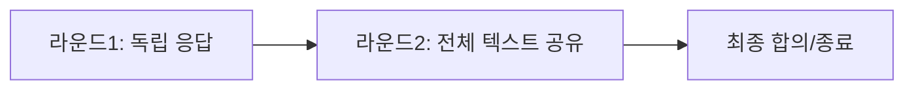

### **최종 요구사항정의서 (v1.0)**  
**프로젝트명**: 크롬 확장 기반 멀티 LLM 협업 시스템  
**작성일**: 2026-05-26  
**대상 환경**: Chrome 데스크톱 (최신 안정판 v126+)  

---

#### **1. 핵심 사양**  
| 카테고리 | 내용 |  
|----------|------|  
| **지원 LLM** | Claude, ChatGPT, Gemini (기본 3종) |  
| **최소 선택** | 2개 (단독 실행 불가) |  
| **실행 방식** | 크롬 확장 프로그램 + 웹팝업 UI |  
| **데이터 저장** | IndexedDB (자동 저장) + MD 파일 내보내기 |  
| **암호화** | 미적용 (로컬 단일 사용자 전용) |  

---

#### **2. 협업 프로세스**  

- **동기화**: 5분 타임아웃 (초과 시 실패 처리)  
- **재질의**: 현재 라운드 내 수정으로 반영 (새 분기 X)  
- **조기 종료**: 사용자 강제 진행 가능  

---

#### **3. 데이터 포맷**  
**Markdown 예시**:  
````markdown  
## [R1] 2026-05-26 14:00  
### Claude  
> 응답 내용...  
### Gemini  
> 응답 내용...  

## [R2] 2026-05-26 14:05  
### Claude (수정)  
> 수정된 응답...  
````  

---

#### **4. UI/UX**  
- **LLM 선택**: 체크박스 그리드 (최근 선택 상태 유지)  
- **응답 비교**: 탭/병렬 보기 지원  
- **이력 조회**: 날짜/LLM 필터링 검색  

---

#### **5. 기술 제약사항**  
| 항목 | 제약 내용 |  
|------|-----------|  
| **모바일** | 미지원 (Chrome 확장 프로그램 제한) |  
| **브라우저** | Chrome 전용 (Firefox/Edge 불가) |  
| **세션** | 크롬 로그인 계정 연동 필수 |  

---

#### **6. 배포 및 유지보수**  
- **설치**: Chrome 웹 스토어 배포 (1회 설치)  
- **업데이트**: LLM 추가 시 확장 프로그램 버전 업그레이드  

> ✅ **결론**: 본 안은 모든 팀원의 동의를 거쳐 확정되었으며, 변경 시 재검토 필요.  
> **개발 시작일**: 2026-06-01 (예정)  

--- 

**첨부**: [프로토타입 스케치] [기술적 위험 평가표]