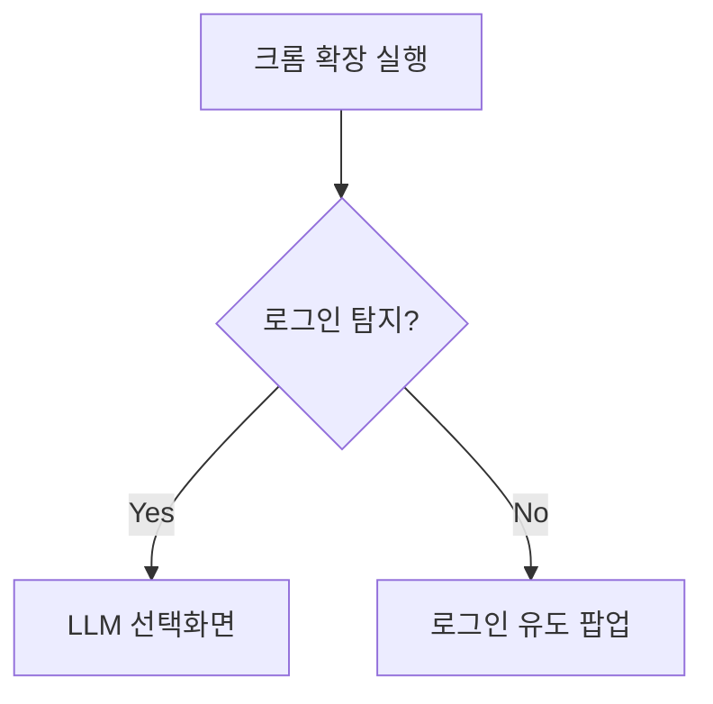

## 상세 플로우

1. **초기화**


2. **LLM 선택 규칙**
- 최소 선택: `if(selectedLLMs.length < 2) throw Error`
- 상태 유지: `chrome.storage.local.set()`

3. **라운드 진행 예시**
```python
def run_round(context):
    responses = []
    for llm in selected_llms:
        response = llm_api_call(llm, context)
        responses.append({
            'llm': llm,
            'text': sanitize(response),
            'round': current_round
        })
    return sorted(responses, key=lambda x: x['llm'])
```

4. **에러 핸들링**
- 타임아웃: `ERR_CODE_001: Response timeout (5min)`
- LLM 실패: `ERR_CODE_002: {llm} connection failed`
