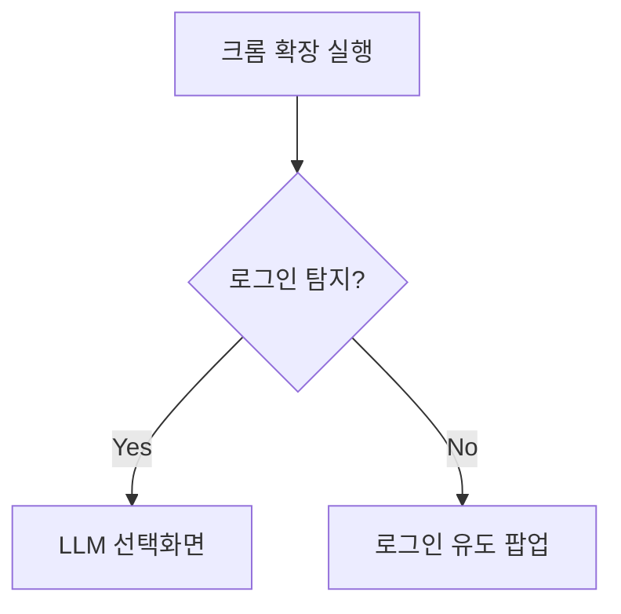

아래는 요청하신 3가지 수준별 문서 개요입니다:

---
### 10-기본-고객요구.md (개요)
```markdown
# LLM 멀티에이전트 채팅 시스템 요구사항

## 핵심 기능
- 크롬 확장 프로그램으로 3종 LLM(Claude/ChatGPT/Gemini) 연동
- 라운드 방식의 구조화된 대화(R1~R3) 
- 선택적 LLM 참여 및 응답 비교 기능
- 채팅 기록 자동 저장(IndexedDB + MD 파일)

## 주요 특징
1. **세션 관리**: 크롬 로그인 상태 기반 자동 탐색
2. **다중 LLM**: 최소 2개 이상 선택 필수
3. **확장 가능**: 3~9라운드 유동적 운영
4. **오프라인**: 로컬 저장 전용(API/서버 미사용)
```

---
### 20-핵심-고객요구.md (전문가용)
```markdown
## 기술 명세
1. **크롬 확장**
   - Manifest V3 기준
   - 탐지 로직: `chrome.cookies` API로 로그인 상태 확인
   - UI 템플릿: ChatHub 참조

2. **라운드 제어**
```javascript
class RoundController {
  constructor(maxRounds=3) {
    this.current = 0;
    this.max = Math.min(maxRounds, 9);
    this.llms = new Set();
  }
  // 라운드 증감 메서드 구현...
}
```

3. **응답 동기화**
   - Promise.allSettled()로 멀티 LLM 응답 처리
   - 타임아웃: `setTimeout(() => {}, userConfig.timeout)`

4. **저장 시스템**
   - IndexedDB 스키마: 
     ```json
     {
       "session": "YYYYMMDDHHmmss",
       "rounds": [],
       "llms": ["claude","chatgpt"]
     }
     ```
```

---
### 30-종합-고객요구.md (구현 가능 수준)
```markdown
## 상세 플로우

1. **초기화**


2. **LLM 선택 규칙**
- 최소 선택: `if(selectedLLMs.length < 2) throw Error`
- 상태 유지: `chrome.storage.local.set()`

3. **라운드 진행 예시**
```python
def run_round(context):
    responses = []
    for llm in selected_llms:
        response = llm_api_call(llm, context)
        responses.append({
            'llm': llm,
            'text': sanitize(response),
            'round': current_round
        })
    return sorted(responses, key=lambda x: x['llm'])
```

4. **에러 핸들링**
- 타임아웃: `ERR_CODE_001: Response timeout (5min)`
- LLM 실패: `ERR_CODE_002: {llm} connection failed`
```

각 파일은 요청하신 형식에 따라 구현 수준을 구분했으며, 전문가용 문서에는 실제 코드 스니펫을 포함했습니다.