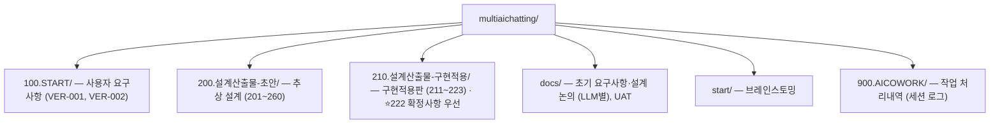
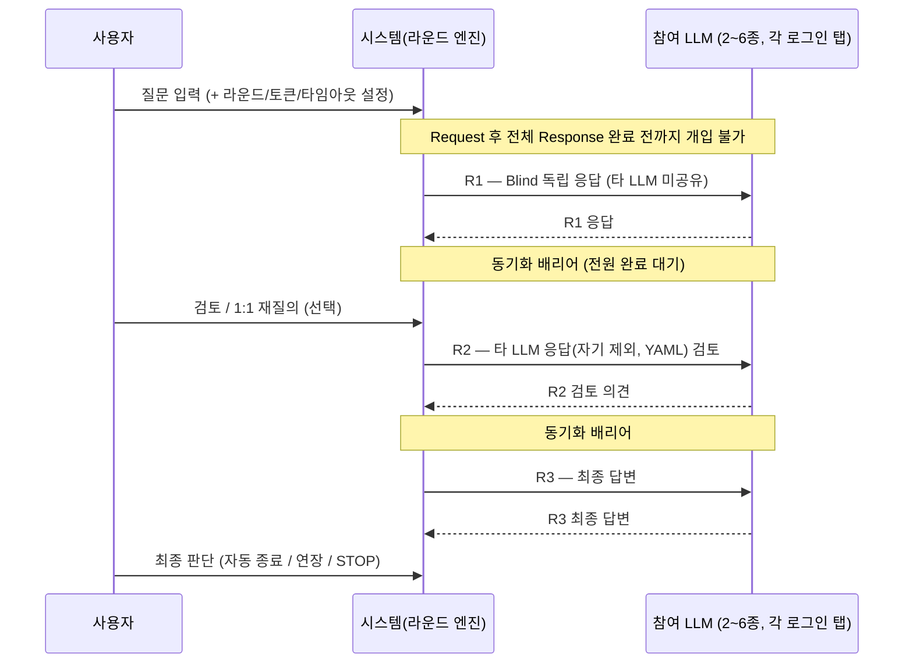

# Multi-LLM Cowork System (다자 AI 협업 시스템)

6종 LLM(ChatGPT · Claude · Gemini · Perplexity · DeepSeek · Grok)과 사용자가 함께 협업하는 **브라우저 세션 기반 멀티 LLM 협업 플랫폼** (Chrome Extension, Manifest V3).

## 개요

사용자가 크롬에 로그인된 계정을 그대로 활용하여(= **API 키 불필요**) 여러 LLM을 동시에 호출하고,
동기식 라운드 협업(R1: 독립응답 → R2: 상호검토 → R3: 최종답변)을 거쳐
사용자가 최종 판단을 내리는 **HITL(Human-in-the-Loop)** 시스템입니다.

**핵심 특징:**
- **API 키 불필요** — 크롬 로그인 세션 + 각 사이트 탭 DOM 어댑터 활용
- **6종 동시 협업** — ChatGPT · Claude · Gemini · Perplexity · DeepSeek · Grok (최소 1개 참여)
- **라운드 기반** — 기본 3회, 콤보 {3, 5, 7, 9} 중 선택 + 진행 중 수동 STOP / 연장
- **LLM swap** — 세션 도중 슬롯의 LLM 교체
- **비밀채팅** — 휘발성(메모리 전용, 미저장) 모드
- **토큰 상한 지시문** — soft 지시문 콤보 {100, 500, 1000, 3000, 5000, 10000} 자동 삽입 (하드 컷 아님, LLM에 위임)
- **MD 저장** — LLM별 + 전체 `summary.md`, IndexedDB 기반 로컬 자동 저장
- **Chrome Extension (MV3)** — ChatHub v1.45.7 오픈소스 개조

## 기술 스택

| 항목 | 값 |
|------|----|
| 베이스 코드 | ChatHub **v1.45.7** 오픈소스 (`E:\workspace\multichat`) |
| 프레임워크 | React 18 + TypeScript(strict) |
| 빌드 | Vite 4 |
| 상태관리 | Jotai |
| 스타일 | Tailwind |
| 플랫폼 | Chrome Extension Manifest V3 |
| 봇 전략 | **6종 전부 로그인 탭 DOM 어댑터(`DomAdapterBot`)** — 내부 API/proxyFetch 미사용. Phase 0 실증 결과 1.45.7 내부 API 봇이 현재 사이트와 불일치(전부 실패) 확인 → 하이브리드 폐기, DOM 통일 (2026-05-29 결정) |

## 프로젝트 구조

> **구현 시작점**: `210.설계산출물-구현적용/` 폴더는 **자기완결적**입니다 — 파일 경로·TS 타입·함수 시그니처·DOM selector 수준으로 기술. `README` → `211`(개요) 순으로 읽고, **충돌 시 `222-구현확정사항`이 우선**합니다. `200.설계산출물-초안`은 출처/대조·감사용입니다.

## 요구사항 (확정 — user-request ver.002, 2026-05-29)

| 구분 | 내용 |
|------|------|
| 대상 LLM | **6종**: ChatGPT · Claude · Gemini · Perplexity · DeepSeek · Grok |
| LLM 접속 | 크롬 로그인 세션 기반 (API 키 불필요), 각 사이트 로그인 탭 필요 |
| LLM 선택 | 6개 노출(2×3), **최소 1개 이상 참여**, 세션 간 선택 상태 유지 |
| LLM swap | 세션 도중 슬롯의 LLM 교체 가능 |
| 라운드 | 기본 3회, 콤보 {3, 5, 7, 9} 선택. 진행 중 수동 STOP / 연장 가능 |
| R1 | Blind 독립 응답 (타 LLM 응답 미공유) |
| R2 | 타 LLM 응답(자기 제외, YAML) 검토 후 의견 제시 |
| R3 | 최종 답변 |
| 동기화 | 모든 LLM 응답 완료 후 다음 라운드 진행 (동기화 배리어, 완료 전 개입 불가) |
| 토큰 제한 | soft 지시문 콤보 {100, 500, 1000, 3000, 5000, 10000} 자동 삽입 (하드 컷 아님) |
| 타임아웃 | 5분 기본, 분 단위 조정. 재시도 3~9회 사용자 설정 |
| LLM 전달 | 제한시간 + 현재차수/제한차수를 request 시 LLM에 전달 |
| 사용자 권한 | 라운드 사이 1:1 재질의 / 최종 판단 / 수동 STOP |
| 비밀채팅 | 휘발성(메모리 전용, 미저장) 모드 |
| 저장 | IndexedDB 자동 저장 + MD 파일 (LLM별 + 전체 `summary.md`) |
| 이력 조회 | 년월일시 / LLM / 라운드 검색 |
| Extension | Manifest V3 |
| UI 참고 / 베이스 | ChatHub (v1.45.7 개조) |

## 협업 흐름

## 진행 상태

- [x] 브레인스토밍 및 아이디어 탐색
- [x] 요구사항정의서 v1.0 확정
- [x] 요구사항 ver.002 확정 (미확정 건 보완)
- [x] 시스템 설계 — `200.설계산출물-초안`(201~260) + `210.설계산출물-구현적용`(211~223)
- [ ] PoC 구현 — Phase 0 실증 진행 (내부 API 봇 실패 확인 → 6종 DOM 어댑터 통일로 전략 전환)
- [ ] MVP 구현

## 범위 밖 (제거)

> 프리미엄 · 라이선스 · 할인 · 사용량 분석(Plausible/Sentry) · 프롬프트 라이브러리 · 웹검색 agent · 불필요 봇(12종) → **제거**. 제품은 "다자 Cowork 브레인스토밍 모드"로 한정.

## 개발 원칙

- **Step by step**: 단계별 검증 후 진행
- **No guess**: 합의되지 않은 내용은 추정 구현 금지
- **빠짐없이 / 틀림없이 / 다름없이 / 더함없이**
- 재사용 가능한 설계 템플릿 자산화

## 참고

- UI/UX 참고 & 구현 베이스: [ChatHub](https://chathub.gg) (크롬 확장 프로그램, v1.45.7)
- 구현 진입 문서: [`210.설계산출물-구현적용/README.md`](210.설계산출물-구현적용/README.md)
