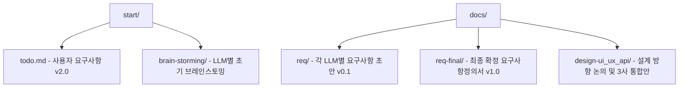
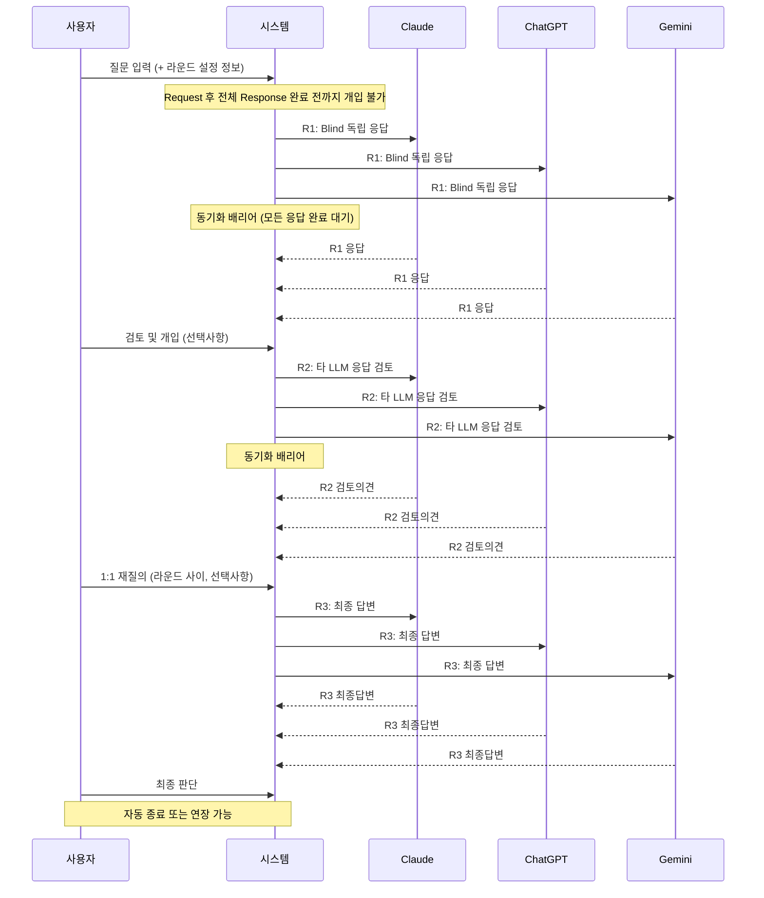

# Multi-LLM Cowork System (다자 AI 협업 시스템)

여러 LLM(Claude, ChatGPT, Gemini)과 사용자가 동시에 협업하는 **브라우저 세션 기반 멀티 LLM 협업 플랫폼**.

## 개요

사용자가 크롬 브라우저에 로그인된 계정을 활용하여 접속 가능한 LLM들을 탐지·선택하고, 
동기식 라운드 협업(R1: 독립응답 → R2: 상호검토 → R3: 최종답변)을 거쳐 
사용자가 최종 판단을 내리는 HITL(Human-in-the-Loop) 시스템입니다.

**핵심 특징:**
- API 키 불필요 (크롬 로그인 세션 활용)
- Claude / ChatGPT / Gemini 동시 협업
- 기본 3회, 채팅 중 최대 9회까지 라운드 증감 가능
- LLM별/전체 MD 파일 저장
- IndexedDB 기반 로컬 자동 저장
- Chrome Extension (Manifest V3) 기반

## 프로젝트 구조

## 요구사항 (확정)

| 구분 | 내용 |
|------|------|
| 대상 LLM | Claude, ChatGPT, Gemini (3종) |
| LLM 접속 | 크롬 로그인 세션 기반 (API 키 불필요) |
| LLM 선택 | 최소 2개 이상, 세션 간 선택 상태 유지 |
| 라운드 | 기본 3회, 채팅 중 1~9회 증감 가능 (마지막 회차에서도 증설 가능) |
| R1 | Blind 독립 응답 (타 LLM 응답 미공유) |
| R2 | 타 LLM 응답 전체 텍스트 검토 후 의견 제시 |
| R3 | 최종 답변 |
| 동기화 | 모든 LLM 응답 완료 후 다음 라운드 진행 (완료 전 개입 불가) |
| 타임아웃 | 5분 기본, 분 단위 조정 가능. 재시도 3~9회 사용자 설정 |
| LLM 전달 | 제한시간 + 현재차수/제한차수를 request 시 LLM에 전달 |
| 사용자 권한 | 라운드 사이 1:1 재질의 / 최종 판단 |
| 출력 형식 | 구조화 강제 |
| 저장 | IndexedDB 자동 저장 + MD 파일 저장 (전체 + LLM별) |
| 이력 조회 | 년월일시 / LLM / 라운드 검색 |
| Extension | Manifest V3 |
| UI 참고 | ChatHub |
| 구현 베이스 | chathub 개선 |

## 협업 흐름

## 진행 상태

- [x] 브레인스토밍 및 아이디어 탐색
- [x] 요구사항정의서 v1.0 확정
- [x] 요구사항정의서 v2.0 (미확정 건 보완)
- [ ] 시스템 설계
- [ ] PoC 구현
- [ ] MVP 구현

## 개발 원칙

- **Step by step**: 단계별 검증 후 진행
- **No guess**: 합의되지 않은 내용은 추정 구현 금지
- **빠짐없이 / 틀림없이 / 다름없이 / 더함없이**
- 재사용 가능한 설계 템플릿 자산화

## 참고

- UI/UX 참고: [ChatHub](https://chathub.gg) (크롬 확장 프로그램)
